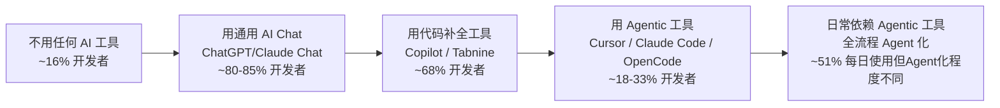

# Market — 市场与竞品分析

> **状态：✅ 完整** — 基于 2025-2026 年公开数据（Stack Overflow Survey 2025、市场研究报告、GitHub 公开数据、用户社区反馈）撰写。部分量化数据为行业分析机构估算值，非精确财报数字源（竞品多为未上市公司，无公开财报）。

## 1. 市场规模与增长

### 1.1 全局市场

| 指标 | 数据 | 来源 |
|---|---|---|
| 2024 年市场规模 | ~$6B | Alora Advisory 估算 |
| 2025 年市场规模 | ~$10B | 多家分析机构估算 |
| 2026 年市场规模 | ~$9.4B–$14.5B | Mordor Intelligence / Alora Advisory |
| 2030-2031 年预测 | $30B–$36B | 多家机构（CAGR 26%–35%区间收敛） |
| 全球专业开发者基数 | ~28-30M | SlashData / 多家来源 |

**增长率趋势**：2021-2024 年以 ~130% CAGR 爆发（Copilot GA 驱动），2025-2026 年收敛至 45-67%，预计 2030 年进一步放缓至 ~18%（开发者基数接近饱和，补全类工具 commoditize）。

**市场结构变化**（Alora Advisory 2026 预测）：
- Code Completion 份额从 2024 年 ~26% 压缩至 2030 年 ~14%（commoditize，开源替代蚕食）
- Agentic Execution 从 ~22%（2024）升至 ~35%（2030）——**这是本产品的目标市场区间**
- 端到端应用生成从 <5% 升至 ~18%

### 1.2 开发者采用数据

Stack Overflow 2025 Developer Survey：

| 指标 | 2024 | 2025 | 变化 |
|---|---|---|---|
| 正在使用或计划使用 AI 工具 | 76% | 84% | ↑ 8pp |
| 专业开发者每日使用 AI 工具 | — | **51%** | — |
| 对 AI 工具持积极态度 | 70%+ | **60%** | ↓ 10pp |
| 认为 AI 工具在复杂任务上仍吃力 | 35% | **29%** | ↓ 6pp |
| 不使用且不计划使用 AI Agent | — | **38%** | — |

**关键信号**：采用率在涨，但满意度在降。51% 每日使用说明 AI 工具已是主流，但 60% 积极态度（下降 10pp）反映了用户预期与实际体验之间的差距在扩大——这对新产品来说不是坏消息，说明现有产品还没完全满足用户的真实需求。

**AI 工具市场份额**（Stack Overflow 2025，开发者报告使用的工具）：

| 工具 | 使用率 | 备注 |
|---|---|---|
| ChatGPT | 81.7% | 不是专用编码工具，但开发者高频使用 |
| GitHub Copilot | 67.9% | 品类第一，靠 VS Code 分发优势 |
| Claude | 47.4% | 此处为 Claude Chat，非 Claude Code |
| Cursor | 18%（JetBrains 调查）/ 33.1%（State of AI 调查） | 有使用过的比例 |
| OpenHands (formerly OpenDevin) | 1% | 开源社区工具，渗透率尚低 |

## 2. 竞品矩阵

| 维度 | Cursor | Claude Code | OpenCode | OpenHands | Codex CLI |
|---|---|---|---|---|---|
| **产品形态** | 独立编辑器 (VS Code fork) | CLI + IDE 插件 + 桌面 App + 浏览器 | 终端 TUI (Go/Bubble Tea) | SDK + CLI + 云平台 | 终端 CLI + macOS App |
| **开闭源** | 闭源 | 闭源 | 开源 MIT | 开源 MIT | 开源 MIT |
| **用户/社区规模** | 1M+ DAU, 50K+ 企业 | 未公开独立 DAU；Max 订阅制 | 108K+ GitHub Stars | 68K+ GitHub Stars | 60K+ GitHub Stars |
| **ARR/估值** | $2B+ ARR (2026初), $29.3B 估值 | 未独立披露（Anthropic 总营收未拆分 CC） | 未盈利，Freemium | $18.8M Series A | 未独立披露 |
| **模型支持** | 多模型 (Claude/GPT/Gemini) | Claude 系列 (无外部模型) | 75+ Providers (含本地) | 任意 LLM | 仅 OpenAI 模型 |
| **定价** | Free / $20/mo (Pro) / $200/mo (Ultra) / $40/user (Team) | 含在 Claude Pro($20)/Max($100-200) 中，另有 Team($25)/Premium($150) | 免费 BYOK / $10/mo 托管 | 免费 BYOK / 企业定制 | $20-200/mo 订阅 |
| **Agent 能力** | Composer 多文件编辑，Cloud Agent | Agentic Loop（最强）、Sub-agent 编排、Dynamic Workflows | Agentic Loop、多 Session 并行 | 最高自主性（全自动 issue→PR） | Agent 默认模式 |
| **MCP 支持** | ✅ | ✅ (最深集成) | ✅ | ✅ | ❌ |
| **本地模型** | 不支持 | 不支持 | ✅ (Ollama/LM Studio) | ✅ (任意) | ❌ |
| **Git 集成** | 基础 | 深度（分支/commit/PR） | 基础 | PR Agent + Checks | 原生 GitHub |
| **IDE 插件** | 自身就是 IDE | VS Code / JetBrains / Cursor / Devin Desktop | VS Code / Cursor | VS Code / JetBrains / Zed | macOS App |
| **Sandbox** | —（编辑器中运行） | 本地运行 / Remote Control | 本地运行 | Docker / Cloud | 本地运行 |
| **企业能力** | SSO/审计/RBAC/用量分析 | SSO/组织用量管控 | 无（社区驱动） | SOC 2 路径中 | OpenAI Enterprise |
| **核心差异化** | 编辑器深度体验、即时反馈、最大用户基数 | Agent 编排质量、Sub-agent 系统、多表面统一引擎 | 本地优先、隐私、70+ Provider 灵活性 | 企业级 SDK、全自动 issue→PR、多 Agent 编排 | OpenAI 原生、与 GitHub 生态无缝 |

### 2.1 竞品定位象限分析

五维竞品定位对比——每个维度 1-5 分（5=最强），基于 §3 深度拆解的综合评估：

| 维度 | Cursor | Claude Code | OpenCode | OpenHands | Codex CLI | **本产品目标** |
|---|---|---|---|---|---|---|
| Agent 编排质量 | 3.5 | **5** | 2.5 | 3 | 3 | **4.5（对标 CC，弥补其效率短板）** |
| 模型灵活性 | 4 | 2 | **5** | 4.5 | 1.5 | **4.5（对标 OC，但保证高质量编排）** |
| 安全默认值 | 2.5 | 3 | 2 | 3.5 | 1.5 | **4（Sandbox+Permission+HardConfirmList）** |
| 生态可扩展 | 3.5 | **4** | 3 | 2.5 | 2 | **3.5（MCP P1 + Plugin SDK P2）** |
| 定价友好度 | 3.5 | 3 | 4.5 | 4 | 3 | **4（免费 BYOK + 付费全托管混合）** |

> **结论**：本产品在竞品矩阵中的最优定位是取 Claude Code（编排质量）、OpenCode（模型灵活性）的长处，补所有竞品在安全默认值上的短板。这不是复制，是组合最优特性。

## 3. 竞品深度拆解

### 3.1 Cursor（Anysphere）

**定位**：AI-first IDE，用 AI 重新定义编辑器体验而非在现有编辑器上加 AI 插件。

**核心数据**：
- ARR：$100M（2024 末）→ $500M（2025.5）→ $1B（2025.11）→ $2B+（2026.2）——史上最快 $1M→$500M ARR 的 SaaS 公司
- 1M+ DAU，50K+ 企业使用，64% Fortune 500 采用
- 员工仅 40-60 人运营如此体量的产品
- 付费转化率 35%（行业领先），3-5% 月流失率（优秀留存）
- 个人付费用户占比 ~35%，企业 ~60%（2026 初企业收入占比提升）

**优势**：
1. **编辑器深度集成**：不是插件是编辑器本身——Tab 补全、Composer 多文件编辑、内联 Diff，每个交互都经过深度 UI 打磨
2. **即时反馈循环**：代码修改即时可见 Diff，用户体感是"AI 在编辑器里直接做事"而非"CLI 后台跑然后我再看"
3. **多模型灵活**：支持 Claude/GPT/Gemini 多个模型系列，不绑定单一供应商
4. **无敌的增长飞轮**：免费版→个人付费→团队推荐→企业采购，有机增长驱动而非销售驱动

**劣势**：
1. **上下文管理偏保守**：在大型代码库（500K LoC+）上，用户反馈其上下文策略过于"节省"，对调试类任务不够深入（HackerNews 反馈"Cursor 只返回第一假设，而 Claude Code 会读几十个文件深入分析"）
2. **模型用量配额机制引发不满**：Pro 计划 500 次快速请求/月，高强度开发可能月末用尽被迫降速或升级 $200/mo Ultra
3. **JetBrains 生态弱势**：Cursor 的核心价值在 VS Code 生态上，JetBrains 用户体验优势不明显
4. **2025.8 开始从固定请求数转向 API-based 计费**：团队计划从"固定请求次数"转向"基于实际 token 消耗"，意味着用户支出会更难预测——这可能是用户不满的新引爆点

**用户反馈痛点**：

> "The Complicated: Managing model request quotas is a pain point. The Pro plan's 500 fast requests per month sounds generous, but during intensive development you can burn through 50-80 in a single day." — Solo Unicorn Club 分析

> "对于大型 monorepo 项目，代码索引速度和准确度仍有提升空间。"

### 3.2 Claude Code（Anthropic）

**定位**：多表面统一引擎的 Agentic 编码助手——同一套 Agent 引擎运行在终端、IDE、桌面 App、浏览器、Slack 上。

**核心数据**：
- 2025.2 发布，Anthropic Max/Team/Enterprise 订阅体系内嵌
- 企业部署平均每日活跃开发者花费 ~$13，月花费 $150-250（90% 用户日均 <$30）
- 企业级市场份额快速攀升：据估算 2025 年 Anthropic 已占 Agentic 编程工作负载的一半以上

**优势**：
1. **Agent 编排质量业界最强**：Sub-agent 系统（Dynamic Workflows 跨 10-100 并行子 Agent）、Plan mode、Routines（定时任务）、自动 Memory
2. **多表面统一**：同一引擎跑在终端/VS Code/JetBrains/桌面/浏览器的会话可互相接续（Remote Control），上下文和配置跨表面同步
3. **MCP 最深集成**：MCP 工具定义延迟加载（deferred by default），工具搜索避免上下文膨胀，每个 MCP Server 的 token 消耗可追溯
4. **上下文管理成熟**：自动 compaction、prompt caching、auto memory、CLAUDE.md 项目级指令——Claude Code 团队对"上下文是成本也是质量"有最深刻的理解
5. **Sub-agent 语境隔离**：每个 sub-agent 独立上下文窗口，互不污染，返回摘要不膨胀主会话

**劣势**：
1. **被 Anthropic 模型绑定**：不支持外部 LLM——如果 Anthropic 模型服务降级或方向调整，用户无逃生舱口
2. **工具调用效率被严重诟病**：GitHub Issue #4482 收集了大量相似抱怨——Claude Code 对简单任务"overthink"，写文件经常首次尝试失败需要 sub-agent 修正，浪费大量 token 和时间
   > "一个简单的单文件写入任务需要 3 次尝试，每次 3.2K tokens，共 ~9K tokens 才完成"
3. **破坏性操作有时过于激进**：用户反馈其在调试时曾卸载整个 Docker 环境、大量 kill 进程，因模型错误地将系统问题归因为"缓存问题"
4. **订阅制限制用量**：Pro/Max/Team 各有用量上限，重度用户可能不够用
5. **模型过载期间质量显著下降**：用户反馈当 Anthropic 服务负载高时，Claude Code 的推理质量和稳定性出现明显退化（"full precision → lowered precision"的量化猜测）
6. **代码质量 vs 效率的矛盾**：部分用户反馈 Claude Code 结果质量最高但执行最慢，调试/debug 任务上 Cursor 可能是 3-5x 更快的替代

**用户反馈痛点**：

> "Claude code often take shortcuts or do extra stuff that I didn't ask." — HackerNews

> "Claude Code is a gigantic vibe-coded dumpster fire with more bugs than an ant hill." — HackerNews 用户（但同时该用户仍在付费使用 Max 计划）

**定价层次**：

| 级别 | 月费 | 适用 |
|---|---|---|
| Pro (含 CC) | $20 | 小型代码库短期任务 |
| Max 5x | $100 | 日常使用的重型用户 |
| Max 20x | $200 | 全天候使用 + Agent Teams |
| Team | $25/user | 团队标准席位 |
| Team Premium | $150/user | 开发者高级席位，增强用量 |

### 3.3 OpenCode（开源，anomalyco/opencode）

**定位**：开源 MIT、终端原生、隐私优先的 AI 编程 Agent。

**核心数据**：
- 108K+ GitHub Stars（本对比中最高），从 2025.5 发布起 30K stars/月的爆发期
- 支持 75+ LLM Provider，含 Ollama/LM Studio 本地模型
- 使用 Go + Bubble Tea (TUI 框架) 构建
- 定价：免费 BYOK + $10/mo 托管模型方案
- Terminal Bench 2.0 分数：51.7%（Claude Opus 4.5），与 OpenHands CLI 的 51.9% 持平

**优势**：
1. **本地优先，隐私最强**：代码完全不离开本机（除非用户主动使用云端模型），支持完全离线工作
2. **模型灵活性无与伦比**：75+ provider，用户不被任何模型供应商锁定——在模型快速迭代的时代这是极强护城河
3. **开源社区驱动**：MIT 协议，企业无法律风险，社区贡献活跃（23K+ forks）
4. **终端原生体验**：Bubble Tea 构建的 TUI 界面，高度可定制、可主题化
5. **多 Session 并行**：同一项目可以跑多个 Agent 实例不冲突

**劣势**：
1. **Agent 编排质量远不如 Claude Code**：HackerNews 用户明确表示"OpenCode is nowhere near Claude Code""keep running back to Claude Code"
2. **Compaction 质量差**：10 分钟等 LLM 服务器 prefill 整个 Session 历史，只产出 5 条摘要——效率极低
3. **Prompt Cache Miss 问题**：glob 文件系统后在每个 SSE Turn 重读 AGENTS.md，以及在 System Prompt 中注入当前日期导致每个 Turn cache miss
4. **代码库膨胀**：HackerNews 批评"hopelessly bloated by vibe coded features"
5. **本地模型支持说得多、做得差**：有用户花一小时尝试用本地模型，发现大量 PR 请求 Ollama 支持未合入，"maintainers simply don't care"
6. **稳定性问题**：用户反馈频繁报错（尤其在使用低价/免费模型时），/scrollback 编辑历史提示不支持
7. **安全漏洞历史**：2025.12 前存在一个 RCE 漏洞（"RCE as a service"级别的严重程度）

**用户反馈痛点**：

> "It's amazing how much other agentic tools suck in comparison to Claude Code. I'd love to have a proper alternative. But they all suck. I keep trying them every few months and keep running back to Claude Code." — HackerNews

> "The default system prompt came across as messy and random, it also contained a typo or two." — HackerNews

### 3.4 OpenHands（原 OpenDevin，All Hands AI）

**定位**：企业级 AI Agent 平台——让企业通过 SDK 构建自定义编程 Agent 并规模化部署。

**核心数据**：
- 68K+ GitHub Stars
- $18.8M Series A（Madrona、Menlo Ventures、Fujitsu Ventures）
- 在 benchmark 上可解决 50%+ 真实 GitHub Issue
- 企业部署报告 87% 同日 Bug Ticket 解决率
- 三种接口：SDK（自定义 Agent 构建）、CLI（终端工作流）、Cloud Platform（团队协作和编排）

**优势**：
1. **唯一的 SDK 化 Agent 平台**：不是终端工具而是 Agent 构建平台——企业可以代码化定义 Agent，本地测试后部署到云端千级扩展
2. **企业级成熟度最高**：有明确的 SOC 2 合规路径、企业部署、SLA 支持——在这个品类中独树一帜
3. **最高的自主执行程度**：全自动 issue→PR，无需人工逐步确认
4. **成熟的融资和团队**：在开源 AI 编码 Agent 中资金最充分

**劣势**：
1. **产品形态不同**：不是终端里用的 AI 助手，是为企业构建 Agent 的平台——与终端用户产品不在同一竞争维度
2. **用户渗透率不高**：Stack Overflow 调查中仅 1% 的开发者报告使用，社区热度虽高但实际使用者少
3. **依赖 Docker/Cloud 部署**：不是本地零配置使用，启动门槛显著高于 CLI 工具
4. **开源但面向商业**：企业版能力（云编排、SOC 2）是付费墙后内容

### 3.5 Codex CLI（OpenAI）

**定位**：OpenAI 官方的终端原生 AI 编程 Agent。

**核心数据**：
- 60K+ GitHub Stars
- 仅支持 OpenAI 模型（GPT-5 系列）
- 订阅制定价：$20-200/mo
- Terminal + macOS App 双形态
- Terminal Bench 2.0 上性能领先——比 OpenCode 快 22%（GPT-5.1）、快 13%（GPT-5.2）

**优势**：
1. **速度领先**：在 Benchmark 上执行速度快于 OpenCode 22%
2. **OpenAI 原生**：与 GitHub/GPT 生态深度整合
3. **双形态可用**：终端 + macOS 桌面应用

**劣势**：
1. **被 OpenAI 模型完全绑定**：如果 OpenAI 模型落后或被 Claude 超越，用户无法切换——在当前 Claude Sonnet 4.5 系列在编程质量上已经被公认领先的现状下，这是致命短板
2. **开发者信任度问题**：HackerNews 反馈 Codex "renamed my tabs after I had named them"、"edited a bunch of my files after a fresh install without asking me"——默认行为的自主性过于激进，且不尊重用户设定
3. **订阅制费用**：与 OpenCode 的免费 BYOK 相比无成本优势
4. **无 MCP 支持**：生态扩展能力弱

### 3.6 其他值得关注的竞品

| 产品 | 一句话 | 与本产品的关系 |
|---|---|---|
| **Aider** | 终端 Agent，Auto-commit 最强的 Git 集成 | 同类终端 Agent，但 Git 工作流更激进（自动 commit） |
| **Cline** (VS Code 插件) | 开源 Agentic 编码插件，57.9K Stars | IDE 插件赛道 vs 本产品的 CLI-first |
| **GitHub Copilot** | 品类开创者，分发优势无人能敌 | 补全类工具的参考基线，非直接竞品（定位不同代码层面） |

## 4. 用户迁移路径与转化分析

### 4.1 开发者工具采用阶梯

**转化关键点**：
- **B→C**：低摩擦。多数 IDE 已内置 Copilot 类补全，无需额外安装或改变工作流——这是 Copilot 最大的护城河
- **C→D**：高摩擦。从"AI 帮我写下一行"到"AI 帮我完成一个任务"是心智模型和工作流的根本变化。这个转化需要用户亲眼看到/体验到 Agent 完成了一个完整任务才可能发生——这是所有 Agent 类产品的共同增长瓶颈
- **D→E**：信任积累周期。用户需要经历多次"Agent 正确完成了复杂任务"后才会从不完全信任过渡到日常依赖

### 4.2 用户对定价的敏感度

| 定价类型 | 代表产品 | 用户接受度 | 本产品参考 |
|---|---|---|---|
| **纯订阅** | Cursor $20-200/mo, Copilot $10-39/mo | 个人开发者对 $20/mo 接受度好；$200/mo 只对重度用户有意义 | v1.0 定价可参考 $10-20/mo 的中间定价区间 |
| **用量计费** | Claude Code (API Based), Cursor (2025 开始转向 API Based) | 开发者不喜欢不可预测的支出，但理解 token 消耗是真实成本 | 建议混合模式：基础订阅 + 可选 API 附加费 |
| **免费 + BYOK** | OpenCode, OpenHands | 对技术用户极具吸引力，但企业客户想要的是全托管体验 | 免费 BYOK 作为开发者获取漏斗，付费全托管作为营收来源 |

## 5. 市场空白与机会——与本产品规范的对齐

### 5.1 从用户反馈中识别到的真实空白

| 用户痛点 | 频率 | 现有产品覆盖 | 本产品的机会 |
|---|---|---|---|
| Agent 上下文管理 vs 性能的平衡 | 极高 | Cursor 偏保守、Claude Code 偏重、OpenCode compaction 差 | [RFC-0002 Context Engine](../03-RFC/RFC-0002%20Context%20Engine.md) 的三路检索+Reranking+Budget——在保守和激进之间找到可配置的平衡 |
| 工具调用效率低下（首次尝试失败率高） | 高（Claude Code 用户集中反映） | 无产品系统性地解决此问题 | [RFC-0003 Tool Runtime](../03-RFC/RFC-0003%20Tool%20Runtime.md) 的 Observation 标准化和 [RFC-0001 Agent Runtime](../03-RFC/RFC-0001%20Agent%20Runtime.md) 的 Reflect→Retry 设计——让 Agent 从失败中学习而非反复重试同样策略 |
| 破坏性操作无默认安全网 | 高（Claude Code 卸载 Docker 事件；Codex 未经允许修改文件） | Claude Code 有 Permission 系统，但默认不够保守 | [RFC-0014 Sandbox](../03-RFC/RFC-0014%20Sandbox.md) + [RFC-0015 Permission](../03-RFC/RFC-0015%20Permission.md) L2 默认模式 + HardConfirmList——这是本规范中设计最完善的安全防线 |
| 模型供应商锁定 | 高（OpenCode 和 OpenHands 的最大卖点）；Claude Code 的最大短板 | OpenCode/OpenHands 解决了，但 Agent 质量不如 Claude Code | [RFC-0012 Model Router](../03-RFC/RFC-0012%20Model%20Router.md) 的 Provider Adapter——做到"多 Provider + 高质量 Agent 编排"而非"多 Provider + 低质量编排" |
| 本地模型支持性差 | 中（OpenCode 的 Ollama 支持被严重诟病） | 无产品真正做到"本地模型可用"级别的支持 | [ADR-0003 Embedding 策略](../08-ADR/ADR-0003-embedding-strategy.md) + Model Router 本地 Provider Adapter |
| 代码隐私焦虑 | 中 | OpenCode 唯一解决，但 Agent 质量差 | [Product Philosophy](../00-Vision/Product%20Philosophy.md) 本地优先 + [ADR-0003](../08-ADR/ADR-0003-embedding-strategy.md) 本地 Embedding 默认 |

### 5.2 与 PRD P0/P1/P2 范围的验证

以上市场空白与本产品 [PRD.md](PRD.md) 已定义的 P0/P1/P2 范围对比：

| 能力 | PRD 优先级 | 市场空白匹配度 | 评估 |
|---|---|---|---|
| Agentic Loop + 高质量编排 | P0 | 🔴 极高——Claude Code 在此维度领先但问题也多 | **本产品的核心竞争维度** |
| 上下文自动收集 + 相关性 | P0 | 🔴 极高——所有竞品都在做但都做得不够好 | P0 优先级合理 |
| 核心工具集 | P0 | 🟡 高——但更多是"执行效率"的差异化而非"有没有" | P0 合理 |
| Diff 预览 | P0 | 🟡 中——竞品都有，差异化空间在体验细节 | P0 合理 |
| Sandbox + Permission | P0 | 🔴 极高——Claude Code 和 Codex 在此方面的失败是本产品最强的差异化机会 | **P0 核心，本规范设计最完善的防线** |
| 多 Provider | P0 | 🔴 极高——OpenCode 用户的最大痛点就是"自由选择模型但 Agent 质量差" | **P0 核心** |
| MCP 支持 | P1 | 🟡 中——Claude Code MCP 集成已极深，竞争差异化空间不大 | P1 合理，但 MCP 集成质量需要对齐 Claude Code 而非满足于"能接上" |
| VS Code 插件 | P1 | 🟢 较低——Cursor 已占绝对优势 | P1 合理，此维度上不具备差异化竞争力，做好基础体验即可 |
| Cloud Agent | P2 | 🟡 中——OpenHands 在此领先但市场尚小 | P2 合理，短期不应投入 |

### 5.3 中国市场机会

（注：以下分析基于公开信息推断，非本地化深度调研——见大纲"前置工作"的本地用户访谈需求）

- **模型接入合规**：中国开发者无法或不愿使用 OpenAI/Anthropic API 的地区（需翻墙、数据合规顾虑），对支持国产模型（如 DeepSeek、Qwen）的本地优先工具有天然需求
- **语言与文档**：现有主流产品（Cursor/Claude Code）的界面和文档均为英文，中文开发者的使用门槛高
- **隐私合规**：企业用户对代码上传云端模型的顾虑在中国市场尤为突出（数据出境合规），本地优先 + 国产模型支持是结构性优势

## 6. 风险因素

### 6.1 结构性风险（无法通过产品策略规避）

| 风险 | 严重度 | 说明 |
|---|---|---|
| **模型厂商自建 Agent 产品** | 🔴 高 | Anthropic (Claude Code) 和 OpenAI (Codex) 都在自建 Agent——他们控制模型、成本（内部 API 价）、分发渠道，独立 Agent 产品在成本和模型获取上处于结构性劣势 |
| **GitHub Copilot 分发优势** | 🔴 高 | Copilot 预装在多数 VS Code 中，它对大多数开发者的摩擦是零——Agent 工具需要用户主动寻找并安装，天然处于获客劣势 |
| **开源免费替代** | 🟡 中 | OpenCode/Aider/OpenHands 的 MIT 协议免费使用——商业产品必须在 Agent 质量或体验上提供足够的付费价值（"好用得让我愿意付费"）才能对抗免费替代 |

### 6.2 市场性风险（可通过策略应对）

| 风险 | 严重度 | 应对 |
|---|---|---|
| **Cursor 的极致增长势头** | 🟡 中 | Cursor 在 IDE 赛道有先发优势和网络效应；本产品应走"CLI-first → IDE 插件"差异化路径，在"不是 Cursor 用户的开发者"中找空间 |
| **定价竞争** | 🟡 中 | Copilot $10/mo + OpenCode Free 让付费定价的天花板很低——需要明确的"为什么我愿意付更多"的价值主张 |
| **开发者的 AI 疲劳** | 🟡 中 | Stack Overflow 2025 显示满意度下降——说明用户被过度的 AI 功能轰炸，新产品需要做好"提供价值而非提供噪音" |
| **安全事件可能毁灭品类信任** | 🔴 高 | OpenCode 的 RCE 漏洞、Claude Code 的破坏性操作已经引发了开发者群体的安全焦虑——一次重大安全事故可能损害所有 Agent 产品的用户信任 |

## 7. 与本产品策略的最终对齐

根据以上市场分析，[Mission.md](../00-Vision/Mission.md)"先对标、不先做差异化"策略是**正确的**——市场已经被 Cursor/Claude Code 验证了需求，但还没有哪个产品做到了"所有维度都让人满意"。

本产品在竞品矩阵中的最优定位是：**Claude Code 的 Agent 质量 × OpenCode 的模型灵活性 × 更好的安全默认值**。这不是直接复制任何一个竞品，而是把已经验证有效的三个最优特性组合到一个产品里。

三个差异化维度都已经在本规范中设计到位：
1. **Agent 编排质量对标 Claude Code**：通过 [RFC-0001 Agent Runtime](../03-RFC/RFC-0001%20Agent%20Runtime.md) 的精细化状态机 + Sub-agent 预留
2. **模型灵活性对标 OpenCode**：通过 [RFC-0012 Model Router](../03-RFC/RFC-0012%20Model%20Router.md) 的 Provider Adapter 抽象
3. **安全默认值超越所有现有竞品**：通过 [RFC-0014 Sandbox](../03-RFC/RFC-0014%20Sandbox.md) + [RFC-0015 Permission](../03-RFC/RFC-0015%20Permission.md) + HardConfirmList——这是本规范中最有可能成为结构性优势的设计
