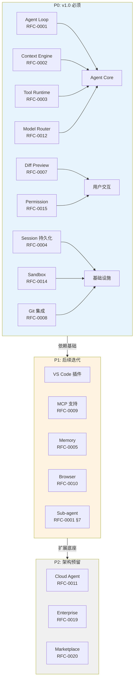

# PRD — AI Coding Agent v1.0

## 1. 概述

| 项目 | 内容 |
|---|---|
| 产品名称 | 待定（本规范中以 `the Agent` / `本产品` 代称） |
| 产品形态 | CLI-first，配套编辑器插件（VS Code 优先） |
| 目标用户 | 专业软件开发者（个人开发者 → 中小团队） |
| 对标产品 | Cursor、Claude Code、OpenCode、OpenHands、Codex |
| 当前阶段 | 功能对标（详见 [Mission](../00-Vision/Mission.md)），暂无差异化定位 |
| 关联文档 | [Vision](../00-Vision/Vision.md)、[Overall Architecture](../02-Architecture/Overall%20Architecture.md) |

## 2. 问题陈述

开发者在使用现有 AI 编码工具时的核心痛点（来自对 Cursor/Claude Code/OpenCode 公开反馈的归纳，详细市场分析见 [Market.md](Market.md)）：

1. **补全类工具止步于"下一行"**：Copilot 类工具擅长补全，但无法理解"完成一个功能需要改哪些文件、按什么顺序改"。
2. **上下文收集依赖用户手动**：多数工具要求用户手动 @ 文件或粘贴代码片段，无法自动理解大型代码库的架构与约定。
3. **自主执行与可控性是对立选项**：要么完全手动确认每一步（慢），要么完全自动无法审查（risky），中间地带的产品体验普遍粗糙。
4. **CLI 和 IDE 体验割裂**：CLI 工具（Claude Code）和 IDE 工具（Cursor）通常是两套不同的产品，上下文和历史不共享。

## 3. 产品范围（本阶段 P0/P1/P2）

### P0/P1/P2 能力全景

### P0 —— 必须在 v1.0 具备（对标基线）

| 编号 | 能力 | 对应 RFC |
|---|---|---|
| P0-1 | Agentic 执行循环：规划→执行→观察→反思，支持多步骤任务 | [RFC-0001](../03-RFC/RFC-0001%20Agent%20Runtime.md) |
| P0-2 | 代码库上下文自动收集与相关性排序 | [RFC-0002](../03-RFC/RFC-0002%20Context%20Engine.md) |
| P0-3 | 核心工具集：文件读写、命令执行、代码搜索、目录浏览 | [RFC-0003](../03-RFC/RFC-0003%20Tool%20Runtime.md) ✅ |
| P0-4 | Diff 预览 + 逐块接受/拒绝 | [RFC-0007](../03-RFC/RFC-0007%20Review.md) ✅ |
| P0-5 | Session 持久化与恢复 | [RFC-0004](../03-RFC/RFC-0004%20Task%20Engine.md) ✅ |
| P0-6 | 本地沙箱执行（进程级隔离） | [RFC-0014](../03-RFC/RFC-0014%20Sandbox.md) ✅ |
| P0-7 | Git 集成（分支、commit、查看变更历史） | [RFC-0008](../03-RFC/RFC-0008%20Git.md) ✅ |
| P0-8 | 渐进自主性配置（只读建议/需确认/自主执行） | [RFC-0015](../03-RFC/RFC-0015%20Permission.md) ✅ |
| P0-9 | 多 Provider 模型接入（至少 2 家 LLM 厂商可切换） | [RFC-0012](../03-RFC/RFC-0012%20Model%20Router.md) ✅ |

### P1 —— 应在后续迭代具备

| 编号 | 能力 | 对应 RFC |
|---|---|---|
| P1-1 | VS Code 插件（IDE 内交互，非仅 CLI） | [04-UX](../04-UX/_INDEX.md) |
| P1-2 | MCP 协议支持（接入第三方工具/数据源） | [RFC-0009](../03-RFC/RFC-0009%20MCP.md)（大纲） |
| P1-3 | 跨 Session 记忆（学习用户偏好、项目约定） | [RFC-0005](../03-RFC/RFC-0005%20Memory.md)（大纲） |
| P1-4 | 浏览器工具（截图、DOM 检查，用于前端调试） | [RFC-0010](../03-RFC/RFC-0010%20Browser.md)（大纲） |
| P1-5 | Sub-agent 编排（复杂任务拆分给专职子 Agent） | [RFC-0001](../03-RFC/RFC-0001%20Agent%20Runtime.md) 附录 |

### P2 —— 明确排除在 v1.0 范围外

- 云端全自动 issue-to-PR 工作流（[RFC-0011 Cloud Agent](../03-RFC/RFC-0011%20Cloud%20Agent.md) 仅做架构预留，不在 v1.0 交付）
- 团队多人实时协同编辑
- 企业级 RBAC/审计/私有化部署（[06-Enterprise](../06-Enterprise/_INDEX.md) 仅占位）
- 插件市场/Marketplace（[RFC-0020](../03-RFC/RFC-0020%20Marketplace.md) 仅占位）

## 4. 核心用户场景（详细旅程见 [User Journey.md](User%20Journey.md) 大纲）

### 场景 A：功能实现

用户在终端描述一个功能需求（"给用户模块加一个邮箱验证流程"），Agent：
1. 分析代码库，定位用户模块相关文件
2. 制定实现计划并展示给用户确认
3. 逐文件生成 diff，用户可逐块接受/拒绝
4. 执行测试验证改动
5. 报告结果，提示是否需要 commit

**验收标准**：在标准测试代码库（见 [Benchmark Task Set](../Appendix/Benchmark%20Task%20Set.md)）上，任务一次性完成率 ≥ 70%，无需人工介入修正逻辑错误。

### 场景 B：Bug 定位与修复

用户粘贴一段报错堆栈或描述症状，Agent：
1. 搜索代码库定位可能相关的代码路径
2. 提出假设并通过读代码/加日志/跑测试验证假设
3. 提出最小化修复方案（而非大范围重构）
4. 展示 diff 并等待确认

**验收标准**：修复方案改动范围（diff 行数）应与问题复杂度匹配，不出现"小 bug 大重构"的过度修改（呼应 [Design Principles](../00-Vision/Design%20Principles.md) 原则 5）。

### 场景 C：代码理解与问答

用户询问"这个函数是做什么的""这两个模块什么关系"，Agent 只读分析，不做任何修改。

**验收标准**：回答需要引用具体文件路径和代码片段，不能是泛泛而谈的总结。

### 场景 D：长任务自主执行

用户对信任度较高的重复性任务（如"把所有测试文件里过时的 mock 写法迁移到新写法"）授权 Agent 自主执行到底，事后查看汇总报告。

**验收标准**：执行过程中每一步操作可追溯（呼应 [Design Principles](../00-Vision/Design%20Principles.md) 原则 3），执行完成后可一键回退全部改动。

## 5. 非功能性需求

| 类别 | 要求 |
|---|---|
| 性能 | 单轮工具调用延迟（不含 LLM 推理时间）应 < 200ms（本地工具） |
| 安全 | 命令执行默认沙箱化，见 [Design Principles](../00-Vision/Design%20Principles.md) 原则 6 |
| 可靠性 | Agent 崩溃/中断后 Session 状态不丢失，可恢复继续 |
| 可观测性 | 所有工具调用、模型请求需有结构化日志，见 [RFC-0016 Telemetry](../03-RFC/RFC-0016%20Telemetry.md)（大纲） |
| 跨平台 | 至少支持 macOS、Linux；Windows 支持视 P1 排期 |

## 6. 验收标准总纲

呼应 [Design Principles](../00-Vision/Design%20Principles.md) 原则 10，本产品的验收不依赖主观评价，而依赖：

1. **基准任务集**：一组标准化的真实编码任务（涵盖场景 A-D），可自动化运行并评分。
2. **对比基线**：与 Claude Code / OpenCode 在相同任务集上做定量对比（完成率、改动准确率、平均耗时）。
3. **安全红线测试**：验证沙箱边界、权限系统在对抗性输入下不失效。

具体指标定义见 [KPI.md](KPI.md)（大纲）。

## 7. 开放问题（需在后续迭代中回答）

- 编辑器插件是自研 VS Code 扩展，还是 fork Cursor 式的完整 IDE？（影响 [Roadmap.md](Roadmap.md) 排期）
- 模型成本策略：是否需要内置的模型路由/降级策略来控制推理成本？（见 [RFC-0012](../03-RFC/RFC-0012%20Model%20Router.md)）
- 定价模式：订阅制 vs 用量计费 vs 混合？（见 [07-Operation](../07-Operation/_INDEX.md)）
