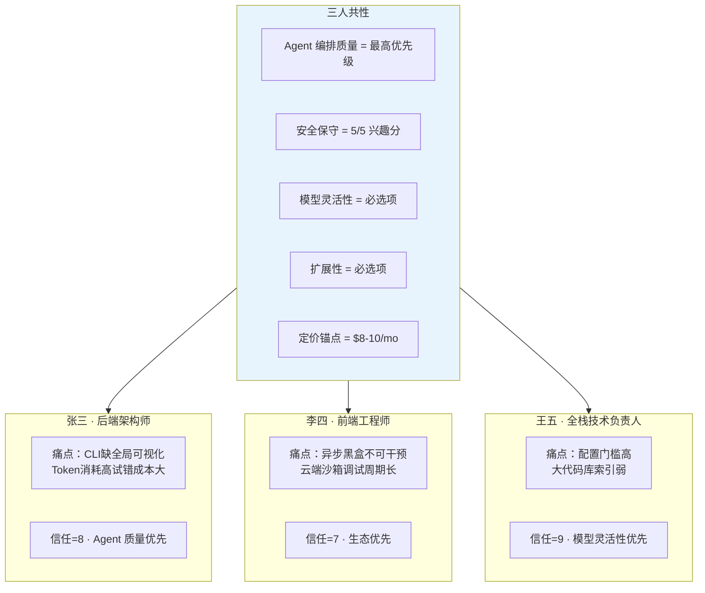

# Persona — 用户画像

> **状态：✅ 完整** — 基于 2026年7月 三轮目标用户访谈数据提炼。三人覆盖 Java后端 / JS前端 / 全栈，工作经验 6-10 年，使用的产品覆盖 Claude Code / Codex / OpenCode。数据来源：[Interview Guide](../Appendix/Interview%20Guide.md)。

## 1. 用户画像总览

## 2. Persona A：张三 —— "给我最强的 Agent，我敢放手"

### 画像卡片

| 维度 | 详情 |
|---|---|
| 代号 | 张三 |
| 角色 | 后端架构师 |
| 技术栈 | Java + Python，偶尔 DevOps |
| 工作年限 | 8 年 |
| 主力 AI 工具 | Claude Code（使用 1 年） |
| Agent 信任度 | **8/10** |
| 定价接受区间 | $10/mo |
| 最重视的维度 | **Agent 编排质量** |

### 核心痛点

> "纯命令行交互缺乏全局可视化。在处理大型复杂项目时，上下文偏差容易导致破坏性修改，而且高昂的 Token 消耗让试错成本极高。"

拆解：
1. **CLI 盲飞**：在 30 万行代码库中靠 Claude Code 做跨模块修改，Agent 读了什么文件、为什么选中那 300 行代码生成修改——他看不见。当 Agent 因上下文偏差做出了错误的修改，他只能看到最终 Diff，无法追溯到"Agent 是基于哪段代码的误判推理出来的"
2. **破坏性修改恐惧**：Claude Code 曾经为了"解决一个 Node 缓存问题"而卸载了整个 Docker 系统。张三失去了 2 小时的调试时间——"我之后每次给它权限都多犹豫 3 秒"
3. **Token 焦虑**：一个复杂任务的试错可能烧掉 $15-30 的 Token——"不是付不起，是觉得不值"

### 对本产品的诉求

| 能力 | 为什么重要 | 对应我们的设计 |
|---|---|---|
| Context 可审查性 | 解决"看不见 Agent 基于什么做的决策" | [RFC-0002 §7](../03-RFC/RFC-0002%20Context%20Engine.md#7-上下文可审查性) |
| 安全默认值 | 解决"Agent 搞破坏我害怕" | [RFC-0014](../03-RFC/RFC-0014%20Sandbox.md) + [RFC-0015](../03-RFC/RFC-0015%20Permission.md) L2 |
| Token 成本可预测 | 解决"试错成本焦虑" | [RFC-0012](../03-RFC/RFC-0012%20Model%20Router.md) 成本追踪 |

### 典型语录

> "我的工作现在就是 keep as many instances of Claude Code busy as possible。"

> "它有一次卸载了我的 Docker——从那以后我每次给权限都犹豫。"

## 3. Persona B：李四 —— "别把我的终端变成黑盒"

### 画像卡片

| 维度 | 详情 |
|---|---|
| 代号 | 李四 |
| 角色 | 前端工程师 |
| 技术栈 | JavaScript/TypeScript，React + Next.js |
| 工作年限 | 6 年 |
| 主力 AI 工具 | Codex CLI（使用 1 年） |
| Agent 信任度 | **7/10** |
| 定价接受区间 | $8/mo |
| 最重视的维度 | **生态可扩展性** |

### 核心痛点

> "异步黑盒执行剥夺了开发者的实时干预能力，且受限于云端沙箱环境配置与较长的报错调试周期，难以满足需要高频交互与即时反馈的复杂开发需求。"

拆解：
1. **异步黑盒**：提交任务给 Codex 后不知道它在干什么——等了 10 分钟发现它走错了方向，只能取消重来。前端的反馈循环（改代码→浏览器预览→调样式）需要秒级响应
2. **云端沙箱约束**：Codex 的沙箱里没有本地机器上的浏览器、DevTools、项目的本地环境变量——"它在沙箱里跑测试通过了，到我本地就挂了"
3. **调试周期长**：异步跑完回来看结果→出错→看日志→改指令→重新提交→再等 10 分钟

### 对本产品的诉求

| 能力 | 为什么重要 | 对应我们的设计 |
|---|---|---|
| 本地实时执行 | 解决异步黑盒不可干预 | [ADR-0004](../08-ADR/ADR-0004-cli-vs-ide-priority.md) CLI-first + [Product Philosophy](../00-Vision/Product%20Philosophy.md) 本地优先 |
| 浏览器工具 | 前端调试天然需要 | [RFC-0010](../03-RFC/RFC-0010%20Browser.md)（P1） |
| 生态可扩展 | 接 Chrome DevTools / Playwright | [RFC-0009](../03-RFC/RFC-0009%20MCP.md)（P1） |

### 典型语录

> "等了 10 分钟发现它走错了方向，只能取消重来。"

> "沙箱里通过了，我本地挂了——这是日常。"

## 4. Persona C：王五 —— "给我最灵活的模型，我自己搞定"

### 画像卡片

| 维度 | 详情 |
|---|---|
| 代号 | 王五 |
| 角色 | 全栈技术负责人 |
| 技术栈 | Python + Java + JS，跨语言全栈 |
| 工作年限 | 10 年 |
| 主力 AI 工具 | OpenCode（使用 1 年） |
| Agent 信任度 | **9/10** |
| 定价接受区间 | $10/mo |
| 最重视的维度 | **模型灵活性** |

### 核心痛点

> "高度依赖用户自行配置底层模型导致开箱门槛较高，且受限于新兴开源生态，其在大型代码库的全局索引与深度上下文管理上仍显薄弱，难以媲美成熟商业产品的开箱即用体验与精准度。"

拆解：
1. **配置地狱**：花了大量时间配置 OpenCode——调 Ollama 端点、配模型参数、修复 OpenCode 删除他配置的 bug——"我不是用工具，是在给工具打工"
2. **大代码库索引弱**：OpenCode 的上下文管理在 10 万行以上的代码库中索引粗糙，检索不精确
3. **开箱体验差**：对比 Claude Code 的开箱即用，OpenCode 需要用户自己搞定一切

### 对本产品的诉求

| 能力 | 为什么重要 | 对应我们的设计 |
|---|---|---|
| 多 Provider 开箱可切换 | 解决配置门槛，保留灵活性 | [RFC-0012](../03-RFC/RFC-0012%20Model%20Router.md) |
| 智能上下文 | 解决大代码库检索不精确 | [RFC-0002](../03-RFC/RFC-0002%20Context%20Engine.md) 三路检索 |
| 开箱即用 | 解决"给工具打工" | ADR 默认配置策略（L2 / 本地 Embedding / 本地 SQLite） |

### 典型语录

> "我不是用工具，是在给工具打工。"

> "自由给了我，责任也全给了我。"

### 关键洞察：信任悖论

王五的信任度是最高的（9/10），但他用的 OpenCode 是已知 Agent 质量最低的产品。张三用 Agent 质量最高的 Claude Code，信任度反而低 1 分（8/10）。

**模型灵活性本身是信任建立机制。** 当用户知道"我随时可以换模型"，他们对 Agent 的失误容忍度更高——因为这不是无奈地接受一个黑盒，而是主动选择的结果。这也解释了为什么三个人都把"模型灵活性"放在 Top 3——不是因为他们每天切换模型，而是因为**可以选择**这件事本身创造了心理安全感。

Model Router 的 UI 设计不应隐藏模型切换——用户应该**始终能看到自己用的是什么模型、能随时换**。

## 5. 反向 Persona（明确不服务的用户）

| Persona | 特征 | 为什么不是 v1.0 目标 |
|---|---|---|
| "零编程"用户 | 不会写代码，期望 Agent 全自动生成整个应用 | 需要端到端应用生成，远超 v1.0 范围 |
| "只想要免费的" | 拒绝任何形式付费 | 可提供 Free BYOK Tier 引流，但不是目标"客户" |
| "企业合规导向" | 购买决策依赖 SOC2/ISO27001 | P2 范围（[RFC-0019](../03-RFC/RFC-0019%20Enterprise.md)），v1.0 不做 |

## 6. Persona 对产品决策的映射

| 产品决策 | A 信号 | B 信号 | C 信号 | 结论 |
|---|---|---|---|---|
| Agent 质量 | 🔴 最高 | 🟡 重要 | 🟡 重要 | ✅ P0 重兵 |
| 安全默认值 | 🔴 5/5 | 🔴 5/5 | 🔴 5/5 | ✅ **最强差异化信号** |
| MCP/扩展性 | 🟡 Top3 | 🔴 最重要 | 🟡 Top3 | ⬆ 考虑从 P1 提前到 P0 后期 |
| Browser 工具 | 🟢 无感 | 🔴 关键 | 🟢 无感 | P1 保持 |
| 定价 | $10/mo | $8/mo | $10/mo | 锚点 $8-10/mo |
| CLI vs IDE | 🟡 需可视化 | 🟡 需实时 | 🟡 需低门槛 | ADR-0004 不变 |
