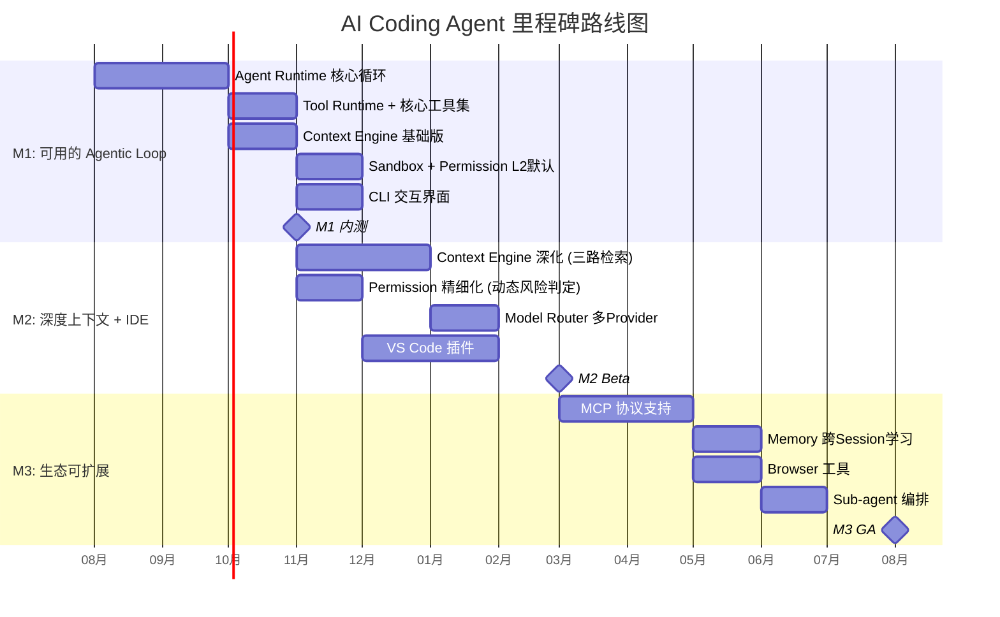
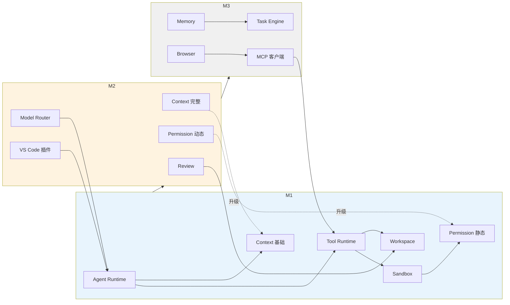

# Roadmap — 路线图

> **状态：✅ 完整** — 基于 [Persona.md](Persona.md) 的用户反馈优先级和 [ADR-0004](../08-ADR/ADR-0004-cli-vs-ide-priority.md)（CLI-first）决策，定义 M1/M2/M3 的里程碑、交付物和验收标准。定价策略基于用户访谈锚点 $8-10/mo。

## 1. 里程碑总览

## 2. M1：可用的 Agentic Loop → 内测（约 4 个月）

**目标**：验证核心 Agent 能力是否达到用户可接受的底线。对内测用户开放 CLI 工具，在真实代码库上做 Benchmark 测试。

### 2.1 交付清单

| 编号 | 交付物 | 对应 RFC | 优先级理由 |
|---|---|---|---|
| M1.1 | Agent Runtime 核心状态机 + 循环 | RFC-0001 | **全三人 Top3**——Agent 编排质量是基准线 |
| M1.2 | Tool Runtime + 5 个核心工具 | RFC-0003 | Agent Runtime 执行循环的依赖项 |
| M1.3 | Context Engine 基础版（符号+语义检索） | RFC-0002 | 三路检索中的两路——依赖图留到 M2 |
| M1.4 | **Sandbox + Permission L2 默认** | RFC-0014 + RFC-0015 | **三人全 5/5 兴趣分**——M1 交付最强差异化 |
| M1.5 | Task Engine（持久化+恢复） | RFC-0004 | Session 可靠性基础 |
| M1.6 | Workspace 文件操作 | RFC-0006 | Tool Runtime 依赖 |
| M1.7 | Git 基础集成（分支隔离+commit建议） | RFC-0008 | Task 完成后落地为可追溯变更 |
| M1.8 | CLI 交互界面 | 04-UX | ADR-0004 CLI-first |
| M1.9 | Benchmark Task Set 自动化运行 | Appendix | 原则10——M1 验收依据 |

### 2.2 M1 验收标准

| 标准 | 指标 | 来源 |
|---|---|---|
| Benchmark 类别A 完成率 | ≥ 60%（M1 不要求 70%——CE 尚未完整） | Benchmark Task Set |
| Sandbox 隔离有效性 | 6/6 逃逸测试通过 | [Security §6](../02-Architecture/Security.md#6-sandbox-隔离验证) |
| Session 恢复成功率 | ≥ 95% | [RFC-0004 §8](../03-RFC/RFC-0004%20Task%20Engine.md#8-验收标准) |
| 内测用户满意度 | 完成率 ≥ 70%（不限定 Benchmark 集） | 内部 Alpha |

### 2.3 M1 不做的事

- **Model Router**：M1 单一模型跑通全链路再做多 Provider——过早支持多模型让调试复杂化
- **IDE 插件**：ADR-0004 CLI-first
- **MCP**：Agent 质量未验证时外部工具集是次要需求

## 3. M2：深度上下文 + IDE 集成 → Beta（约 5 个月）

**目标**：补齐 Context Engine 完整能力，上线 VS Code 插件，对外开放 Beta。

### 3.1 交付清单

| 编号 | 交付物 | 对应 RFC | 优先级理由 |
|---|---|---|---|
| M2.1 | Context Engine 完整三路检索 + Reranking | RFC-0002 | M1 仅两路——M2 补全依赖图 |
| M2.2 | **Context 可审查性面板** | RFC-0002 §7 | **Persona A 核心痛点**——"看不见基于什么做的决策" |
| M2.3 | Permission 完整动态风险判定 | RFC-0015 §4.1 | M1 静态→M2 动态命令分析 |
| M2.4 | **Model Router + 至少 2 家 Provider** | RFC-0012 | **全三人 Top3**——M2 必须交付 |
| M2.5 | VS Code 插件 | 04-UX | ADR-0004 M2 启动 |
| M2.6 | Review Diff 交互（Hunk级，CLI+IDE） | RFC-0007 | 升级为标准 Review 流程 |
| M2.7 | Event Bus 完整事件系统 | Event Bus | IDE 插件需实时订阅 Agent 状态 |

### 3.2 M2 验收标准

| 标准 | 指标 | 来源 |
|---|---|---|
| Benchmark 类别A 完成率 | ≥ 70% | Benchmark Task Set |
| 类别E 检索 Recall | ≥ 80% | [RFC-0002 §10](../03-RFC/RFC-0002%20Context%20Engine.md#10-验收标准) |
| 多 Provider 切换 | OpenAI↔Anthropic，同 Benchmark 质量无明显退化 | [RFC-0012 §10](../03-RFC/RFC-0012%20Model%20Router.md#10-验收标准) |
| VS Code 插件可用 | Beta 用户可在 IDE 内完成任务 | 可用性测试 |

## 4. M3：生态可扩展 → GA（约 5 个月）

### 4.1 交付清单

| 编号 | 交付物 | 对应 RFC | 优先级理由 |
|---|---|---|---|
| M3.1 | **MCP 协议客户端** | RFC-0009 | **Persona B 最高维度 + 三人 Top3** |
| M3.2 | Memory 跨 Session 学习 | RFC-0005 | M2 积累的真实数据使 Memory 有样本量 |
| M3.3 | Browser 工具 | RFC-0010 | Persona B 关键需求 |
| M3.4 | Sub-agent 编排 | RFC-0001 §7 | 效率提升——但优先级低于 MCP |
| M3.5 | Prompt Engine 模板管理 | RFC-0013 | 多 Provider × 多 Task 类型的组合复杂 |
| M3.6 | Telemetry 完整版 | RFC-0016 | GA 需要系统化质量监控 |

### 4.2 M3 验收标准

| 标准 | 指标 |
|---|---|
| MCP 协议 | 接入 ≥ 3 个常用 MCP Server，Agent 正确调用其工具 |
| NPS | ≥ 40，基于 Beta 用户群 |
| 次月留存 | ≥ 60% |
| Benchmark | 类别 A-F 全部达标 |

## 5. 依赖关系与关键路径

**关键路径**：Context Engine 基础（M1）→ Context Engine 完整（M2早期）→ 可审查性面板（M2中期）→ VS Code 插件（M2后期）。这是 M1+M2 的最长链。

## 6. 定价策略

| 档位 | 价格 | 目标 | 包含 |
|---|---|---|---|
| Free Tier | $0/mo | 试用/轻度 | 限量 Token + BYOK 模式 + L1 安全 |
| **Pro** | **$8/mo（年付）/ $10/mo（月付）** | 个人开发者（锚点） | 合理用量 + 多 Provider + L2 + 本地 Embedding |
| Pro+ | $20/mo | 重度个人 | 高用量 + 顶尖模型 + 优先请求 |
| Team | $15/user/mo | 小团队 | 统一计费 + 团队配置 + 共享 MCP |

**定价依据**：用户锚点 $8-10/mo——低于 Cursor Pro ($20) 但高于 Copilot ($10)。Free Tier BYOK 零成本引流。Pro $8/mo 足够低以获取个人开发者（最大市场），Pro+ $20/mo 给重度用户升级路径。

## 7. 明确的非目标

| 能力 | 原因 | 最早 |
|---|---|---|
| Cloud Agent（issue-to-PR 全自动） | 三人都是本地实时交互派 | v2.0 |
| Enterprise（RBAC/SOC2） | 需要企业需求信号 | v2.0 |
| Marketplace | 需要 MCP 生态先有积累 | v2.0 |
| 本地模型推理完整支持 | 仅 Persona C 用——且他抱怨配置体验而非模型本身 | v2.0（Free BYOK 可接 Ollama） |

## 8. 风险与缓解

| 风险 | 缓解 |
|---|---|
| M1 单一模型下 Agent 质量不达用户期望 | 内测用户免费——先验证质量再谈定价 |
| M2 Model Router 接入复杂导致延期 | M2.4 在 M2 最早 sprint 启动开发 |
| M3 阶段竞品已补齐差异化 | M1 Sandbox+Permission 立即交付——竞品追赶安全设计需要时间 |
| $8-10 定价无法覆盖模型成本 | Free BYOK 零成本；Pro 通过用量限制控制；Pro+ 为利润贡献档 |
