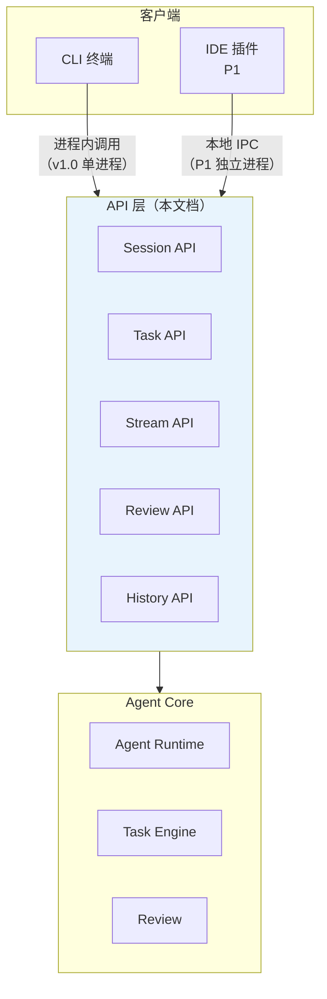
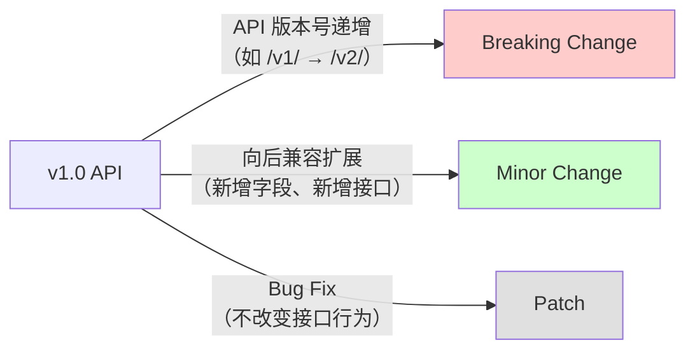

# API — API 设计

> **状态：✅ 完整** — 基于 [Domain Model](Domain%20Model.md) 的实体定义，设计 CLI/IDE 客户端与 Agent Core 之间的接口契约。v1.0 场景为本地进程间通信，接口设计为函数级 TypeScript 定义而非 HTTP REST API。

## 1. API 分层



**v1.0 通信方式**：CLI 与 Agent Core 在同一进程中运行——API 层是 TypeScript 函数接口，不是 HTTP/gRPC。P1 IDE 插件阶段（ADR-0004），如果 IDE 插件在 VS Code Extension Host 中独立运行，需升级 API 层为本地 IPC（Unix domain socket 或命名管道），但**接口契约不变**——这是本 API 文档的核心价值：无论底层是函数调用还是 IPC，上层看到的是同一套接口签名。

## 2. 核心接口概览

| 接口组 | 端点 | 说明 |
|---|---|---|
| Session | `createSession` | 创建新 Session，绑定 Workspace |
| Session | `resumeSession` | 恢复已存在的 Session |
| Session | `closeSession` | 关闭 Session（触发数据清理） |
| Session | `listSessions` | 列出所有 Session（跨 Workspace） |
| Task | `submitTask` | 提交用户任务描述，开始执行 |
| Task | `cancelTask` | 优雅取消当前 Task |
| Task | `forceCancelTask` | 强制取消当前 Task |
| Stream | `subscribeToStream` | 订阅 Session 的执行流 |
| Review | `submitReview` | 提交 Review 决策 |
| History | `getTrajectory` | 获取 Task 的完整执行历史 |

## 3. Session API

```typescript
// === 创建 Session ===
interface CreateSessionRequest {
  workspacePath: string;
  config?: {
    autonomyLevel?: "L1" | "L2" | "L3" | "L4";  // 默认 L2
    modelId?: string;                              // 默认使用用户全局配置
    overrideConfig?: boolean;                      // 是否覆盖 config.yaml 中的设置
  };
}

interface CreateSessionResponse {
  sessionId: string;
  status: "Created" | "Active";
  createdAt: string;  // ISO 8601
}

// === 恢复 Session ===
interface ResumeSessionRequest {
  sessionId: string;
  autoContinue?: boolean;  // true = 跳过恢复确认，直接继续
}

interface ResumeSessionResponse {
  sessionId: string;
  lastTaskId: string;
  lastTurnIdx: number;
  status: SessionStatus;
  warnings?: ResumeWarning[];  // Workspace 一致性校验警告
}

type SessionStatus = "Created" | "Active" | "Paused" | "Interrupted" | "Recovering" | "Completed";

interface ResumeWarning {
  type: "EXTERNAL_MODIFICATION" | "GIT_STATE_CHANGED";
  path: string;
  detail: string;
}

// === 关闭 Session ===
interface CloseSessionResponse {
  sessionId: string;
  status: "Completed";
  cleanupWarnings?: string[];  // 清理过程中的警告
}
```

**Session 创建时的并发控制**：如果在同一 Workspace 已有 Active Session，`createSession` 返回 `Error: WORKSPACE_IN_USE`（对应 [Domain Model §3.1](Domain%20Model.md#31-session-聚合) 的同 Workspace 互斥不变量）。

## 4. Task API

```typescript
// === 提交任务 ===
interface SubmitTaskRequest {
  sessionId: string;
  userPrompt: string;
  context?: {
    attachedFiles?: string[];     // 用户显式 @ 的文件路径
    attachedCode?: string;        // 用户粘贴的代码片段
    previousTaskId?: string;      // 继承上一个 Task 的部分上下文
  };
}

interface SubmitTaskResponse {
  taskId: string;
  status: "TaskCreated";
  estimatedPlan?: string;        // Agent 初步规划的简要描述（如果即时生成）
}

// === 取消任务 ===
interface CancelTaskRequest {
  taskId: string;
  mode: "graceful" | "force";   // 优雅取消 vs 强制取消
}

interface CancelTaskResponse {
  taskId: string;
  status: "Cancelling" | "Cancelled";
  completedTurnIdx: number;     // 最后一个已完成的 Turn
  pendingToolCalls: string[];   // 被中断的进行中工具调用（仅在 force cancel 后）
}
```

**cancelTask 行为差异**（对应 [RFC-0004 §6](file:///D:/code/test/java-coding-agent/AI-Coding-Agent-Spec/03-RFC/RFC-0004%20Task%20Engine.md#6-task-取消与中断)）：
- `graceful`：等待当前 Turn 完成后停止，返回已完成的 Turn 序号和完整 Trajectory
- `force`：立即中断，可能丢弃当前 Turn 的未完成工具调用

## 5. Stream API（流式订阅）

```typescript
// === 事件类型枚举 ===
type StreamEvent =
  // Agent 状态变更
  | { type: "session_status"; data: { sessionId: string; status: SessionStatus } }
  | { type: "task_status"; data: { taskId: string; status: TaskStatus } }

  // Turn 进度
  | { type: "turn_started"; data: { taskId: string; turnIdx: number } }
  | { type: "turn_completed"; data: { taskId: string; turnIdx: number } }

  // LLM Token 流
  | { type: "text_delta"; data: { taskId: string; turnIdx: number; content: string } }
  | { type: "text_done"; data: { taskId: string; turnIdx: number } }

  // 工具调用进度
  | { type: "tool_call_start"; data: { taskId: string; callId: string; toolName: string } }
  | { type: "tool_call_progress"; data: { taskId: string; callId: string; status: string } }
  | { type: "tool_call_end"; data: { taskId: string; callId: string; observation: ObservationSummary } }

  // 需要用户确认
  | { type: "confirmation_required"; data: { taskId: string; turnIdx: number; decision: PermissionDecisionSummary } }

  // Token 用量
  | { type: "token_usage"; data: { taskId: string; turnIdx: number; inputTokens: number; outputTokens: number; estimatedCostUSD: number } }

  // 错误
  | { type: "error"; data: { taskId: string; code: string; message: string; recoverable: boolean } };

// === 订阅接口 ===
interface SubscribeRequest {
  sessionId: string;
  eventTypes?: StreamEvent["type"][];  // 过滤事件类型，不传=全部
}

// 返回 AsyncIterable，v1.0 实现为 Node.js EventEmitter
// P1 IDE 插件升级时为 SSE（Server-Sent Events）或 WebSocket
```

**为什么用 AsyncIterable 而非 WebSocket**：v1.0 CLI 和 Core 在同一进程，AsyncIterable（或者 EventEmitter）是零开销的进程内模式。P1 升级时，Stream API 的接口签名不变（仍然是 `AsyncIterable<StreamEvent>`），底层切换到 SSE/WebSocket。详见 §8 版本演进策略。

## 6. Review API

```typescript
interface SubmitReviewRequest {
  taskId: string;
  decisions: ReviewDecisionInput[];
  batchMode?: "all_accept" | "all_reject";  // 批量模式快捷路径
}

interface ReviewDecisionInput {
  hunkId: string;               // DiffSet 中每个 Hunk 的唯一 ID
  decision: "accept" | "reject" | "edit";
  reason?: string;              // 拒绝理由（会注入下一个 Turn 的 Prompt）
  editedContent?: string;       // 仅 decision=edit 时有效
}

interface SubmitReviewResponse {
  taskId: string;
  acceptedHunks: number;
  rejectedHunks: number;
  editedHunks: number;
  nextAction: "continue" | "complete";
}
```

**与 [RFC-0007 Review](file:///D:/code/test/java-coding-agent/AI-Coding-Agent-Spec/03-RFC/RFC-0007%20Review.md) 状态机的对应**：
- 用户逐 Hunk 审查 → 多次调用 `submitReview`（每次一批 ReviewDecision），直到全部 Hunk 审查完毕
- 用户批量确认 → 一次调用 `submitReview`（`batchMode: "all_accept"`）
- `nextAction: "complete"` 表示所有 Hunk 审查完毕，Agent 进入下一个 Turn
- `nextAction: "continue"` 表示还有 Hunk 待审查，Review 状态机保持在 `ReviewNext` 状态

## 7. History API

```typescript
interface ListTasksRequest {
  workspacePath?: string;       // 过滤特定项目
  olderThan?: string;           // ISO 8601，默认 30 天
  limit?: number;               // 默认 50
  offset?: number;
}

interface TaskSummary {
  taskId: string;
  sessionId: string;
  workspacePath: string;
  userPrompt: string;           // 用户原始输入
  status: TaskStatus;
  turnCount: number;
  createdAt: string;
  completedAt?: string;
}

type ListTasksResponse = TaskSummary[];

// === 获取完整 Trajectory ===
interface GetTrajectoryRequest {
  taskId: string;
  format?: "summary" | "full";  // summary=仅 Turn 元数据，full=含完整 Prompt/Response
}

interface TrajectoryResponse {
  taskId: string;
  turns: TurnDetail[];
}

interface TurnDetail {
  idx: number;
  planState?: object;
  toolCalls: ToolCallDetail[];
  tokenUsage?: { input: number; output: number };
}

interface ToolCallDetail {
  callId: string;
  toolName: string;
  parameters: object;
  observationSummary: { status: string; contentPreview: string };  // summary 模式返回摘要
  observationFull?: { content: string };                           // full 模式返回完整内容
}
```

## 8. 协议与序列化

### 8.1 v1.0：进程内函数调用

当前阶段 API 是 TypeScript 函数接口。所有 DTO（Data Transfer Object）使用 TypeScript 接口定义，无需 JSON 序列化/反序列化。优势：类型安全编译期检查、零序列化开销、直连 Domain Model 实体。

### 8.2 P1：本地 IPC

当 IDE 插件需要独立进程运行时：

- 传输协议：Unix domain socket（macOS/Linux）/ 命名管道（Windows）
- 序列化格式：JSON（保持 Domain Model 的 TypeScript 接口与 IPC JSON 的双向转换由一层薄薄的 IPC Adapter 负责）
- Stream API 映射：`AsyncIterable<StreamEvent>` → SSE（Server-Sent Events），每个 `StreamEvent` 序列化为 `data: {...}\n\n`
- 认证：本地 socket 文件权限控制（只有同一用户可访问），不需要 API Key

**API 文档保持一致**：本文件中定义的接口签名在 IPC 升级后仍然有效——只是把 `function foo(req: FooRequest): Promise<FooResponse>` 映射为 `POST /foo`，参数和返回值类型不变。

## 9. 错误处理规范

```typescript
interface ApiError {
  code: string;          // 机器可读错误码
  message: string;       // 用户可读错误信息（英文）
  taskId?: string;       // 相关 Task（如有）
  recoverable: boolean;  // 用户是否可以从此错误恢复
  details?: object;      // 额外上下文
}
```

**标准错误码清单**（部分）：

| 错误码 | 场景 | recoverable |
|---|---|---|
| `WORKSPACE_IN_USE` | 同一 Workspace 已有 Active Session | true（关闭另一个 Session 后重试） |
| `WORKSPACE_NOT_FOUND` | Workspace 路径不存在 | false（需要修正路径） |
| `SESSION_NOT_FOUND` | 恢复/操作一个不存在的 Session | false |
| `TASK_ALREADY_RUNNING` | 尝试在同一 Session 提交第二个 Task | true（取消当前 Task 后重试） |
| `TASK_CANCELLED` | Task 被用户取消 | true（重新提交 Task） |
| `MAX_RETRIES_EXCEEDED` | Agent 达到最大重试次数上限 | true（用户修改指令后重试） |
| `RESOURCE_EXHAUSTED` | Sandbox 资源超限（内存/CPU/时长） | true（增加资源限制后重试） |
| `PROVIDER_RATE_LIMITED` | LLM Provider 限流 | true（等待后自动重试，或切换 Provider） |
| `CONFIG_INVALID` | 配置文件格式/内容错误 | false（修正配置后重试） |
| `INTERNAL_ERROR` | 未预期的内部错误 | false（需联系技术支持） |

## 10. 版本管理策略



**版本策略**：
- v1.0 阶段 API 版本号跟随产品版本（如 `agent-core@1.0.0` 对应 `API v1`）
- 向后兼容的修改（新增可选字段、新增端点）在 Minor 版本中发布，不改变主版本号
- Breaking change（删除字段、改变字段语义、改变错误码含义）需递增主版本号
- IDE 插件在启动时检查 Core 版本：`core.getVersion()` → 插件判断自己的兼容范围 → 不兼容则提示升级

## 11. 开放问题

- v1.0 是否需要引入 API 文档自动生成（从 TypeScript 接口生成 OpenAPI Schema）——当前阶段不建议，因为 v1.0 没有 HTTP 服务器。P1 IPC 升级时再引入
- `StreamEvent` 事件类型的粒度是否足够——当前 9 种事件类型覆盖了主要进度节点，但真实使用中是否需要更细粒度的事件（如"Agent 正在生成 Plan 中"）
- History API 的全文搜索需求（"搜出我上周问过 'email validation' 的所有 Task"）在 v1.0 是否必要——当前设计只有按时间/Workspace 过滤。如果此需求高频，需要引入 SQLite FTS5 对 `task.user_prompt` 做全文索引
