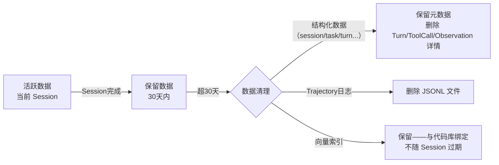

# Database — 数据库设计

> **状态：✅ 完整** — 基于 [Domain Model §7](Domain%20Model.md#7-与持久化模型和-api-的映射层次) 的映射约定，将核心实体落实到 SQLite 表结构。向量索引和文件存储见 §4-§5。

## 1. 存储选型总览

| 数据类型 | 存储引擎 | 位置 | 理由 |
|---|---|---|---|
| 结构化数据（Session/Task/Turn/ToolCall/Observation/Snapshot/PermissionDecision） | **SQLite** | `~/.agent/data.db` | 本地优先（[Product Philosophy](../00-Vision/Product%20Philosophy.md)）、零配置、单文件便携、支持全文检索（FTS5） |
| Trajectory 全量日志（每个 Turn 的完整 Prompt/Response） | **JSON Lines 文件** | `~/.agent/trajectories/{sessionId}/` | 体积大、增长快、独立的数据生命周期、便于压缩归档 |
| 向量索引（Context Engine Embedding） | **SQLite + 本地向量扩展** 或 **独立向量文件** | `~/.agent/index/` | 见 §4 向量索引存储 |
| 配置文件 | **YAML/JSON** | `~/.agent/config.yaml` | 非数据库范畴，用户可手动编辑 |

**为什么不用 PostgreSQL/MySQL**：v1.0 单机部署不需要 C/S 架构数据库。SQLite 满足了"零安装、零配置、零运维"的本地优先目标，且 WAL 模式下读写并发性能对 Agent 的工作负载（单 Session 单线程，偶尔跨 Workspace 多 Session 并发）完全足够。P2 Cloud Agent 阶段（[RFC-0011](../03-RFC/RFC-0011%20Cloud%20Agent.md)）再评估分布式数据库需求。

## 2. 核心表结构

### 2.1 session 表

```sql
CREATE TABLE session (
    id              TEXT PRIMARY KEY,          -- UUID
    workspace_path  TEXT NOT NULL,             -- 项目根目录绝对路径
    autonomy_level  TEXT NOT NULL DEFAULT 'L2', -- L1|L2|L3|L4
    model_id        TEXT NOT NULL,             -- 如 'claude-sonnet-4-20250514'
    status          TEXT NOT NULL DEFAULT 'Created', -- Created|Active|Paused|Interrupted|Recovering|Completed
    created_at      TEXT NOT NULL DEFAULT (datetime('now')),
    last_active_at  TEXT NOT NULL DEFAULT (datetime('now'))
);

CREATE INDEX idx_session_status ON session(status);
CREATE INDEX idx_session_workspace ON session(workspace_path);
CREATE UNIQUE INDEX idx_session_active_workspace ON session(workspace_path)
    WHERE status = 'Active';  -- 保证同一 Workspace 同时只有一个 Active Session
```

### 2.2 task 表

```sql
CREATE TABLE task (
    id              TEXT PRIMARY KEY,          -- UUID
    session_id      TEXT NOT NULL REFERENCES session(id),
    user_prompt     TEXT NOT NULL,             -- 用户原始输入
    status          TEXT NOT NULL DEFAULT 'TaskCreated', -- TaskCreated|Running|WaitingUser|TaskCompleted|TaskFailed
    retry_count     INTEGER NOT NULL DEFAULT 0,
    created_at      TEXT NOT NULL DEFAULT (datetime('now')),
    completed_at    TEXT
);

CREATE INDEX idx_task_session ON task(session_id);
CREATE INDEX idx_task_status ON task(status);
CREATE INDEX idx_task_created ON task(created_at DESC);  -- 历史查询排序
```

### 2.3 turn 表

```sql
CREATE TABLE turn (
    idx             INTEGER NOT NULL,          -- Task 内递增，从 0 开始
    task_id         TEXT NOT NULL REFERENCES task(id),
    plan_state      TEXT,                      -- Plan 状态的 JSON 快照
    started_at      TEXT NOT NULL DEFAULT (datetime('now')),
    completed_at    TEXT,
    PRIMARY KEY (task_id, idx)
);
```

### 2.4 tool_call 表

```sql
CREATE TABLE tool_call (
    call_id         TEXT PRIMARY KEY,          -- UUID
    task_id         TEXT NOT NULL REFERENCES task(id),
    turn_idx        INTEGER NOT NULL,
    tool_name       TEXT NOT NULL,             -- 'read_file'|'write_file'|'execute_command'|...
    parameters      TEXT NOT NULL,             -- JSON
    status          TEXT NOT NULL,             -- pending|running|success|error|cancelled
    duration_ms     INTEGER,
    started_at      TEXT NOT NULL DEFAULT (datetime('now')),
    FOREIGN KEY (task_id, turn_idx) REFERENCES turn(task_id, idx)
);

CREATE INDEX idx_tool_call_task ON tool_call(task_id);
CREATE INDEX idx_tool_call_tool_name ON tool_call(tool_name);  -- 审计查询"上次调用 X 工具是什么时候"
```

### 2.5 observation 表

```sql
CREATE TABLE observation (
    call_id                 TEXT PRIMARY KEY REFERENCES tool_call(call_id),
    status                  TEXT NOT NULL,     -- success|error|partial
    content                 TEXT NOT NULL,     -- 工具输出内容（截断后）
    error_code              TEXT,              -- VALIDATION_ERROR|TIMEOUT|PERMISSION_DENIED|...
    exit_code               INTEGER,          -- 命令退出码
    truncated               INTEGER NOT NULL DEFAULT 0,  -- 0|1
    truncated_original_len  INTEGER           -- 截断前原始长度
);
```

### 2.6 snapshot 表（Task Engine 快照）

```sql
CREATE TABLE snapshot (
    id              TEXT PRIMARY KEY,          -- UUID
    task_id         TEXT NOT NULL REFERENCES task(id),
    turn_idx        INTEGER NOT NULL,
    plan_state      TEXT NOT NULL,             -- Plan 状态序列化（JSON）
    modified_files  TEXT NOT NULL DEFAULT '[]', -- JSON array of {path, mtime, sha256}
    created_at      TEXT NOT NULL DEFAULT (datetime('now')),
    FOREIGN KEY (task_id, turn_idx) REFERENCES turn(task_id, idx)
);

CREATE INDEX idx_snapshot_task ON snapshot(task_id);
CREATE INDEX idx_snapshot_task_turn ON snapshot(task_id, turn_idx DESC);  -- 取最近快照
```

**保留策略**：同一 Task 只保留最近 3 个 Snapshot 行（[RFC-0004 §4.1](file:///D:/code/test/java-coding-agent/AI-Coding-Agent-Spec/03-RFC/RFC-0004%20Task%20Engine.md#41-快照粒度)）。在写入新 Snapshot 时，如果该 Task 已有 ≥3 个，删除最旧的。此逻辑在应用层实现（SQLite 不内置滑动窗口删除），通过事务保证一致性。

### 2.7 permission_decision 表

```sql
CREATE TABLE permission_decision (
    id              TEXT PRIMARY KEY,          -- UUID
    task_id         TEXT NOT NULL REFERENCES task(id),
    turn_idx        INTEGER NOT NULL,
    tool_name       TEXT NOT NULL,
    risk_tier       TEXT NOT NULL,             -- low|medium|high|critical
    decision        TEXT NOT NULL,             -- allowed|needs_confirmation|denied
    reason          TEXT NOT NULL,             -- 判定理由（可解释性）
    was_escalated   INTEGER NOT NULL DEFAULT 0, -- 0|1
    created_at      TEXT NOT NULL DEFAULT (datetime('now')),
    FOREIGN KEY (task_id, turn_idx) REFERENCES turn(task_id, idx)
);

CREATE INDEX idx_permission_task ON permission_decision(task_id);
CREATE INDEX idx_permission_decision ON permission_decision(decision);
```

## 3. Trajectory 全量日志（文件存储）

Trajectory 日志体积大（每个 Turn 包含完整 LLM Prompt/Response，可达数十 KB），不适合放在 SQLite 中（会显著拖慢查询和增加 WAL 体积）。使用 JSON Lines 文件独立存储：

**存储路径**：`~/.agent/trajectories/{sessionId}/{taskId}.jsonl`

**每行格式**：
```json
{
  "turnIdx": 3,
  "startedAt": "2026-07-21T10:30:00Z",
  "modelId": "claude-sonnet-4-20250514",
  "request": {
    "systemPrompt": "...",
    "messages": [{ "role": "user", "content": "..." }],
    "tools": ["...tool definitions..."],
    "estimatedInputTokens": 45000
  },
  "response": {
    "text": "...",
    "toolCalls": [{ "callId": "uuid", "toolName": "read_file", "parameters": {} }],
    "outputTokens": 3200
  },
  "toolCallResults": [
    { "callId": "uuid", "observation": { "status": "success", "content": "..." } }
  ]
}
```

**存储量级预估**：

| 场景 | 单 Turn 大小 | 日活跃 Session（10 Turn/天） | 30 天总量 |
|---|---|---|---|
| 小型任务（简单问答） | ~5 KB | ~50 KB | ~1.5 MB |
| 中型任务（多文件修改） | ~30 KB | ~300 KB | ~9 MB |
| 重型任务（长上下文+多轮工具调用） | ~80 KB | ~800 KB | ~24 MB |

**压缩/归档策略**：
- 写入时不做压缩（JSON Lines 便于逐行查询）
- 保留策略默认 30 天，可配置为 7/30/90 天或"永不过期"
- 超期日志自动删除，用户可通过 `agent history --task <id>` 在删除前保存到自定义路径
- 如果用户需要长期存档，可在保留策略到期前手动导出为 `.tar.gz`

## 4. 向量索引存储

Context Engine（[RFC-0002](file:///D:/code/test/java-coding-agent/AI-Coding-Agent-Spec/03-RFC/RFC-0002%20Context%20Engine.md)）需要存储代码片段的 Embedding 向量，供语义检索使用。

**存储方案**（v1.0）：

| 组件 | 存储 | 说明 |
|---|---|---|
| 符号索引（函数/类/变量位置） | SQLite FTS5 全文索引 | 支持高效符号名搜索 |
| 语义向量索引（Embedding） | SQLite + sqlite-vec 扩展（零依赖向量扩展） | 在 SQLite 内直接存储和检索向量，不需要额外进程 |
| 依赖图（调用关系/import关系） | SQLite `dependency_graph` 表 | `(source_symbol TEXT, target_symbol TEXT, relation_type TEXT)` |

**为什么用 sqlite-vec 而非 Chroma/Milvus**：
- sqlite-vec 是 SQLite 的纯向量扩展，零额外进程、零网络配置——与"本地优先"完全一致
- v1.0 代码库规模（1-10 万行）的向量索引在 sqlite-vec 上检索延迟 < 5ms，满足 [RFC-0002 §10](file:///D:/code/test/java-coding-agent/AI-Coding-Agent-Spec/03-RFC/RFC-0002%20Context%20Engine.md#10-验收标准) 的性能要求
- 如果未来需要更高性能（百万行级），可升级为独立向量服务——此时 SQLite 表结构不需要变化，只需替换向量检索后端

**向量表结构**：
```sql
CREATE VIRTUAL TABLE embedding_index USING vec0(
    chunk_id    INTEGER PRIMARY KEY,
    file_path   TEXT NOT NULL,
    symbol_name TEXT,           -- 如果是函数/类内，关联的符号名
    chunk_text  TEXT NOT NULL,  -- 代码片段原文（用于 Reranking 阶段的文本对比）
    start_line  INTEGER NOT NULL,
    end_line    INTEGER NOT NULL,
    embedding   FLOAT[384]     -- 384 维向量（all-MiniLM-L6-v2，见 ADR-0003）
);
```

**索引更新策略**：与 [RFC-0002 §4](file:///D:/code/test/java-coding-agent/AI-Coding-Agent-Spec/03-RFC/RFC-0002%20Context%20Engine.md#4-索引构建) 的增量更新一致——文件变更事件触发时，仅重新解析和嵌入变更文件对应的 chunk，删除旧向量行并插入新行，不重建整个索引表。

## 5. 加密与安全

### 5.1 数据库加密

SQLite 数据库文件不主动应用全库加密（SQLite 原生不支持，需要 SQLCipher 扩展）。v1.0 的安全假设是：数据库文件存储在用户本地计算机上，受操作系统文件权限保护。如果在企业场景（[RFC-0019 Enterprise](../03-RFC/RFC-0019%20Enterprise.md) P2）需要增强保护，可升级为 SQLCipher。

### 5.2 敏感字段加密

个别敏感字段在写入 SQLite 前进行应用层加密：

| 字段 | 存储表 | 加密方式 |
|---|---|---|
| LLM API Key | 不存数据库——存操作系统密钥链（macOS Keychain / Linux Secret Service / Windows Credential Manager） | N/A |
| user_prompt（任务描述） | task 表 | 明文——用户输入不含 API 密钥，且可解释性需求要求日志可读 |
| ToolCall.parameters（可能含敏感数据如 API 密钥测试用例） | tool_call 表 | 默认**不存储**完整参数——Observation.content 中如果检测到疑似密钥模式（正则匹配），在存储前脱敏 |

**自动脱敏**：在 Observation.content 写入 SQLite 前，检测内容是否匹配已知 API 密钥格式（如 `sk-*`、`ghp_*`、`AKIA*` 模式），命中则替换为 `[REDACTED]`。这是纯应用层逻辑，不影响 Agent 推理（推理发生在脱敏之前，Agent 能看到原始内容但在 Trajectory 日志中不会留下密钥）。

## 6. 数据生命周期策略



| 数据 | 默认保留期 | 可配置范围 | 用户主动清理方式 |
|---|---|---|---|
| session/task 元数据（id, prompt, status, 时间） | 永久 | 永久 | `agent clean --all` |
| turn/tool_call/observation 详情 | 30 天 | 7/30/90天/永久 | `agent clean --older-than 7d` |
| permission_decision | 30 天 | 7/30/90天/永久 | 同上 |
| snapshot | 仅保留最近3个，Task 完成后不再保留 | N/A | N/A |
| Trajectory JSONL 日志 | 30 天 | 7/30/90天/永久 | `agent clean --trajectories` |
| 向量索引 | 与代码库绑定 | 手动重建 | `agent index --rebuild` |

## 7. 未来云端同步的 Schema 兼容性（P2 预留）

v1.0 不做云端同步，但为未来扩展预留兼容性：

- 所有表主键使用 UUID（而非自增 ID）——UUID 在云端汇聚时无冲突
- session.workspace_path 存储绝对路径——云端同步时需映射为用户标识+项目标识。当前字段类型为 TEXT，未来可通过新增 `workspace_id` 列完成映射而不破坏已有数据
- Trajectory JSONL 文件中的 `modelId` 字段不绑定特定 Provider——当模型通过 Model Router 调用时，Provider 信息在 JSONL 的 `request` 对象中单独存储

> **设计原则**：不做"为不存在的需求预先设计复杂方案"（如不在 v1.0 引入分库分表、读写分离、CockroachDB 兼容性），但做"避免写死只能单机使用的字段语义"（如不用自增 ID、不硬编码 Provider 名称到顶层字段）。
