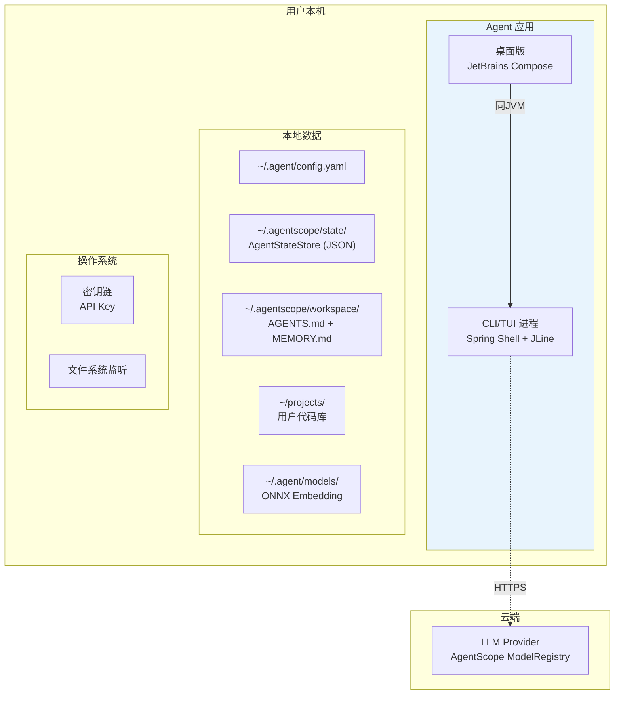

# Deployment — 部署架构

> **状态：✅ 完整** — 基于 [ADR-0006](../08-ADR/ADR-0006-java-agentscope.md)（Java + AgentScope + GraalVM）。修订分发方案为 SDKMAN、Maven Central、GraalVM native-image。

## 1. 本地单机部署拓扑（v1.0）



## 2. 安装与分发

| 渠道 | 目标用户 | 命令 |
|---|---|---|
| **SDKMAN** | Java 开发者 | `sdk install agent-coding` |
| **Maven Central** | 项目集成 | 添加 `io.agent.coding:agent-core` 依赖 |
| **GraalVM native-image** | 无 JDK 用户 | 单文件二进制 ~30MB |
| **Homebrew** | macOS 用户 | `brew install agent-coding` |

## 3. 配置文件

```yaml
# ~/.agent/config.yaml
agent:
  name: "coding-agent"

model:
  default: "qwen:qwen-plus"
  providers:
    qwen:     { apiKey: "from-keychain" }
    deepseek: { apiKey: "from-keychain" }
    ollama:   { baseUrl: "http://localhost:11434" }

autonomy:
  defaultLevel: "L2"

context:
  embeddingModel: "local"
  indexExcludePaths: ["node_modules", "dist", ".git"]

git:
  defaultCommitStrategy: "suggest"

sensitiveFiles:
  excludePatterns: ["**/.env", "**/*.pem", "**/*.key"]
```

## 4. 跨平台

| 组件 | macOS | Linux | Windows |
|---|---|---|---|
| Sandbox 隔离 | AgentScope Sandbox 统一抽象 | 同 | 同 |
| 文件监听 | FSEvents | inotify | ReadDirectoryChangesW |
| 密钥链 | Keychain | Secret Service | Credential Manager |
| 原生二进制 | GraalVM Mach-O | GraalVM ELF | GraalVM PE |

**关键简化**：AgentScope 的 Sandbox 抽象统一了三平台隔离实现——不再需要维护三套平台特定的 Sandbox 代码。

## 5. 桌面版

桌面版（JetBrains Compose Desktop）与 CLI 共享同一 JVM 中的 AgentService Bean，直接方法调用，不需要 IPC。

## 6. 资源基线

| 状态 | CPU | 内存 | 说明 |
|---|---|---|---|
| 空闲 | < 1% | ~80 MB（JVM模式）/ ~50 MB（native-image） | |
| 索引构建 | 100%（单核）1-5 min | +300 MB | 10万行代码初始索引 |
| Task 执行 | 5-20% | +200-400 MB | AgentScope 自动管理内存 |

GraalVM native-image：冷启动 < 200ms，空闲内存 ~50 MB。

## 7. 验收标准

1. `sdk install agent-coding` 后 `agent --version` 正确输出
2. native-image 二进制冷启动 < 500ms
3. 三平台原生二进制正常运行
4. 首次运行自动创建 `~/.agentscope/state/` 和 `~/.agent/` 目录结构
