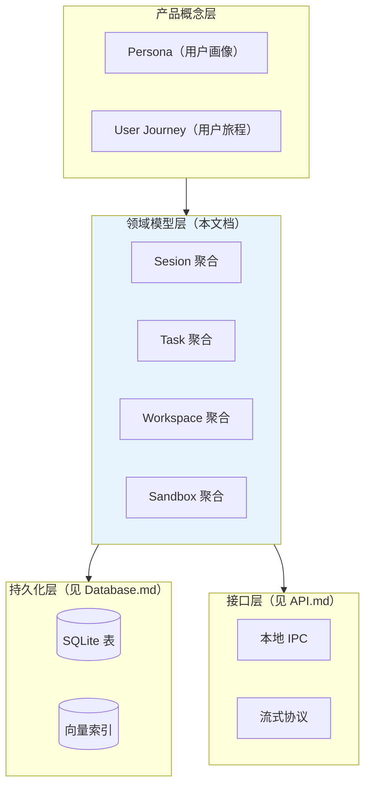
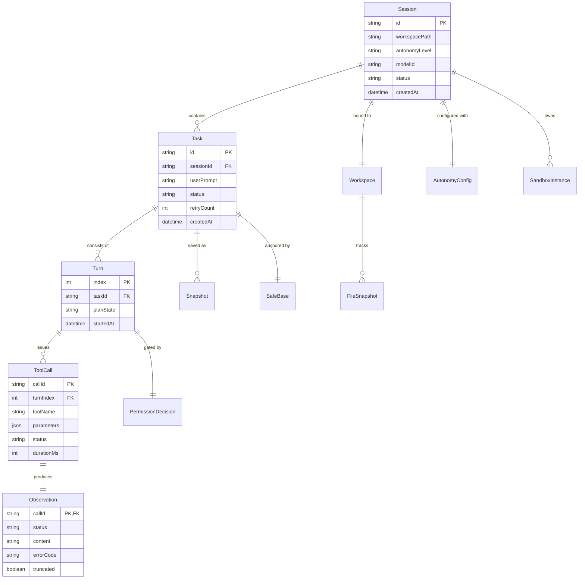
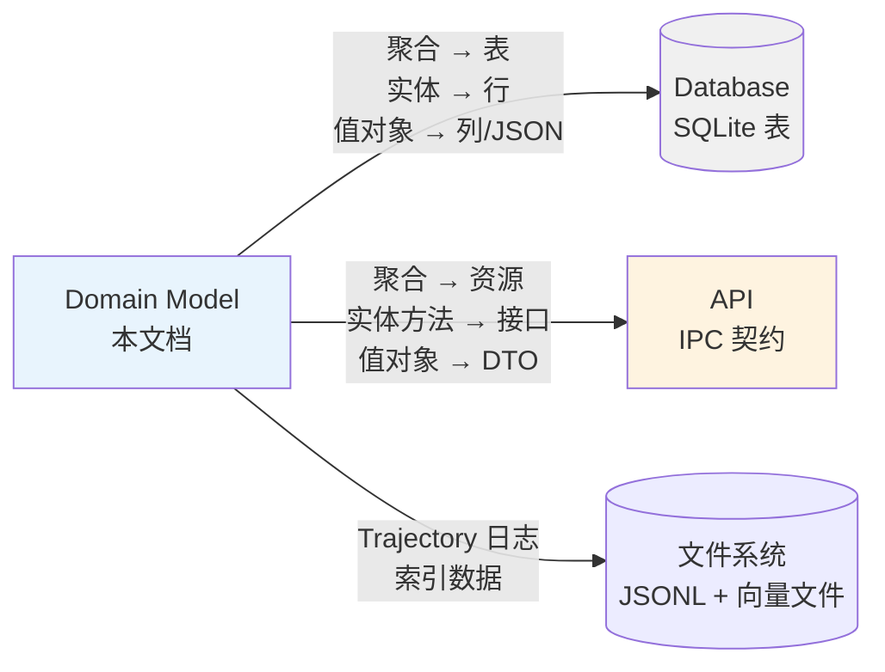

# Domain Model — 领域模型

> **状态：✅ 完整** — 统一汇总 10 篇 P0 RFC 中分散定义的实体、值对象、聚合、领域事件。本文档是 [Database.md](Database.md) 和 [API.md](API.md) 设计的直接输入。

## 1. 层次划分

> **说明**：产品概念层（详见 [01-Product](../01-Product/)）定义了用户视角的信息实体。本文档聚焦技术层的领域建模——产品概念和技术实体之间可能存在一对多/多对一映射（见 [Information Architecture.md](../01-Product/Information%20Architecture.md) 大纲）。两层的对齐关系在本文档不做主述。

## 2. 实体关系总览

## 3. 聚合根

### 3.1 Session 聚合

**定义**：一个 Agent 运行实例的完整生命周期容器。生命周期从用户启动 Agent 到用户退出（或进程崩溃）——对应 [RFC-0004 §3.1](../03-RFC/RFC-0004%20Task%20Engine.md#31-session-生命周期状态机) 的状态机。

**不变量**：
- 同一 Workspace 路径下同时只允许一个 Active 状态的 Session（[RFC-0004 §5](../03-RFC/RFC-0004%20Task%20Engine.md#5-并发-session-管理)）
- Session 状态为 `Active` 时，其 `workspacePath` 不可变更

**包含的实体**：Task（1..n）、SandboxInstance（0..1，按需创建）

**包含的值对象**：AutonomyConfig

**生命周期状态**（详见 [RFC-0004 §3.1](../03-RFC/RFC-0004%20Task%20Engine.md#31-session-生命周期状态机)）：`Created → Active → Paused/Interrupted → Recovering → Active → Completed`

### 3.2 Task 聚合

**定义**：Session 内的一次用户请求——用户在会话中说了一句话（"帮我加个邮箱验证功能"），这就是一个 Task。一个 Session 可包含多个连续 Task。

**不变量**：
- Task 的 `sessionId` 不可变更（Task 不能跨 Session 迁移）
- 同一 Session 内同一时刻只有一个 Task 处于 `Running` 状态

**包含的实体**：Turn（1..n）、Snapshot（0..n）

**包含的值对象**：userPrompt、SafeBase

**生命周期状态**：`TaskCreated → Running → WaitingUser → Running → TaskCompleted | TaskFailed`

### 3.3 Workspace 聚合

**定义**：一个项目目录的文件系统抽象，为 Tool Runtime 提供统一的文件读写和变更追踪接口。详细设计见 [RFC-0006 Workspace](../03-RFC/RFC-0006%20Workspace.md)。

**不变量**：
- Workspace 的 `rootPath` 不可变更（一旦绑定到目录，不移至其他路径）
- WriteIntent 只有持有者（同一 Task）可写入对应文件

**包含的实体**：FileSnapshot（0..n）、ChangeEvent（领域事件）

**注意**：Workspace 本身不是"存储层实体"——它没有 ID、不持久化到数据库。Workspace 是"文件系统的运行时抽象"，它的 FileSnapshot 用于 Diff 生成，但不需要独立持久化（持久化由 Task Engine 的 Snapshot 负责）。

### 3.4 Sandbox 聚合（运行时聚合）

**定义**：一个隔离执行环境实例。与 Session 一对一绑定，Session 结束时销毁。详细设计见 [RFC-0014 Sandbox](../03-RFC/RFC-0014%20Sandbox.md)。

**注意**：Sandbox 是**纯运行时聚合**——它在 Agent 运行期间存在，关闭即销毁，不持久化任何状态。这也是它与其他聚合最大的不同：其他聚合有持久化对应物，Sandbox 只有内存态。

## 4. 实体详细定义

以下只列出跨 RFC 共享的核心实体。单一 RFC 内的辅助实体（如 DiffSet、Hunk、ReviewDecision 等）在各自 RFC 中定义，本文档不做重复。

### 4.1 Session

| 字段 | 类型 | 说明 |
|---|---|---|
| `id` | string (UUID) | 唯一标识 |
| `workspacePath` | string | 绑定的项目根目录绝对路径 |
| `autonomyLevel` | enum: L1/L2/L3/L4 | 当前自主性级别（来自 [RFC-0015](../03-RFC/RFC-0015%20Permission.md) §3） |
| `modelId` | string | 当前使用的模型 ID（来自 [RFC-0012 Model Router](../03-RFC/RFC-0012%20Model%20Router.md)） |
| `status` | enum: Created/Active/Paused/Interrupted/Recovering/Completed | 生命周期状态 |
| `createdAt` | datetime | 创建时间 |
| `lastActiveAt` | datetime | 最后活跃时间（任何 Task 执行或用户交互） |

### 4.2 Task

| 字段 | 类型 | 说明 |
|---|---|---|
| `id` | string (UUID) | 唯一标识 |
| `sessionId` | string FK → Session.id | 所属 Session |
| `userPrompt` | string | 用户的原始输入文本 |
| `status` | enum: TaskCreated/Running/WaitingUser/TaskCompleted/TaskFailed | 持久化状态（来自 [RFC-0004 §3.2](../03-RFC/RFC-0004%20Task%20Engine.md#32-task-持久化状态对应-agent-runtime-状态机)） |
| `retryCount` | int | Agent 在 PartialFailure 后的累计重试次数 |
| `createdAt` | datetime | 创建时间 |
| `completedAt` | datetime? | 完成时间（Task 结束时写入） |

### 4.3 Turn

| 字段 | 类型 | 说明 |
|---|---|---|
| `index` | int（Task 内递增） | Turn 在 Task 内的序号，从 0 开始 |
| `taskId` | string FK → Task.id | 所属 Task |
| `planState` | string (JSON) | 当前 Turn 执行时的 Plan 状态快照 |
| `startedAt` | datetime | Turn 开始时间 |
| `completedAt` | datetime? | Turn 完成时间 |

**注意**：Turn 的 LLM 完整 Prompt/Response 不存储在 Turn 实体中——它们体积大且有独立的数据生命周期，存储在独立的 Trajectory 日志中（见 [Database.md](Database.md) §3）。

### 4.4 ToolCall

**建模决策**：ToolCall 和对应的 Observation 作为独立实体——不是内嵌在 Turn 中。理由：
- 审计需求：需要能查询"Agent 上一次调用 `execute_command` 是什么时候，参数是什么"，如果内嵌在 Turn 中需要解析 JSON 再过滤
- 成本追踪：每个 ToolCall 关联的 TokenUsage 需要独立查询和聚合（[RFC-0012 §8](../03-RFC/RFC-0012%20Model%20Router.md#8-成本追踪埋点) 成本埋点依赖此结构）
- 重放能力：独立的 ToolCall + Observation 使得调试时可精确重放单次工具调用

| 字段 | 类型 | 说明 |
|---|---|---|
| `callId` | string (UUID) | 唯一标识（由 LLM 生成或 Agent Runtime 分配） |
| `turnIndex` | int FK → Turn.index | 所属 Turn |
| `taskId` | string FK → Task.id | 所属 Task（冗余，避免 join Turn 表） |
| `toolName` | string | 工具名，如 `read_file`、`execute_command` |
| `parameters` | JSON | 调用参数（JSON Schema 定义来自 [RFC-0003 §3](../03-RFC/RFC-0003%20Tool%20Runtime.md#3-工具注册机制)） |
| `status` | enum: pending/running/success/error/cancelled | 执行状态 |
| `durationMs` | int | 执行耗时 |
| `startedAt` | datetime | 开始时间 |

### 4.5 Observation

| 字段 | 类型 | 说明 |
|---|---|---|
| `callId` | string PK, FK → ToolCall.callId | 与 ToolCall 一一对应 |
| `status` | enum: success/error/partial | 结果状态（来自 [RFC-0003 §6](../03-RFC/RFC-0003%20Tool%20Runtime.md#6-observation-结构定义)） |
| `content` | text | 工具输出的文本内容（最大 50KB 截断前原始长度） |
| `errorCode` | string? | 标准化错误码（VALIDATION_ERROR/TIMEOUT/PERMISSION_DENIED/...） |
| `exitCode` | int? | 进程退出码（仅命令执行工具有意义） |
| `truncated` | boolean | 输出是否因超长被截断 |
| `truncatedOriginalLength` | int? | 截断前原始长度 |

### 4.6 Snapshot（Task Engine 快照）

| 字段 | 类型 | 说明 |
|---|---|---|
| `id` | string (UUID) | 唯一标识 |
| `taskId` | string FK → Task.id | 所属 Task |
| `turnIndex` | int | 快照对应的 Turn 序号（Turn 完成后生成） |
| `planState` | string (JSON) | Plan 状态序列化 |
| `modifiedFiles` | JSON array of {path, mtime, sha256} | 本 Turn 中 Agent 修改过的文件清单（用于恢复时的 Workspace 一致性校验，[RFC-0004 §4.2](../03-RFC/RFC-0004%20Task%20Engine.md#42-session-恢复流程)） |
| `createdAt` | datetime | 快照创建时间 |

### 4.7 FileSnapshot（Workspace 层）

| 字段 | 类型 | 说明 |
|---|---|---|
| `path` | string | 文件路径（相对 Workspace root） |
| `mtime` | number | 修改时间戳 |
| `sha256` | string | 文件内容 SHA-256 哈希 |
| `size` | number | 文件大小（bytes） |

**注意**：FileSnapshot 是纯运行时值对象——它在内存中创建和比较，不独立持久化。持久化版本由 Task Engine 的 Snapshot.modifiedFiles 字段承载（仅存储被 Agent 修改过的文件的 FileSnapshot）。

### 4.8 PermissionDecision

**建模决策**：独立实体——不是内嵌在 Turn 中。理由：
- 审计需求：需要追踪"Agent 在那个时间点被允许/拒绝了什么操作"，这是 [Product Philosophy](../00-Vision/Product%20Philosophy.md) 可解释性支柱的技术落地
- Pattern 分析：用户可能想查询"最近我拒绝了哪些类型的操作"，用于判断是否该调整自主性级别

| 字段 | 类型 | 说明 |
|---|---|---|
| `id` | string (UUID) | 唯一标识 |
| `turnIndex` | int FK → Turn.index | 判定发生的 Turn |
| `taskId` | string FK → Task.id | 所属 Task |
| `toolName` | string | 工具名 |
| `riskTier` | enum: low/medium/high/critical | 风险级别 |
| `decision` | enum: allowed/needs_confirmation/denied | 判定结果 |
| `reason` | string | 判定理由（可解释性——"当前自主性级别 L2，write 操作需确认"） |
| `wasEscalated` | boolean | 是否触发了逃生舱口（[RFC-0014 §7](../03-RFC/RFC-0014%20Sandbox.md#7-权限提升逃生舱口)） |
| `createdAt` | datetime | 判定时间 |

## 5. 值对象清单

以下是不需要独立标识（无 ID、生命周期依附于父实体）的值对象：

| 值对象 | 依附于 | 定义来源 |
|---|---|---|
| `AutonomyConfig` | Session | [RFC-0015 §3](../03-RFC/RFC-0015%20Permission.md)：`{ level, sessionTrust: SessionTrust[] }` |
| `SessionTrust` | Session.AutonomyConfig | [RFC-0015 §6](../03-RFC/RFC-0015%20Permission.md)：临时信任记录 `{ toolName, riskTier, grantedAt }` |
| `SafeBase` | Task | [RFC-0008 §2](../03-RFC/RFC-0008%20Git.md)：`{ branchName, headCommitHash, stashedChangesRef? }` |
| `Context Card` | 无（注入后即消费） | [RFC-0002 §2](../03-RFC/RFC-0002%20Context%20Engine.md)：`{ filePath, content, sourceType, relevanceScore }` |
| `DiffSet` | Task（Review 阶段） | [RFC-0007 §2](../03-RFC/RFC-0007%20Review.md)：`{ files: DiffFile[], hunks: Hunk[] }` |
| `ReviewDecision` | DiffSet.Hunk | [RFC-0007 §2](../03-RFC/RFC-0007%20Review.md)：`{ decision, reason? }` |
| `ResourceLimit` | SandboxInstance | [RFC-0014 §2](../03-RFC/RFC-0014%20Sandbox.md)：`{ maxCpu, maxMemoryMB, maxDurationMs }` |
| `TokenUsage` | ToolCall | [RFC-0012 §8](../03-RFC/RFC-0012%20Model%20Router.md)：`{ inputTokens, outputTokens, estimatedCostUSD }` |

**Context Card 为什么是值对象而非实体**：Context Card 的生命周期很短——它在每个 Turn 开始时由 Context Engine 生成、注入到 Prompt 中、被 LLM 消费后就完成了使命。没有需要跨 Turn 追踪 Context Card 的场景，给它分配独立 ID 和持久化带来的价值不匹配其复杂度。

## 6. 领域事件

以下是在各 RFC 中定义的、需要跨聚合通信的关键领域事件：

| 事件 | 发布方 | 订阅方 | 说明 |
|---|---|---|---|
| `FileChanged` | Workspace | Context Engine（[RFC-0002 §4](../03-RFC/RFC-0002%20Context%20Engine.md#4-索引构建)） | 触发增量索引重建 |
| `TurnCompleted` | Agent Runtime | Task Engine（[RFC-0004 §4.1](../03-RFC/RFC-0004%20Task%20Engine.md#41-快照粒度)） | 触发快照持久化 |
| `PermissionDecided` | Permission | Telemetry（[RFC-0016](../03-RFC/RFC-0016%20Telemetry.md) 大纲） | 记录审计日志 |
| `TokenConsumed` | Model Router | Telemetry | 记录成本追踪数据 |
| `SandboxCreated` / `SandboxDestroyed` | Sandbox | Task Engine | Session 生命周期联动——Session 结束时 Task Engine 确认 Sandbox 已销毁 |
| `SessionStatusChanged` | Task Engine | CLI/IDE（UI 层） | 驱动 UI 状态展示（Agent 当前状态实时变化） |

> **说明**：v1.0 单进程架构下，这些"事件"在实现上是进程内 EventEmitter 调用而非分布式消息队列——后者留待 P2 Cloud Agent 场景启用。见 [Event Bus.md](Event%20Bus.md) 大纲。

## 7. 与持久化模型和 API 的映射层次

- **Domain Model → Database**：聚合根映射为表，实体映射为行，值对象内嵌为 JSON 列或关联列。详细表结构见 [Database.md](Database.md) §2。
- **Domain Model → API**：聚合根映射为 REST 资源（或 IPC 端点），实体的操作方法映射为接口动词。详细接口定义见 [API.md](API.md) §2。

## 8. 本地专属 vs 未来云端可同步

呼应大纲核心问题 6——明确哪些实体需要在建模时预留云端同步的兼容性（不要求 v1.0 实现，但不要锁死路径）：

| 实体 | v1.0 范围 | 未来云端同步考量 |
|---|---|---|
| Session 元数据（id, workspacePath, createdAt...） | 本地 SQLite | 结构上可序列化为云端格式，不做字段级修改即可同步 |
| Task / Turn / ToolCall / Observation / PermissionDecision | 本地 SQLite | 同上，核心审计数据，企业场景（[RFC-0019 Enterprise](../03-RFC/RFC-0019%20Enterprise.md) P2）可能需要同步到审计平台 |
| Trajectory 全量日志 | 本地文件（JSON Lines） | 体积大，云端同步建议选择性上传而非全量 |
| SandboxInstance | **永不持久化** | 纯运行时聚合，云端有自己的 Sandbox 实例管理 |
| FileSnapshot | **不独立持久化** | 无意义——文件状态与物理文件系统绑定 |
| Context Card | **不持久化** | 无意义——消费即销毁 |

> **设计原则**：所有"可能同步到云端"的实体，其 schema 设计不引入"只有本地才合理的字段类型"（如文件路径引用本地绝对路径——改为相对于 Workspace root 的相对路径）。具体同步策略见 [RFC-0011 Cloud Agent](../03-RFC/RFC-0011%20Cloud%20Agent.md) P2 预留。
