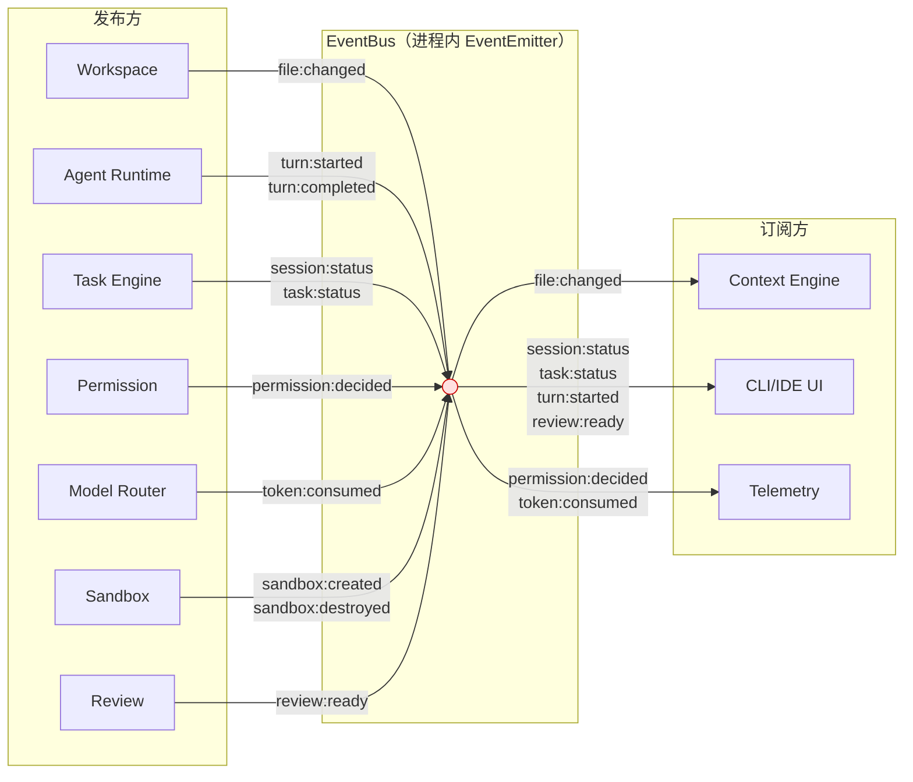

# Event Bus — 事件总线

> **状态：✅ 完整** — 基于 ADR-0001（单进程 TypeScript）、ADR-0005（自定义轻量 Telemetry）以及 [Domain Model §6](Domain%20Model.md#6-领域事件) 的领域事件清单，定义 v1.0 的事件通信机制与 P2 可替换性设计。

## 1. 事件总线的必要性论证

v1.0 单进程架构下（[Overall Architecture §5.1](Overall%20Architecture.md#51-本地单机模式v10-主要形态)），Agent Core 所有模块在同一进程中。这引出一个根本问题：**是否需要事件总线，而不是直接函数调用？**

**回答：需要，但它是进程内轻量的 EventEmitter，不是独立中间件。**

| 通信场景 | 走事件总线 | 直接函数调用 | 理由 |
|---|---|---|---|
| Agent Runtime → Tool Runtime：执行工具调用 | ❌ | ✅ | 这是同步的请求-响应模式，Agent Runtime 需要等待工具执行结果才能继续下一个 Turn。事件总线（fire-and-forget）不适合 |
| Workspace 文件变更 → Context Engine：增量索引 | ✅ | ❌ | Workspace 不需要知道 Context Engine 的存在——它只是发出"文件变了"。如果 Context Engine 不存在，Workspace 行为不受影响。这是典型的发布-订阅解耦场景 |
| Agent Runtime 状态变更 → CLI/IDE UI：状态展示 | ✅ | ❌ | Agent Runtime 不依赖 UI 层存在——CLI 关闭了 Agent 仍应正常运行。UI 层的生命周期独立 |
| Permission Decision → Telemetry：审计日志 | ✅ | ✅ | 都可以——但走事件更利于解耦（Telemetry 是可插拔的"侧面关注点"） |
| Model Router → Telemetry：成本追踪 | ✅ | ✅ | 同上 |

**指导原则**：当一个模块不需要等待另一个模块的响应才能继续工作，且接收方是可选的/可替换的，走事件总线。否则走直接调用。这个原则避免了"所有跨模块通信都走 EventBus"的过度设计。

## 2. 核心事件清单

基于 [Domain Model §6](Domain%20Model.md#6-领域事件) 的领域事件清单，v1.0 需要正式定义以下事件：

| 事件名 | 发布方 | 订阅方 | Type | 说明 |
|---|---|---|---|---|
| `file:changed` | Workspace | Context Engine | Fire-and-forget | 文件创建/修改/删除——触发 Context Engine 增量索引 |
| `session:status` | Task Engine | CLI/IDE UI | Broadcast | Session 状态变更（Created/Active/Paused/Interrupted/Recovering/Completed）——驱动 UI 展示 |
| `task:status` | Task Engine | CLI/IDE UI | Broadcast | Task 状态变更——驱动进度展示 |
| `turn:completed` | Agent Runtime | Task Engine | Fire-and-forget | Turn 完成——触发快照持久化 |
| `turn:started` | Agent Runtime | CLI/IDE UI | Broadcast | Turn 开始——驱动 UI"Agent 正在思考"的展示 |
| `permission:decided` | Permission | Telemetry | Fire-and-forget | 权限判定完成——触发审计日志写入 |
| `token:consumed` | Model Router | Telemetry | Fire-and-forget | 模型调用完成——触发成本追踪写入 |
| `sandbox:created` / `sandbox:destroyed` | Sandbox | Task Engine | Fire-and-forget | Sandbox 生命周期事件——Session 结束时确认清理 |
| `review:ready` | Review | CLI/IDE UI | Broadcast | DiffSet 生成完成——触发 UI 展示 Review 界面 |

## 3. 事件 Schema 定义

每个事件遵循统一基类：

```typescript
interface BaseEvent {
  eventId: string;       // UUID，用于去重和追踪
  type: string;          // 事件类型名
  timestamp: number;     // Unix ms
  sessionId: string;     // 关联 Session
  taskId?: string;       // 关联 Task（如适用）
  payload: unknown;      // 事件特定数据
}

// === 具体事件 payload 定义 ===

interface FileChangedEvent extends BaseEvent {
  type: "file:changed";
  payload: {
    changes: Array<{
      type: "created" | "modified" | "deleted";
      path: string;      // 相对 Workspace root
      mtime: number;
    }>;
  };
}

interface SessionStatusEvent extends BaseEvent {
  type: "session:status";
  payload: {
    previousStatus: SessionStatus;
    newStatus: SessionStatus;
    reason?: string;     // 如在 Interrupted 状态，标注原因
  };
}

interface TurnCompletedEvent extends BaseEvent {
  type: "turn:completed";
  payload: {
    turnIdx: number;
    planState: string;   // Plan 状态 JSON 快照
    modifiedFiles: Array<{ path: string; mtime: number; sha256: string }>;
  };
}

interface PermissionDecidedEvent extends BaseEvent {
  type: "permission:decided";
  payload: {
    toolName: string;
    riskTier: "low" | "medium" | "high" | "critical";
    decision: "allowed" | "needs_confirmation" | "denied";
    reason: string;
    wasEscalated: boolean;
  };
}

interface TokenConsumedEvent extends BaseEvent {
  type: "token:consumed";
  payload: {
    provider: string;
    modelId: string;
    inputTokens: number;
    outputTokens: number;
    estimatedCostUSD: number;
    durationMs: number;
  };
}
```

## 4. 发布-订阅关系图



**设计要点**：
- Context Engine **只**订阅 `file:changed`——不需要知道 Agent 状态、Token 消耗
- CLI/IDE UI 订阅所有面向前端的状态事件——不需要关心内部实现细节
- Telemetry 订阅所有可审计/可追踪的侧面事件——独立于业务逻辑

## 5. v1.0 本地实现方案

**技术选型**：Node.js 内置 `EventEmitter`（`events` 模块）。

理由：
- v1.0 单进程——不需要跨进程或跨网络的中间件，`EventEmitter` 零开销
- TypeScript 原生类型支持——事件类型可以通过泛型保证编译期安全
- 不需要引入额外依赖（如 Redis、NATS、RabbitMQ）
- P2 替换为消息队列时，EventEmitter 接口与消息队列的 publish/subscribe 模型在语义上完全兼容

**实现骨架**：

```typescript
import { EventEmitter } from "events";

class EventBus {
  private emitter = new EventEmitter();

  // 发布：fire-and-forget，不等待订阅者处理
  publish<T extends BaseEvent>(event: T): void {
    this.emitter.emit(event.type, event);
  }

  // 订阅：返回取消订阅的句柄
  subscribe<T extends BaseEvent>(
    eventType: string,
    handler: (event: T) => void
  ): () => void {
    this.emitter.on(eventType, handler);
    return () => this.emitter.off(eventType, handler);
  }
}

// 全局单例——v1.0 单进程下所有模块共享同一 EventBus 实例
const eventBus = new EventBus();
```

**为什么不持久化事件**：v1.0 的事件是**纯内存态**——它们只在进程存活期间有意义。Session 恢复不依赖事件重放，而依赖 Task Engine 的状态快照（[RFC-0004 §4](file:///D:/code/test/java-coding-agent/AI-Coding-Agent-Spec/03-RFC/RFC-0004%20Task%20Engine.md#4-快照与恢复策略)）。如果需要在事件重放（如离线审计），Telemetry 层已经记录了 `permission:decided` 和 `token:consumed` 事件到 SQLite，无需 EventBus 自己持久化。

## 6. P2 可替换性设计

v1.0 不需要消息队列，但接口需要设计为"可被替换"——避免 P2 阶段重写所有发布方和订阅方：

```typescript
// 抽象接口——v1.0 实现为 EventEmitter，P2 实现为 MQ Adapter
interface IEventBus {
  publish<T extends BaseEvent>(event: T): Promise<void>; // P2 需改为 async
  subscribe<T extends BaseEvent>(eventType: string, handler: (event: T) => void): () => void;
}

// v1.0: 进程内 EventEmitter
class InProcessEventBus implements IEventBus {
  // ... 上述实现
  async publish<T extends BaseEvent>(event: T): Promise<void> {
    this.emitter.emit(event.type, event);  // 同步发布
  }
}

// P2: 分布式消息队列（如 Redis Pub/Sub 或 NATS）
// class DistributedEventBus implements IEventBus { ... }
```

**P2 切换的关键约束**：
- `publish` 在 P2 中变为异步（网络发送），v1.0 的同步调用方需要改为 `await`——这是唯一需要修改调用方的点
- `subscribe` 接口不变——返回取消订阅句柄的语义在消息队列中同样适用
- 事件 Schema（`BaseEvent` 及其子类型）在跨进程中序列化为 JSON——当前类型定义已兼容 JSON 序列化（无 `Date` 对象，用 `timestamp: number` 替代）

## 7. 验收标准

1. 文件修改后，Context Engine 在 200ms 内收到 `file:changed` 事件（不包含索引重建本身的耗时）
2. 关闭 CLI（UI 层取消订阅）后 Agent 仍正常运行——UI 层的订阅/取消不阻塞 Agent 工作流
3. Telemetry 层崩溃不影响 Agent Runtime 的 Turn 执行——`publish` 是 fire-and-forget，订阅方的异常不传播回发布方
4. EventBus 实例化开销 < 1ms——不影响 Agent 启动速度

## 8. 开放问题

- 是否需要事件去重（同一 `eventId` 被重复发布时只处理一次）——当前 `eventId` 字段已预留，但 v1.0 不实现去重逻辑。去重在分布式部署中有意义，单进程场景下几乎不会发生重复
- `file:changed` 事件的 debounce 是在发布方（Workspace）还是消费方（Context Engine）处理——当前由 Workspace 做 debounce（[RFC-0006 §4](file:///D:/code/test/java-coding-agent/AI-Coding-Agent-Spec/03-RFC/RFC-0006%20Workspace.md#4-文件变更检测机制)），Context Engine 接收到的已经是 debounce 后的事件
