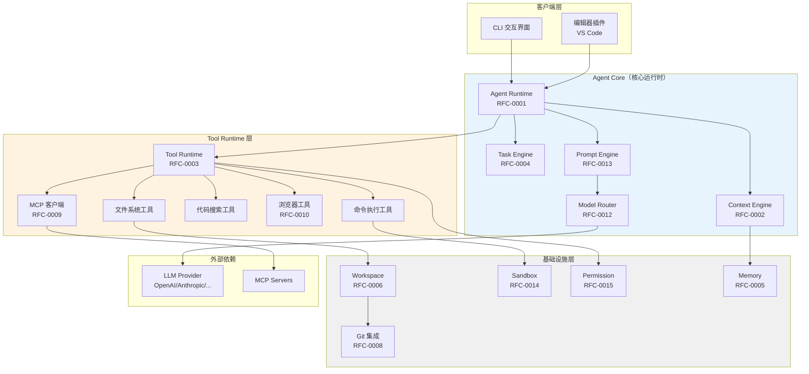
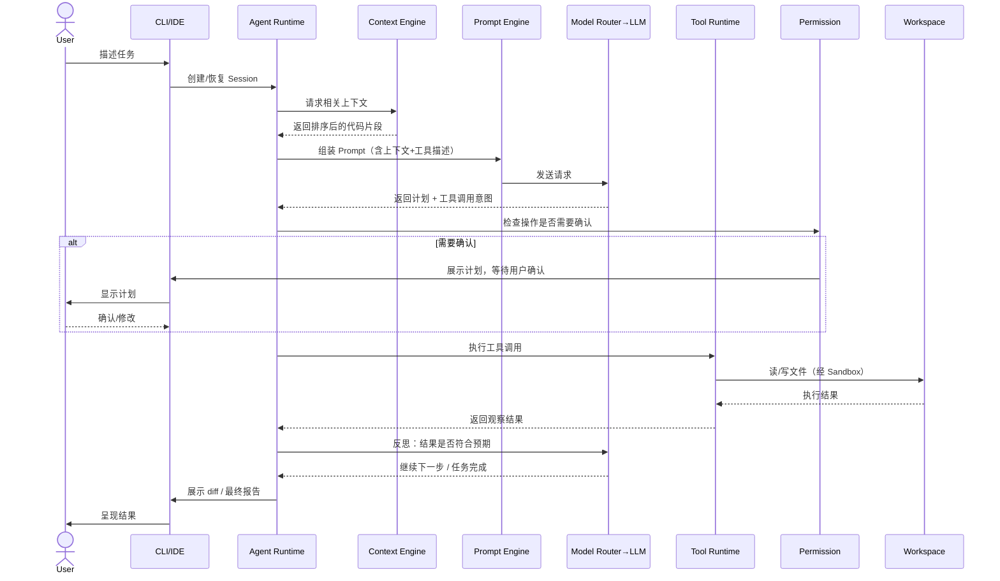
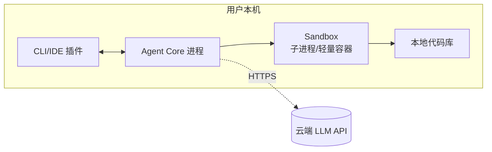
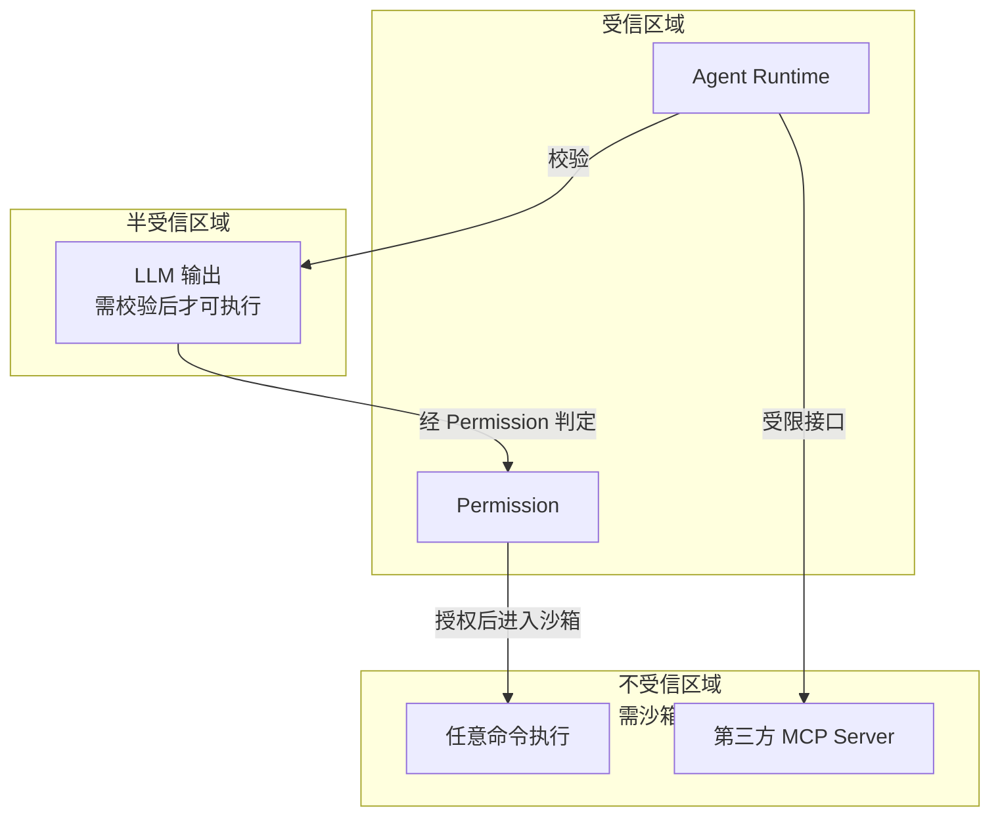

## 1. 架构定位

本文档定义 AI Coding Agent 的整体系统架构，是 [PRD](../01-Product/PRD.md) 到各 [RFC](../03-RFC/) 的中间层：回答"系统由哪些模块组成、模块间如何交互、部署形态是什么"，不深入单个模块的内部设计（那是每个 RFC 的职责）。

架构设计遵循 [Design Principles](../00-Vision/Design%20Principles.md)，尤其是原则 6（沙箱缺省）、8（Provider 无关）、9（协议优先）。

## 2. 整体分层架构

## 3. 模块职责总览

| 模块 | 职责 | 详细设计 |
|---|---|---|
| **Agent Runtime** | Agentic 循环编排：规划→执行→观察→反思；管理 Agent/Sub-agent 生命周期 | [RFC-0001](../03-RFC/RFC-0001%20Agent%20Runtime.md) |
| **Task Engine** | Session/任务状态机管理，持久化与恢复 | [RFC-0004](../03-RFC/RFC-0004%20Task%20Engine.md) |
| **Context Engine** | 代码库索引、相关性检索、上下文压缩与注入 | [RFC-0002](../03-RFC/RFC-0002%20Context%20Engine.md) |
| **Prompt Engine** | Prompt 模板管理、System Prompt 组装、工具描述生成 | [RFC-0013](../03-RFC/RFC-0013%20Prompt%20Engine.md) |
| **Model Router** | 多 Provider 抽象、模型选择/降级策略、请求重试 | [RFC-0012](../03-RFC/RFC-0012%20Model%20Router.md) |
| **Tool Runtime** | 工具注册、调用调度、结果格式化 | [RFC-0003](../03-RFC/RFC-0003%20Tool%20Runtime.md) |
| **MCP 客户端** | 接入外部 MCP Server，动态扩展工具集 | [RFC-0009](../03-RFC/RFC-0009%20MCP.md) |
| **Workspace** | 工作区文件系统抽象、文件变更追踪 | [RFC-0006](../03-RFC/RFC-0006%20Workspace.md) |
| **Sandbox** | 命令执行隔离（进程级/容器级） | [RFC-0014](../03-RFC/RFC-0014%20Sandbox.md) |
| **Git 集成** | 分支管理、diff 生成、commit 操作 | [RFC-0008](../03-RFC/RFC-0008%20Git.md) |
| **Permission** | 自主性级别管理、操作风险分级、确认流程 | [RFC-0015](../03-RFC/RFC-0015%20Permission.md) |
| **Memory** | 跨 Session 记忆、用户偏好与项目约定学习 | [RFC-0005](../03-RFC/RFC-0005%20Memory.md) |
| **Review** | Diff 展示、逐块接受/拒绝交互 | [RFC-0007](../03-RFC/RFC-0007%20Review.md) |

## 4. 核心交互流程（简化时序）

完整时序图集合（含异常路径、多轮迭代、Sub-agent 编排）见 [Sequence.md](Sequence.md)（大纲）。

## 5. 部署形态

### 5.1 本地单机模式（v1.0 主要形态）

Agent Core 作为本地进程运行，LLM 推理调用远程 API（除非用户配置本地模型）。这是呼应 [Product Philosophy](../00-Vision/Product%20Philosophy.md) "本地优先"的默认部署形态。

### 5.2 Cloud Agent 模式（P2，架构预留）

云端异步任务处理形态，详见 [RFC-0011 Cloud Agent](../03-RFC/RFC-0011%20Cloud%20Agent.md)（大纲）。v1.0 不交付，但本架构在 Agent Runtime 与 Workspace 的接口设计上需预留可替换性（本地 Workspace ↔ 云端 Sandbox Workspace 实现同一接口）。

完整部署拓扑（含多副本、共享存储等）见 [Deployment.md](Deployment.md)（大纲）。

## 6. 技术选型方向（待细化，非最终决策）

| 领域 | 候选方向 | 决策状态 |
|---|---|---|
| Agent Core 语言 | TypeScript/Node.js（生态对齐 VS Code 插件）或 Go（性能/分发） | 待 ADR 决策 |
| Sandbox 隔离 | 本地：轻量进程隔离 + 文件系统权限；重型任务：Docker | 待 ADR 决策 |
| 向量索引（Context Engine） | 本地嵌入式向量库 vs 云端向量服务 | 待 [RFC-0002](../03-RFC/RFC-0002%20Context%20Engine.md) 细化 |
| Session 持久化存储 | 本地文件（SQLite/JSON）为主，可选云同步 | 待 [Database.md](Database.md) 细化 |

技术选型的最终决策需要通过 [08-ADR](../08-ADR/_INDEX.md) 正式记录，本文档仅给出方向性输入。

## 7. 跨模块设计约束

1. **所有对外部资源（文件系统、网络、进程）的访问必须经过 Permission 层校验**——即使是 P0 场景下"自动执行"的操作，也要经过风险分级判断（呼应 [Design Principles](../00-Vision/Design%20Principles.md) 原则 4）。
2. **Tool Runtime 与 MCP 客户端共享同一工具调用接口**——内置工具和 MCP 外部工具对 Agent Runtime 而言应该是无差别的调用形式（呼应原则 9）。
3. **Model Router 是 LLM 调用的唯一出口**——Prompt Engine、Agent Runtime 都不直接持有 Provider SDK 实例，保证 Provider 可替换性（呼应原则 8）。
4. **Workspace 是文件操作的唯一入口**——Tool Runtime 不直接调用宿主文件系统 API，所有读写经 Workspace 抽象，便于未来切换本地/沙箱/云端实现。

## 8. 安全边界总览

详细安全架构见 [Security.md](Security.md)（大纲），此处给出架构层面的边界划分：

核心原则：**LLM 的输出永远不被当作可信指令直接执行**，必须经过 Permission 层的风险判定，高风险操作进入 Sandbox 隔离环境。

## 9. 与本规范其他文档的关系

- 本文档的每个模块对应一篇 RFC，深入设计以 RFC 为准，本文档如与 RFC 冲突，以 RFC 为准并回填修正本文档
- 领域实体设计见 [Domain Model.md](Domain%20Model.md) ✅
- API 契约见 [API.md](API.md) ✅
- 数据持久化设计见 [Database.md](Database.md) ✅
