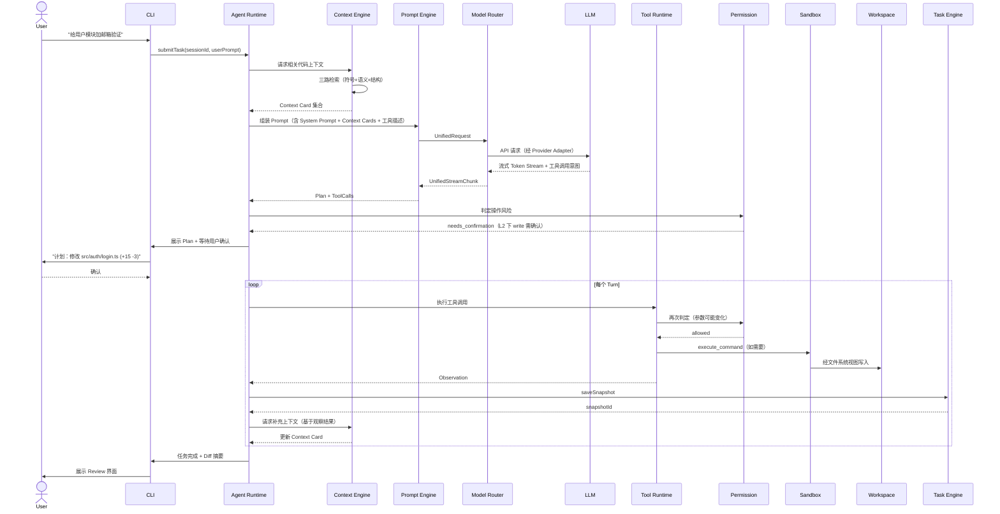
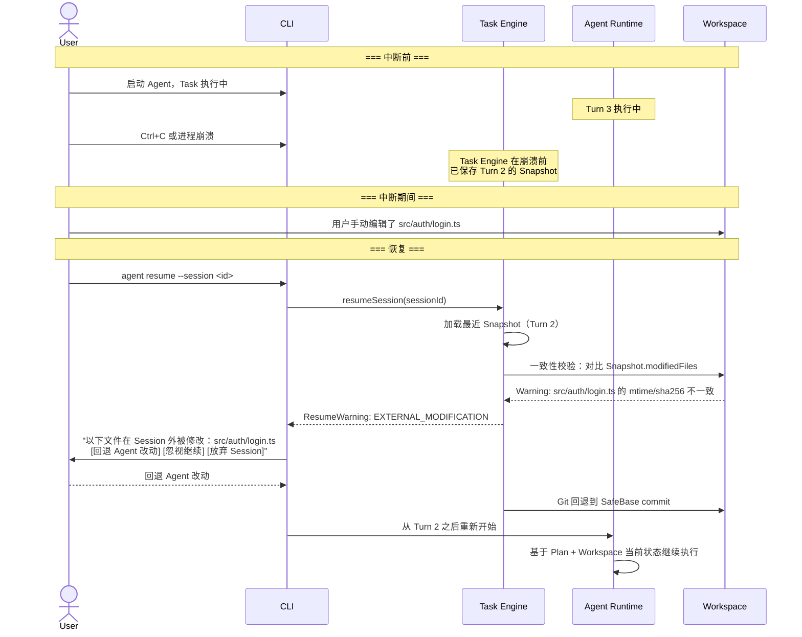
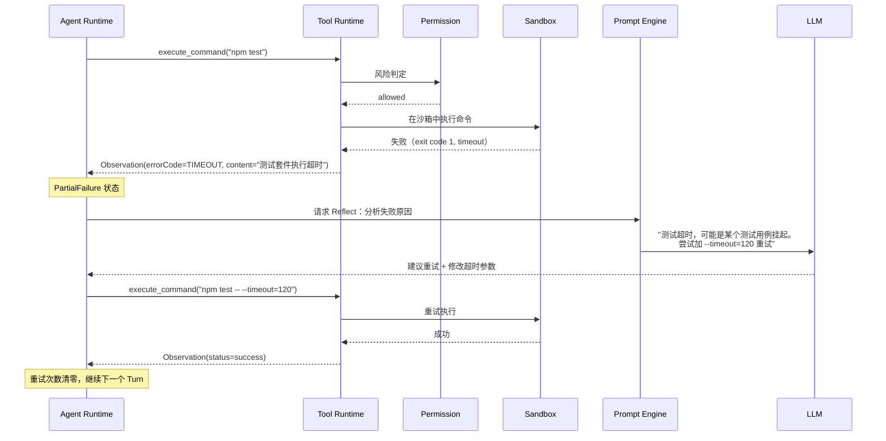
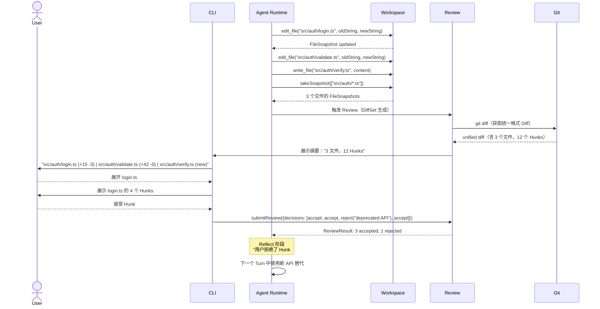
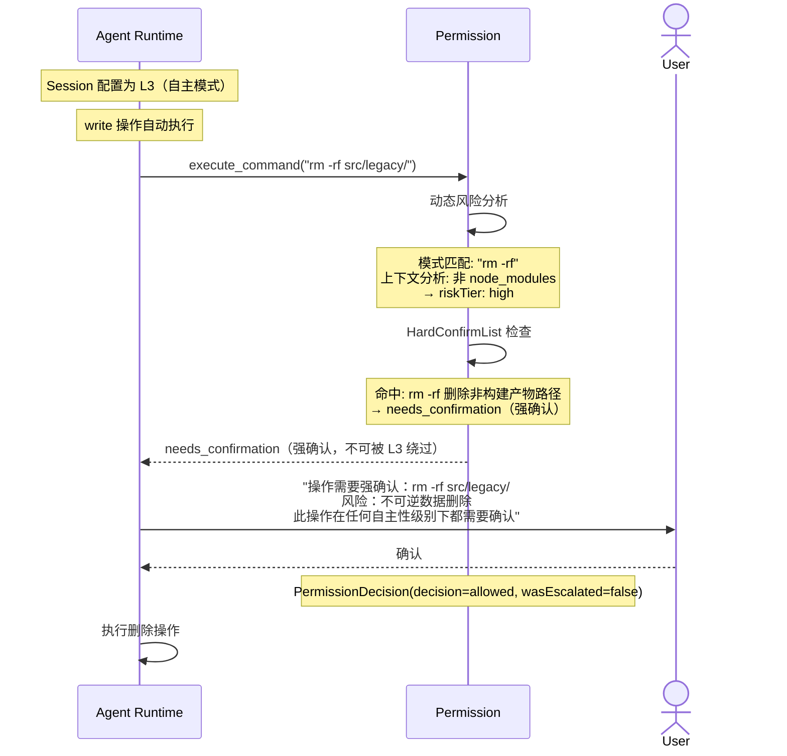
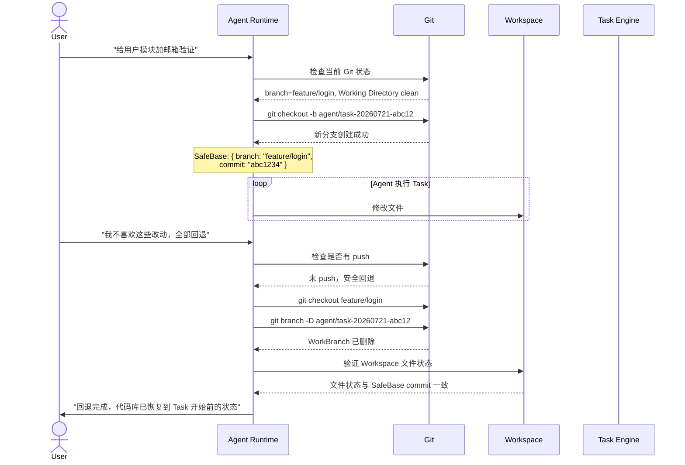
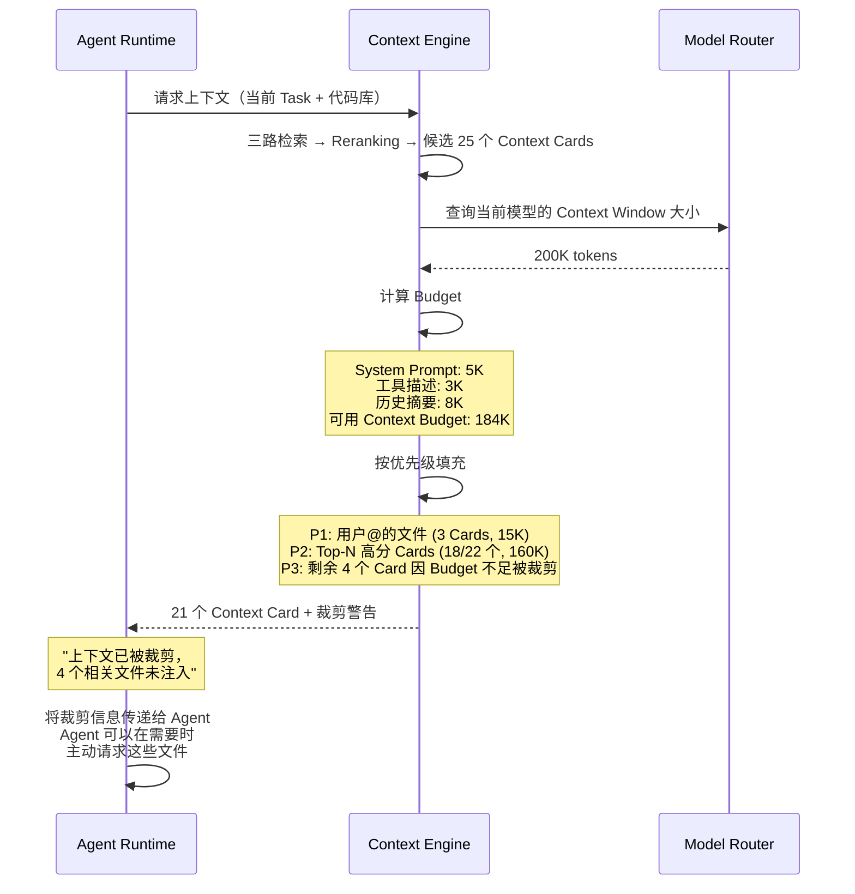
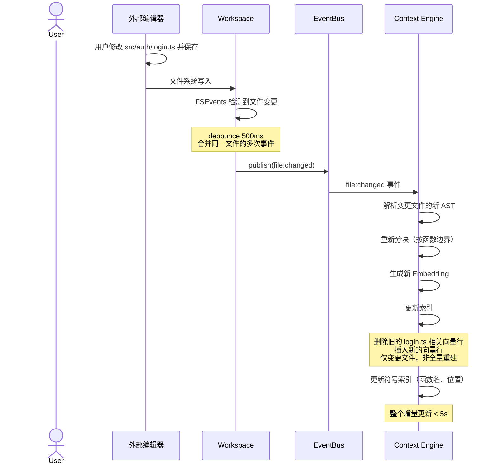

# Sequence — 关键时序图

> **状态：✅ 完整** — 基于 10 篇 P0 RFC 的完整接口定义，绘制 8 个覆盖主流程、异常路径、子系统交互的时序图。与 [Overall Architecture §4](Overall%20Architecture.md#4-核心交互流程简化时序) 的简化时序互补——本文档提供完整交互细节。

## 场景 1：任务执行主流程（完整版）

## 场景 2：Session 中断与恢复

## 场景 3：工具调用失败重试

## 场景 4：多文件编辑与 Review 确认

## 场景 5：渐进自主性降级

## 场景 6：Git 分支隔离与回退

## 场景 7：上下文预算裁剪

## 场景 8：索引增量更新

## 时序图与现有 RFC 的交叉校验

| 场景 | 验证的 RFC 设计 | 关键接口一致性 |
|---|---|---|
| 场景 1 | RFC-0001、RFC-0002、RFC-0003、RFC-0015 | ✅ Agent Runtime → Context Engine → Prompt Engine → Model Router → Tool Runtime 链路闭环 |
| 场景 2 | RFC-0004 §4.2、RFC-0006 | ✅ Task Engine 恢复流程 + Workspace 一致性校验（mtime/sha256 三元组） |
| 场景 3 | RFC-0001 §3 (PartialFailure)、RFC-0003 §4 | ✅ PartialFailure → Reflecting → 调整参数 → 重试 |
| 场景 4 | RFC-0007 §3-6、RFC-0008 §5 | ✅ Workspace Snapshot Diff + Git unified diff → Review 展示 → 拒绝反馈回 AR |
| 场景 5 | RFC-0015 §4.1、§5 | ✅ 动态风险分析 → HardConfirmList → L3 无法绕过强确认 |
| 场景 6 | RFC-0008 §3、§6 | ✅ 智能分支策略 + SafeBase + 全量回退 |
| 场景 7 | RFC-0002 §6、§6.1 | ✅ Budget 瀑布分配 + 裁剪警告 |
| 场景 8 | RFC-0002 §4、RFC-0006 §4、Event Bus | ✅ 文件变更 → EventBus → Context Engine 增量重建 |
