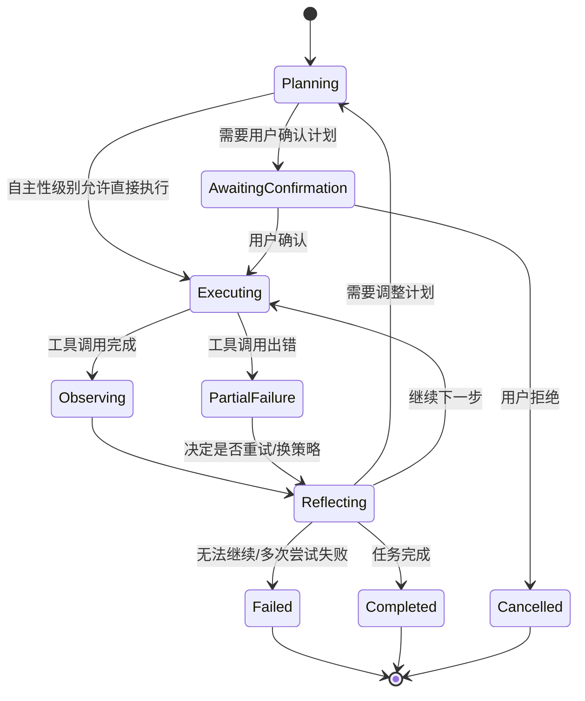
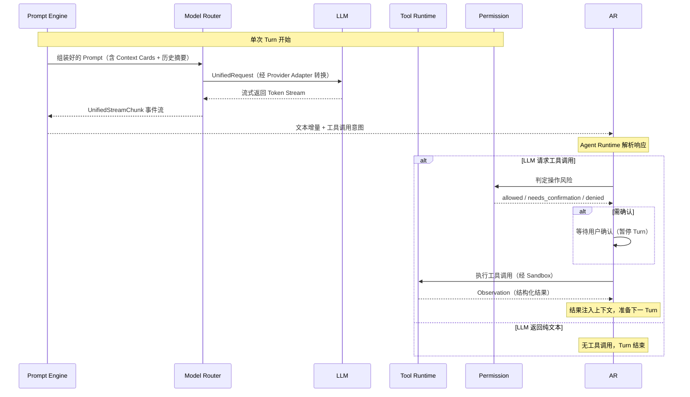
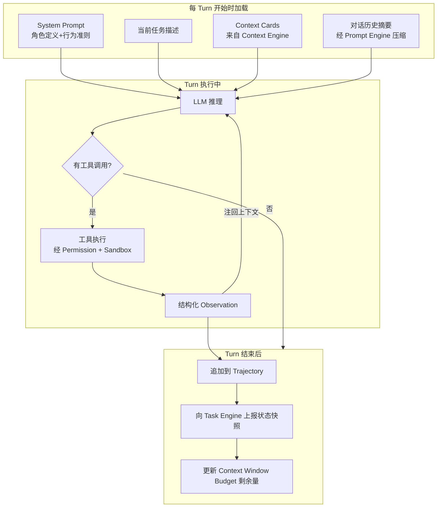
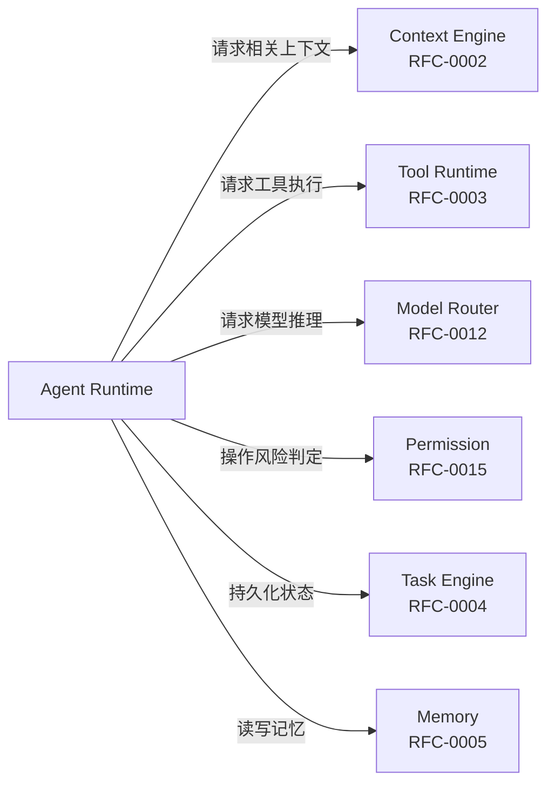

## 元信息

| 项 | 值 |
|---|---|
| RFC 编号 | RFC-0001 |
| 标题 | Agent Runtime |
| 状态 | Draft |
| 关联 PRD | [P0-1](../01-Product/PRD.md#3-产品范围本阶段-p0p1p2) |
| 关联架构 | [Overall Architecture §3](../02-Architecture/Overall%20Architecture.md#3-模块职责总览) |
| 依赖 RFC | RFC-0002 Context Engine、RFC-0003 Tool Runtime（大纲）、RFC-0012 Model Router（大纲）、RFC-0015 Permission（大纲） |

## 1. 背景与目标

Agent Runtime 是整个产品的"心脏"——负责把一个自然语言任务转化为一系列工具调用并驱动到完成。这是 [PRD P0-1](../01-Product/PRD.md) 的核心实现，也是 Cursor（Composer 模式）、Claude Code、OpenCode 共同验证过的核心范式：**Agentic Loop（规划-执行-观察-反思）**。

### 目标

1. 支持多步骤任务的自主执行，无需每步人工重新输入指令
2. 循环的每一步可观察、可中断（呼应 [Design Principles](../00-Vision/Design%20Principles.md) 原则 1、3）
3. 支持渐进自主性——同一套 Runtime 逻辑，通过 Permission 层控制确认粒度
4. 为未来 Sub-agent 编排预留扩展点（P1，见 §7）

### 非目标（本 RFC 不涵盖）

- 具体工具的实现细节（见 [RFC-0003 Tool Runtime](RFC-0003%20Tool%20Runtime.md)）
- 上下文如何被检索和排序（见 RFC-0002）
- 模型请求的重试/降级策略（见 RFC-0012）

## 2. 核心概念

| 概念 | 定义 |
|---|---|
| **Turn** | 一次"LLM 请求 → 响应 → （可选）工具调用 → 结果"的最小循环单元 |
| **Step** | 一个 Turn 中被执行的单个工具调用 |
| **Plan** | Agent 在循环开始时（或循环中动态调整）生成的任务分解 |
| **Trajectory** | 一个 Session 内所有 Turn 的有序集合，是可追溯的完整执行历史 |
| **Reflection** | 每个 Turn 结束后，Agent 判断"结果是否符合预期、是否需要调整计划"的步骤 |

## 3. 状态机设计

Agentic Loop 的核心是一个显式状态机，呼应 [Design Principles](../00-Vision/Design%20Principles.md) 原则 7（失败是一等公民状态）：



**关键设计决策**：`PartialFailure` 不直接进入 `Failed`，而是回到 `Reflecting` 让 Agent 判断"这个失败是否致命、要不要换个方法重试"——这与人类工程师调试问题的方式一致，也避免了"一次工具调用失败就整个任务终止"的脆弱性。但需要有**最大重试次数上限**，防止无限循环（见 §6 风险与缓解）。

### 3.1 单 Turn 生命周期

每个 Turn 内部的微观流程——LLM 从收到上下文到产出下一步决策的完整路径：



### 3.2 上下文在 Agentic Loop 中的流动



## 4. 核心循环伪代码

```typescript
async function runAgenticLoop(session: Session, userTask: string): Promise<TaskResult> {
  let plan = await generatePlan(userTask, session.context);
  let trajectory: Turn[] = [];
  let retryCount = 0;
  const MAX_RETRIES = 3; // 见 §6，防止无限循环

  while (plan.status !== "completed" && plan.status !== "failed") {
    const nextStep = plan.getNextStep();

    // 关键：Permission 层判定，而不是 Runtime 自己决定
    const decision = await permissionLayer.evaluate(nextStep, session.autonomyLevel);
    if (decision === "needs_confirmation") {
      const userDecision = await requestUserConfirmation(nextStep);
      if (userDecision === "rejected") {
        return { status: "cancelled", trajectory };
      }
    }

    const observation = await toolRuntime.execute(nextStep); // 见 RFC-0003
    trajectory.push({ step: nextStep, observation });

    if (observation.status === "error") {
      retryCount++;
      if (retryCount > MAX_RETRIES) {
        return { status: "failed", reason: "max_retries_exceeded", trajectory };
      }
    }

    const reflection = await reflect(trajectory, plan); // LLM 调用，判断下一步
    plan = reflection.updatedPlan;
  }

  return { status: plan.status, trajectory };
}
```

这是简化示意，真实实现需处理并发工具调用、流式输出、中断信号等，具体接口定义留待实现阶段的技术设计文档。

## 5. 与其他模块的接口



**接口契约要点**：
- Agent Runtime 不直接持有 LLM SDK，所有推理请求经 Model Router（呼应 [Design Principles](../00-Vision/Design%20Principles.md) 原则 8）
- Agent Runtime 不直接执行工具，所有执行经 Tool Runtime + Permission 双重把关
- 每个 Turn 结束后必须向 Task Engine 上报状态快照，保证 Session 可恢复（呼应 PRD P0-5）

## 6. 风险与缓解

| 风险 | 缓解措施 |
|---|---|
| Agent 陷入无限重试循环 | 状态机设置 `MAX_RETRIES` 硬上限；超限后进入 `Failed` 并展示完整 trajectory 供用户诊断 |
| 计划与实际执行逐渐偏离（"计划漂移"） | 每次 `Reflecting` 阶段都重新评估 Plan 与原始任务的一致性，偏离过大时主动询问用户 |
| 长任务中途用户想要中断 | 状态机的每个状态都是可中断点，Runtime 需支持外部中断信号并将 trajectory 保存到 Task Engine |
| 工具调用结果被误判为成功 | Observing 阶段的结果需结构化（不是自由文本），Reflecting 阶段基于结构化字段判断而非重新解析文本 |

## 7. 扩展点（P1：Sub-agent 编排）

v1.0 的 Agent Runtime 面向单一 Agent 执行单一任务。P1 阶段计划支持主 Agent 将子任务派发给专职 Sub-agent（例如"测试专职 Agent""代码审查专职 Agent"），复用同一状态机设计，Sub-agent 的 trajectory 嵌套在主 Agent trajectory 中。这部分在 v1.0 只做接口预留（`Plan.getNextStep()` 可返回 `type: "delegate"` 的 Step），不做完整实现。

## 8. 验收标准

呼应 [Design Principles](../00-Vision/Design%20Principles.md) 原则 10，验收需基于可执行标准：

1. 在 [PRD 场景 A（功能实现）](../01-Product/PRD.md#4-核心用户场景详细旅程见-user-journeymd-大纲) 的基准任务集上，任务一次性完成率 ≥ 70%
2. 中途中断后，Session 可从 Task Engine 恢复并继续，trajectory 不丢失
3. 人为注入工具调用失败（如模拟文件权限错误），验证状态机正确进入 `PartialFailure → Reflecting`，不会直接崩溃
4. 设置 `MAX_RETRIES = 3` 后，构造必然失败的任务，验证在第 4 次工具调用失败时进入 `Failed` 而非无限循环

## 9. 开放问题

- Reflection 阶段是否每次都需要单独的 LLM 调用（成本 vs 准确性权衡）？还是可以和下一步 Planning 合并为一次调用？
- `Plan` 的数据结构是纯文本描述还是结构化 DAG？结构化 DAG 更利于可视化展示给用户，但生成成本更高。
- Sub-agent 编排的通信协议是否需要独立于主循环的消息总线？（可能影响 [Event Bus](../02-Architecture/Event%20Bus.md) 设计）
