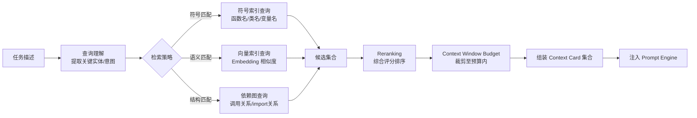
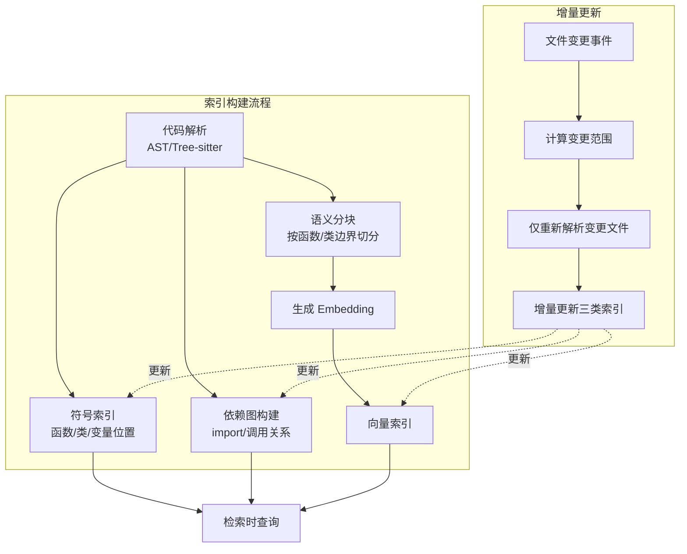
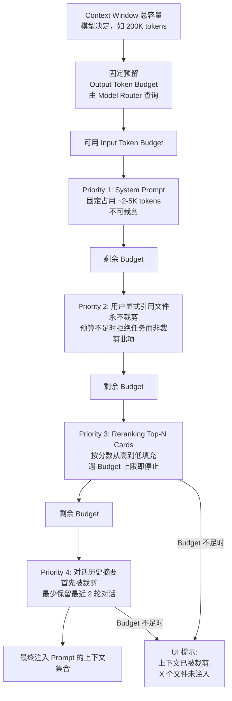
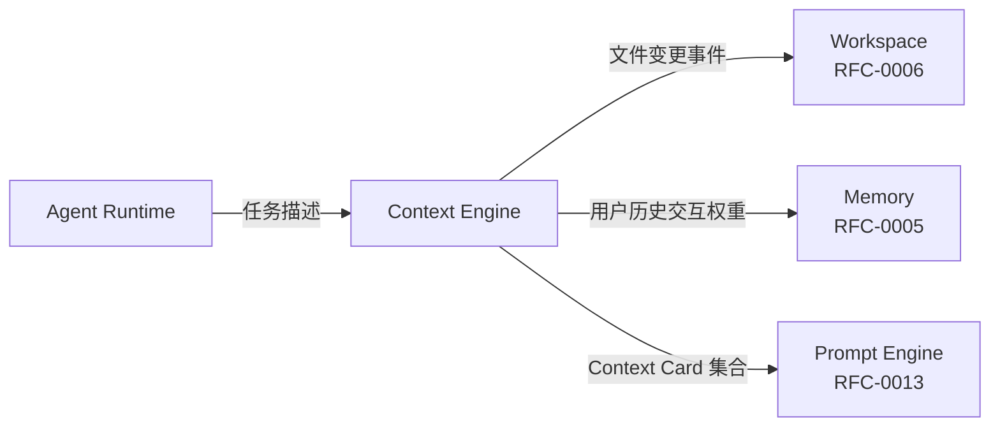

## 元信息

| 项 | 值 |
|---|---|
| RFC 编号 | RFC-0002 |
| 标题 | Context Engine |
| 状态 | Draft |
| 关联 PRD | [P0-2](../01-Product/PRD.md#3-产品范围本阶段-p0p1p2) |
| 关联架构 | [Overall Architecture §3](../02-Architecture/Overall%20Architecture.md#3-模块职责总览) |
| 依赖 RFC | RFC-0006 Workspace（大纲）、RFC-0005 Memory（大纲） |

## 1. 背景与目标

这是本产品与"补全类工具"最关键的分野之一。Copilot 类工具的上下文通常局限于"当前打开的文件 + 光标附近"；Cursor 通过 Codebase Indexing 证明了"全库语义索引 + 相关性检索"能显著提升大型代码库中的任务完成质量。这是 [PRD P0-2](../01-Product/PRD.md) 明确要对标的能力。

### 目标

1. 无需用户手动 `@` 文件，Agent 能根据任务描述自动定位相关代码
2. 遵循 [Design Principles](../00-Vision/Design%20Principles.md) 原则 2："相关性优先于数量"——精准最小上下文，而非塞满上下文窗口
3. 上下文注入过程对用户可审查（呼应 [Product Philosophy](../00-Vision/Product%20Philosophy.md) 可解释性支柱）
4. 支持增量索引更新，代码库变更后无需全量重建索引

### 非目标

- 具体的向量数据库选型与部署（见 [Database.md](../02-Architecture/Database.md) 大纲）
- Memory（跨 Session 记忆）不在本 RFC 范围，是独立子系统（见 RFC-0005）

## 2. 核心概念

| 概念 | 定义 |
|---|---|
| **Index** | 代码库的结构化表示：符号索引（函数/类/变量）+ 语义嵌入索引的组合 |
| **Retrieval** | 根据任务描述，从 Index 中检索候选相关代码片段的过程 |
| **Reranking** | 对 Retrieval 结果按真实相关性重新排序、过滤的过程 |
| **Context Window Budget** | 单次 LLM 请求中分配给"代码上下文"的 token 预算 |
| **Context Card** | 注入到 Prompt 中的单个上下文单元（通常是一个函数/类/文件片段 + 元信息） |

## 3. 整体流程



**为什么是三路检索而非单一策略**：
- 纯语义检索（向量相似度）擅长"意图相关"但对精确符号名不敏感（用户提到 `UserService.validateEmail` 时，符号匹配比语义匹配更精确）
- 纯符号匹配无法处理"用自然语言描述功能但不知道具体函数名"的场景
- 结构匹配（依赖图）能补充"这个函数被谁调用/依赖了什么"这类检索无法直接命中但对任务至关重要的上下文

三路结果的融合与去重策略是本 RFC 的核心设计难点，见 §5。

## 4. 索引构建



**关键设计决策**：分块策略以**函数/类边界**为单位，而非固定行数窗口。原因：固定窗口切分会把一个函数从中间切断，导致语义不完整的 Embedding；按 AST 边界分块保证每个 Context Card 是语义自洽的单元。

**增量更新触发时机**：监听 Workspace（见 [RFC-0006](RFC-0006%20Workspace.md)）的文件变更事件，仅对变更文件重新解析和嵌入，而非全量重建——这是支撑"大型代码库也能快速响应"的关键。

## 5. 检索结果融合与 Reranking

三路候选集合需要融合去重后统一排序，采用的评分维度：

| 维度 | 说明 | 权重来源 |
|---|---|---|
| 语义相似度 | 向量检索的 cosine similarity | 向量索引原始分数 |
| 符号精确匹配 | 任务描述中提到的标识符是否精确命中 | 符号索引匹配加权 |
| 结构邻近度 | 与已确定相关文件的调用/依赖距离 | 依赖图跳数加权 |
| 最近修改时间 | 近期变更的代码更可能与当前任务相关 | Git 历史加权 |
| 用户历史交互 | 该文件在近期 Session 中被频繁引用 | 见 RFC-0005 Memory 接口 |

最终排序是多维度加权融合，具体权重需通过基准任务集调参（不在本 RFC 中给出具体数值，避免过早锁定未经验证的参数）。

## 6. Context Window Budget 分配

呼应 [Design Principles](../00-Vision/Design%20Principles.md) 原则 2，预算分配遵循优先级：

1. **系统 Prompt + 工具描述**（固定开销，见 [RFC-0013 Prompt Engine](RFC-0013%20Prompt%20Engine.md)）
2. **当前任务直接提及的文件**（用户显式引用的，最高优先级）
3. **Reranking Top-N 的高分 Context Card**
4. **对话历史摘要**（长 Session 场景下不能塞入全部历史，见 §7）

当预算不足时，裁剪顺序相反：先裁剪对话历史摘要，再裁剪低分 Context Card，用户显式引用的文件永不裁剪。

### 6.1 预算分配瀑布模型



### 6.2 检索质量反馈环路

```mermaid
graph LR
    subgraph Retrieval["检索阶段"]
        Query[任务描述] --> Retrieval[三路检索]
        Retrieval --> Rerank[Reranking]
        Rerank --> Cards[Context Card 集合]
    end

    subgraph Evaluation["质量评估阶段（离线/准实时）"]
        Cards --> Compare[与 Ground Truth 对比]
        GroundTruth[人工标注的正确文件集合] --> Compare
        Compare --> Metrics[计算 Recall/Precision]
        Metrics --> Dashboard[质量看板]
    end

    subgraph Feedback["反馈调整"]
        Dashboard -->|"Recall < 80% 告警"| Tuning[Reranking 权重调整]
        Dashboard -->|"特定文件类型召回差"| Strategy[检索策略优化]
        Tuning --> Retrieval
        Strategy --> Retrieval
    end
```

> **说明**：检索质量反馈是准实时/离线环路，不阻塞 Agent 实时任务执行。每次检索的 Context Card 来源标注（§7）在 Session 结束后可用于与 Ground Truth 对比计算 Recall，作为 [Benchmark Task Set](../Appendix/Benchmark%20Task%20Set.md) 类别 E 的评分依据。

## 7. 上下文可审查性

呼应 [Product Philosophy](../00-Vision/Product%20Philosophy.md) 可解释性支柱，Context Engine 的输出（即将注入 Prompt 的 Context Card 集合）在执行前应可展示给用户：

- CLI/IDE 界面提供"本次参考了哪些文件"的展示（不要求默认展开，但要求可查）
- 每个 Context Card 携带来源标注（来自符号匹配/语义匹配/结构匹配/用户历史），便于调试检索质量问题

## 8. 与其他模块的接口



## 9. 风险与缓解

| 风险 | 缓解措施 |
|---|---|
| 大型代码库（百万行级）索引构建耗时过长 | 增量索引为默认路径；首次索引可后台异步进行，期间降级为纯符号匹配 |
| 语义检索召回不相关代码，误导 Agent | Reranking 阶段设置最低分数阈值，低于阈值的候选宁可不注入，不强行凑数量 |
| 上下文预算不足导致关键代码被裁剪 | 用户显式引用文件永不裁剪（见 §6）；裁剪发生时在 UI 上提示"上下文已被裁剪" |
| 索引与实际文件内容不一致（过期索引） | 每次检索前校验文件 mtime/hash，检测到不一致触发对应文件的增量重建 |

## 10. 验收标准

1. 在标准测试代码库上，用户不 `@` 任何文件、仅用自然语言描述任务，Agent 定位到的相关文件与人工标注的"正确相关文件集合"重合度（Recall）≥ 80%
2. 代码库发生单文件变更后，索引更新延迟 < 5 秒（不含大规模重构场景）
3. 人为构造"任务描述提及具体函数名"的场景，验证符号精确匹配的 Context Card 排名进入 Top-3
4. Context Window Budget 不足时的裁剪行为在 UI 上有可见提示，不静默丢弃

## 11. 开放问题

- Embedding 模型是否本地部署（保护代码隐私但增加本地资源消耗）还是调用云端 Embedding API？呼应 [Product Philosophy](../00-Vision/Product%20Philosophy.md) "本地优先"，倾向本地，但需评估性能可行性
- 超大单体仓库（monorepo）的索引范围如何界定？是否需要用户手动配置索引边界？
- Reranking 的权重是否需要针对不同编程语言/项目类型做自适应调整？
