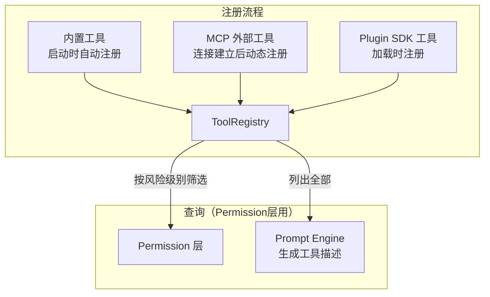
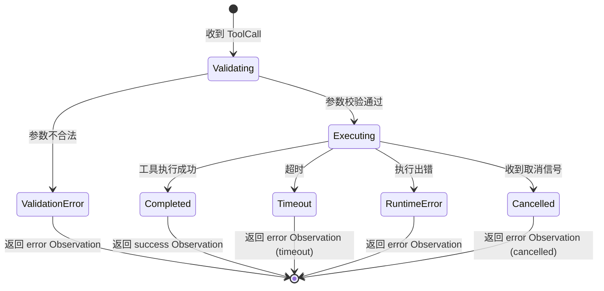
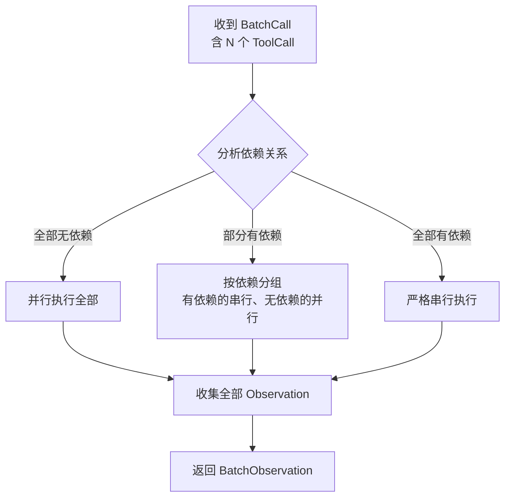
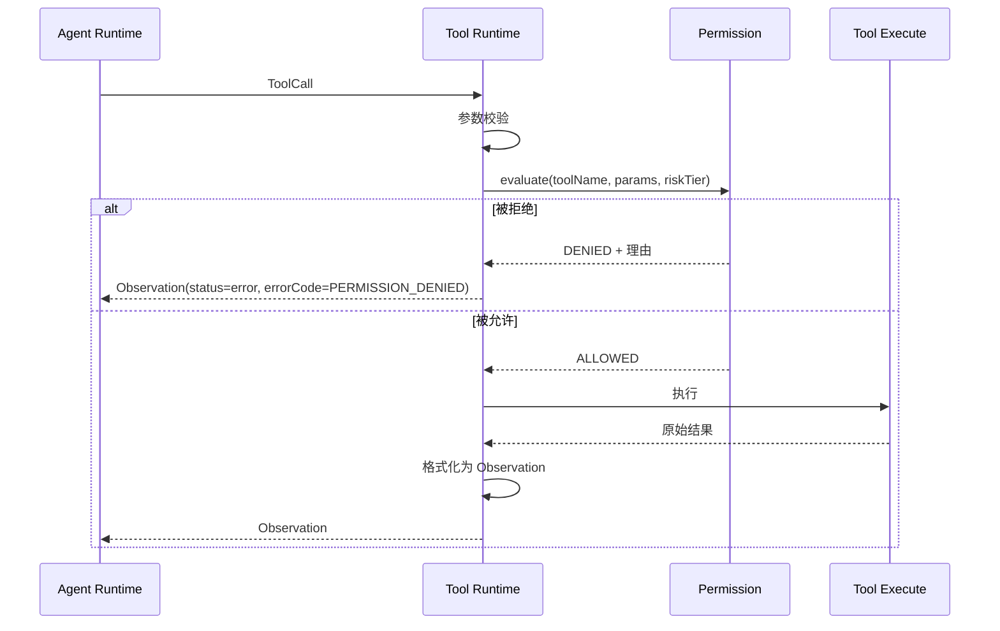

## 元信息

| 项 | 值 |
|---|---|
| RFC 编号 | RFC-0003 |
| 标题 | Tool Runtime |
| 状态 | Draft |
| 关联 PRD | [P0-3](../01-Product/PRD.md#3-产品范围本阶段-p0p1p2) |
| 关联架构 | [Overall Architecture §3](../02-Architecture/Overall%20Architecture.md#3-模块职责总览) |
| 依赖 RFC | RFC-0014 Sandbox、RFC-0015 Permission |

## 1. 背景与目标

Tool Runtime 是 Agent Runtime 与实际执行能力之间的调度层。它的职责是：接收 Agent Runtime 发出的工具调用意图，做参数校验、调用分发、结果格式化，最终返回结构化 Observation 给 Agent Runtime。这是 [PRD P0-3](../01-Product/PRD.md) 核心工具集的统一执行入口。

本 RFC 的设计直接承接两条 [Design Principles](../00-Vision/Design%20Principles.md)：
- **原则 4**（破坏性操作前置确认）：Tool Runtime 本身不做确认判断，但需为每个工具标注"只读/写"元数据，供 Permission 层使用
- **原则 9**（工具集可扩展，协议优先）：内置工具和 MCP 外部工具共享同一调用接口，新增工具无需修改 Agent Runtime 核心调度逻辑

### 目标

1. 提供统一的工具注册、调用、结果格式化接口，内置工具和 MCP 工具无差别调用
2. 支持并发工具调用，同时防止工具间隐式依赖导致的竞态问题
3. 结构化错误处理：工具调用失败返回的是"结构化的失败 Observation"而非抛异常，让 Agent Runtime 有机会在 Reflect 阶段做合理决策
4. 为 Permission 层提供精确的工具元数据，使其能做风险判定

### 非目标

- 工具本身的具体实现（如 grep 用什么算法）不在本 RFC 范围——本 RFC 只定义工具的接口契约和调度逻辑
- MCP 协议细节见 [RFC-0009](RFC-0009%20MCP.md)（大纲）
- 命令执行的安全性由 [RFC-0014 Sandbox](RFC-0014%20Sandbox.md) 保证，本 RFC 只负责调用调度，不负责执行环境的隔离

## 2. 核心概念

| 概念 | 定义 |
|---|---|
| **Tool** | 一个可被 Agent 调用的能力单元，包含名称、描述（供 LLM 理解）、参数 Schema、执行函数、元数据（只读/写标记、风险级别、默认超时） |
| **ToolCall** | 一次工具调用请求，来自 Agent Runtime（由 LLM 工具调用意图转换而来），包含工具名、参数、调用 ID |
| **Observation** | 工具调用完成后返回给 Agent Runtime 的结构化结果，包含状态（success/error/partial）、内容、耗时、错误码 |
| **ToolRegistry** | 所有已注册工具的集中列表，支持运行时查询、按条件筛选（如"列出所有只读工具"供 Permission 层使用） |
| **BatchCall** | 同一 Turn 内 LLM 请求的多个并发工具调用集合 |

## 3. 工具注册机制



**注册接口设计**：

```typescript
interface ToolDefinition {
  name: string;              // 唯一标识，如 "read_file"
  description: string;       // LLM 可理解的自然语言描述，会注入 Prompt
  parameters: JSONSchema;    // 参数定义，复用 JSON Schema 标准（与 MCP 兼容）
  riskTier: "readonly" | "write" | "destructive";  // 供 Permission 层使用的风险标注
  defaultTimeoutMs: number;  // 默认超时（ms），工具可覆盖为具体值
  execute: (params: Record<string, unknown>) => Promise<Observation>;
}

class ToolRegistry {
  register(tool: ToolDefinition): void;
  list(): ToolDefinition[];
  listByRiskTier(tier: string): ToolDefinition[];  // Permission 层查询接口
  get(name: string): ToolDefinition;
  toPromptDescription(): string;  // 生成供 LLM 使用的工具列表描述
}
```

**关键设计决策**：工具注册支持静态编译期注册（内置工具在启动代码中注册）和运行时动态注册（MCP 工具在连接建立后注册）。ToolRegistry 是线程安全的，动态注册/取消注册不影响正在执行的调用。

**参数 Schema 复用 JSON Schema**：与 MCP 协议保持一致，避免两套参数定义体系产生转换摩擦。内置工具的参数定义也用 JSON Schema 描述，即使内置工具不走 MCP 通道。

## 4. 调用调度状态机



**关键设计决策**：所有失败路径（ValidationError、Timeout、RuntimeError、Cancelled）都返回一个**结构化的 error Observation**，而不是抛出异常。这样 Agent Runtime 在 Reflect 阶段可以统一处理所有结果（成功/失败），而不需要 try-catch 区分"工具本身失败"和"调度层异常"——呼应 [Design Principles](../00-Vision/Design%20Principles.md) 原则 7（失败是一等公民状态）。

## 5. 并发调度策略

一个 Turn 内 LLM 可能返回多个并发工具调用（如"先读 fileA 和 fileB，然后根据内容决定下一步"）。Tool Runtime 需要判断这些调用能否并行执行：



**依赖检测规则**：
- 工具定义中可选的 `dependsOnCallIds` 字段让 Agent Runtime 显式声明依赖（最可靠，但依赖 LLM 输出格式能否支持）
- v1.0 降级方案：如果 LLM 输出无法可靠标注依赖关系，**保守策略——默认串行执行所有并发调用**，避免"先创建目录、再写文件"类竞态导致不必要的 flaky 问题
- 如果 Benchmark Task Set 显示串行策略成为效率瓶颈，再评估引入更智能的依赖推断（如基于参数中是否引用其他调用 ID 做启发式分析）

**超时策略差异化**：

| 工具类型 | 默认超时 | 理由 |
|---|---|---|
| 文件读取 | 5s | 本地 I/O，失败大概率是文件不存在或无权限，不应长时间挂起 |
| 文件写入 | 10s | 写入比读取可能更慢（大文件），但不应太久 |
| 命令执行 | 60s | 跑测试/装依赖可能需要较长时间 |
| 代码搜索 | 15s | 可能跨多文件扫描 |
| MCP 外部工具 | 30s | 外部服务延迟不可控，但也不应无限等待 |

所有默认超时可被用户全局配置覆盖。单次调用也可以由 Agent Runtime 传入自定义超时值。

## 6. Observation 结构定义

每个工具调用返回统一格式的 Observation：

```typescript
interface Observation {
  callId: string;                    // 对应 ToolCall 的调用 ID
  status: "success" | "error" | "partial";
  content: string;                   // 工具输出的文本内容，会注入 LLM 上下文
  metadata: {
    toolName: string;
    durationMs: number;
    exitCode?: number;               // 仅命令执行工具有意义
    errorCode?: string;              // 标准化错误码，见下文
    truncated: boolean;              // 输出是否因超长被截断
    truncatedOriginalLength?: number;
  };
}

// 标准化错误码
type ErrorCode =
  | "VALIDATION_ERROR"       // 参数不合法
  | "TIMEOUT"                // 执行超时
  | "PERMISSION_DENIED"      // Permission 层拒绝（附拒绝理由）
  | "SANDBOX_DENIED"         // Sandbox 拒绝（如网络访问被拦截）
  | "FILE_NOT_FOUND"         // 文件读取：路径不存在
  | "COMMAND_FAILED"         // 命令执行：非零退出码
  | "UNKNOWN_ERROR";         // 未分类错误
```

**关键设计决策**：`errorCode` 是结构化字段，与 `content`（文本描述）并存。Agent Runtime 在 Reflect 阶段可以先看 `errorCode` 做结构化决策（如 PERMISSION_DENIED → 询问用户是否提权，TIMEOUT → 询问是否增加超时），再看 `content` 获取详细上下文。不能只依赖文本解析判断失败原因。

**输出截断规则**：所有工具调用输出都受最大长度限制（默认 50KB），超过则截断并在 `metadata.truncated` 标注。这是防止单次工具调用返回巨大输出撑爆 LLM 上下文窗口的兜底措施。用户可配置最大输出长度。

## 7. 与 Permission 层的交互契约

Tool Runtime 与 [RFC-0015 Permission](RFC-0015%20Permission.md) 的交互遵循以下契约：



**关键设计**：Permission 判定发生在 Tool Runtime 内部，在参数校验之后、实际执行之前。Agent Runtime 看到的只有最终的 Observation——如果 Observation 的 `errorCode` 是 `PERMISSION_DENIED`，Agent Runtime 才知道操作被拒绝，可以在 Reflect 阶段决定下一步（询问用户提权/换策略）。

呼应 [Design Principles](../00-Vision/Design%20Principles.md) 原则 4：**工具调用本身不判断是否该执行**——那个职责归 Permission 层。Tool Runtime 只负责"如果被允许，我如何安全地执行；如果不被允许，我如何清晰地报告被拒原因"。

## 8. 内置工具清单

以下为 v1.0 的 P0 内置工具集。每个工具都需在 ToolRegistry 注册时标注完整的元数据（风险级别、超时等）：

| 工具名 | 功能 | 风险级别 | 说明 |
|---|---|---|---|
| `read_file` | 读取文件内容 | readonly | 支持 offset/limit 分段读取大文件 |
| `write_file` | 创建/覆盖文件 | write | 遵循 [Design Principles](../00-Vision/Design%20Principles.md) 原则 5 的 Diff 优先精神——本工具应在 Review 流程确认后才被调用 |
| `edit_file` | 基于 diff 的精确替换 | write | 用 oldString/newString 执行精确文本替换，比全量覆盖 write_file 更安全，是 P0-4 Diff 预览的底层能力 |
| `list_directory` | 列出目录内容 | readonly | |
| `search_code` | 搜索代码文本（grep） | readonly | 支持正则、文件类型过滤 |
| `search_symbol` | AST 符号搜索 | readonly | 查找函数/类/变量定义位置 |
| `execute_command` | 在沙箱中执行命令 | 见下 | **操作风险级别独立评定**，不硬编码在 Tool 定义中 |

**关于 `execute_command` 的风险级别**：命令执行的风险级别不固定——`npm test`、`rm -rf`、`git push` 的风险完全不同，无法在工具注册时静态标注一个固定级别。因此 `execute_command` 的工具元数据标记为 `riskTier: "dynamic"`，实际风险评估由 [RFC-0015 Permission §4](RFC-0015%20Permission.md) 的命令分析逻辑动态判定，不依赖 Tool Runtime 的静态标注。

## 9. 风险与缓解

| 风险 | 缓解措施 |
|---|---|
| 并发工具调用引入隐式文件状态竞态 | v1.0 默认串行执行；后续可通过显式依赖声明或启发式分析逐步引入并行 |
| 大输出撑爆 LLM 上下文窗口 | 输出截断机制（§6），截断发生时在 Observation 中标注，让 Agent Runtime 意识到信息不完整 |
| 参数校验不够全面，恶意参数通过校验 | 校验层需覆盖：类型检查、必填项检查、字符串长度上限、文件路径注入预防（路径参数统一校验不包含 `..` / 绝对路径除非显式允许） |
| MCP 工具的错误格式不一致导致 Agent 误判 | 无论 MCP Server 返回什么格式，Tool Runtime 都强制转换为 Observation 标准格式后再返回 Agent Runtime，MCP 原始错误码映射到标准 ErrorCode 枚举 |

## 10. 验收标准

1. 所有内置工具执行结果都返回标准化 Observation 结构，Agent Runtime 无需为不同工具做特殊处理
2. 并发 5 个 `read_file` 调用（全部无依赖），3 次以上实验的平均总耗时 ≤ 单次 `read_file` 耗时的 1.3 倍（验证并行调度有效）
3. 人为构造参数不合法的调用，返回 `VALIDATION_ERROR` errorCode 且 content 包含具体参数名和期望值，而非笼统错误信息
4. 工具执行超时时返回 `TIMEOUT` errorCode，不阻塞后续 Turn 的执行
5. Permission 层返回 DENIED 时，Tool Runtime 正确传递拒绝理由到 Observation 的 content 字段

## 11. 开放问题

- `edit_file` 的 diff 匹配策略（exact match vs fuzzy match）需要与 [RFC-0007 Review](RFC-0007%20Review.md) 的 diff 展示粒度协同设计——Review 层展示的 diff 是否直接由 `edit_file` 工具产生，还是 Review 层有独立的 diff 生成能力？
- 工具输出的截断长度（默认 50KB）需要在真实使用中调参——对代码文件来说足够，但对命令输出的 `--verbose` 模式可能仍不够，是否需要对命令执行给更大的默认截断上限？
- 动态风险级别工具（`execute_command`）的评估逻辑当前由 Permission 层全权负责，但 Tool Runtime 是否需要一个"预检查"机制（如扫描命令中是否包含危险模式，在传给 Permission 层之前先做一次快速筛选）？
