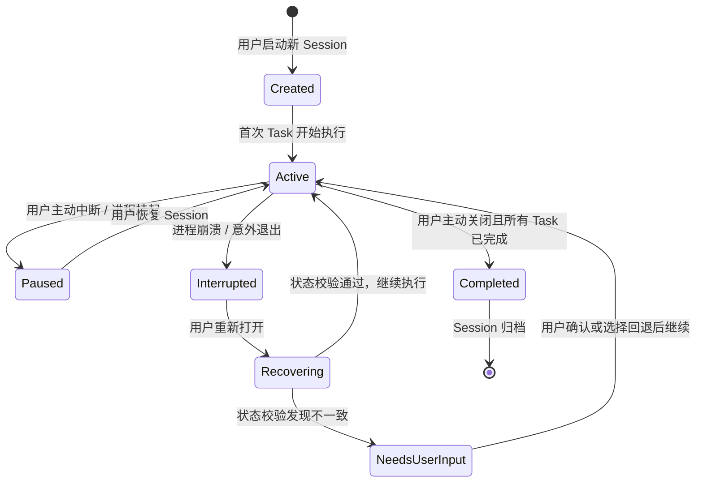
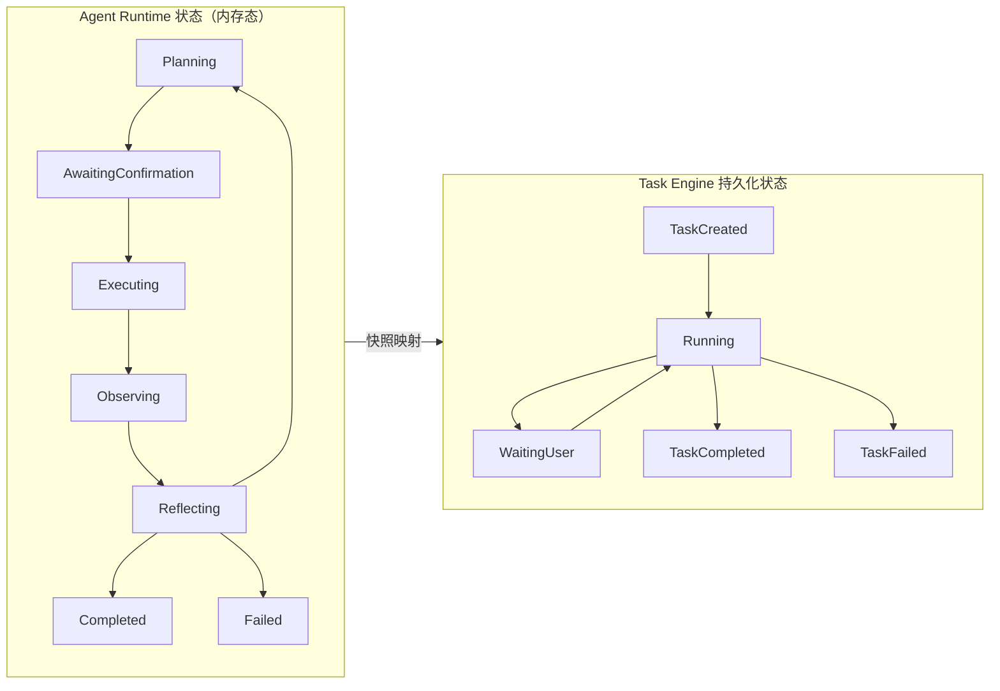
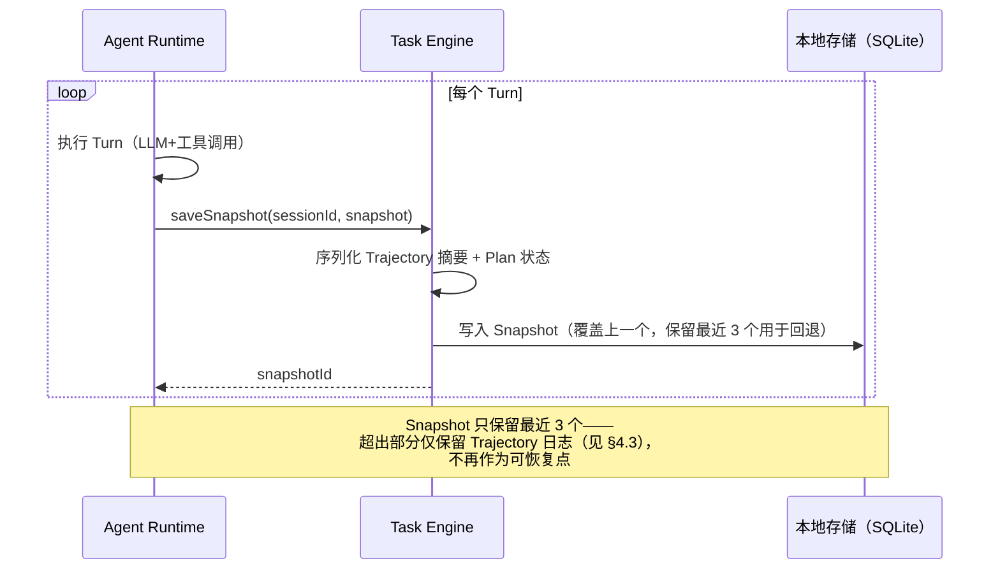
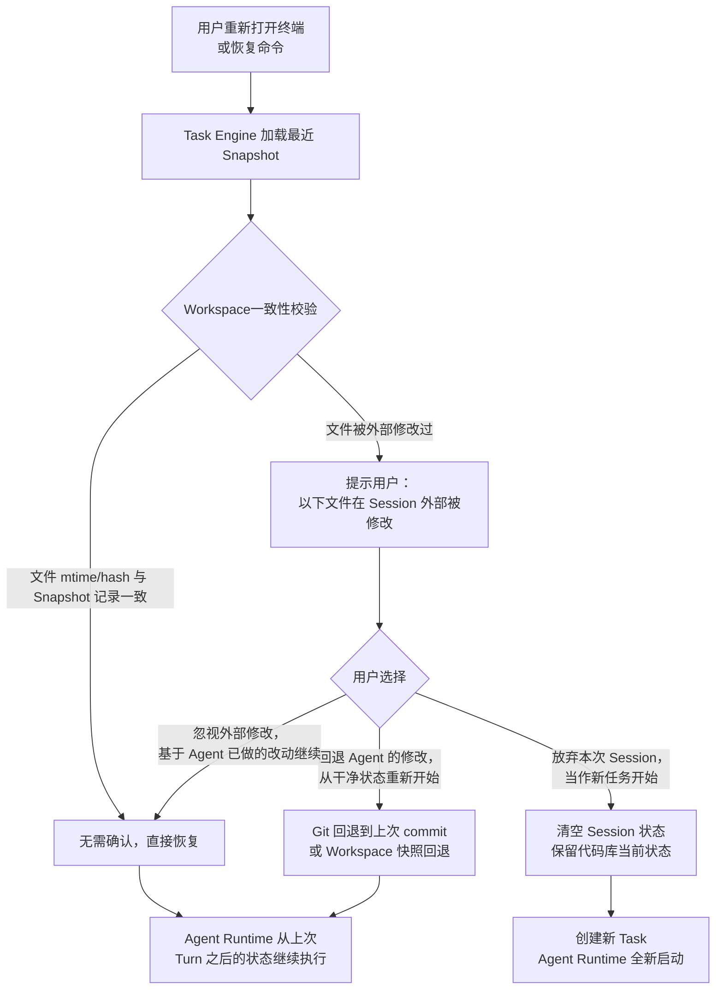
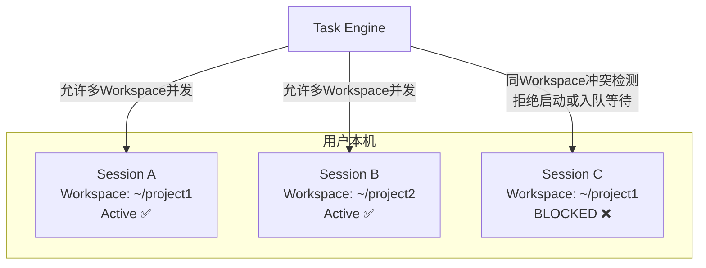
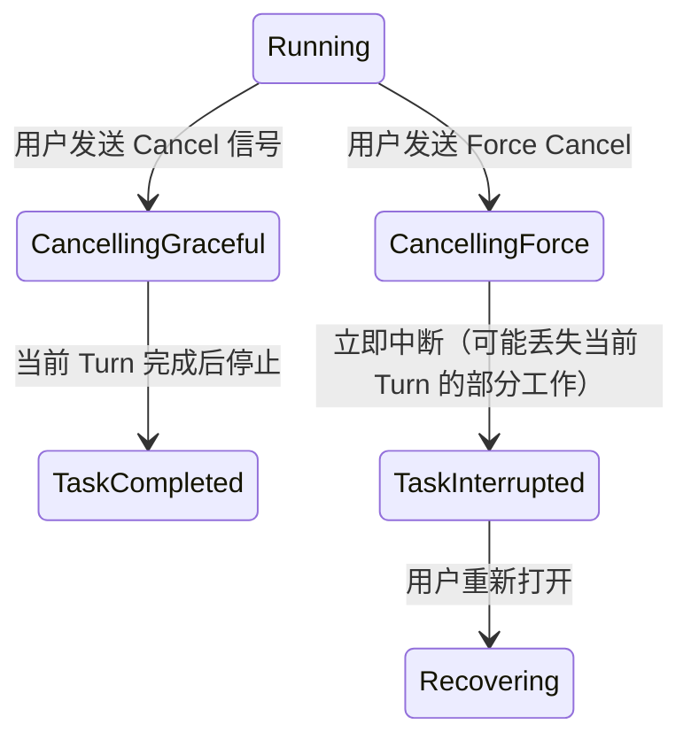

## 元信息

| 项 | 值 |
|---|---|
| RFC 编号 | RFC-0004 |
| 标题 | Task Engine |
| 状态 | Draft |
| 关联 PRD | [P0-5](../01-Product/PRD.md#3-产品范围本阶段-p0p1p2) |
| 关联架构 | [Overall Architecture §3](../02-Architecture/Overall%20Architecture.md#3-模块职责总览) |
| 依赖 RFC | RFC-0001 Agent Runtime、RFC-0006 Workspace |

## 1. 背景与目标

Task Engine 负责 Session 和 Task 的持久化、生命周期管理与恢复。这是 [PRD P0-5](../01-Product/PRD.md) 的直接实现：用户关闭终端后重新打开，会话应该能无缝接续——Agent 记得之前做了什么、代码库在中断前的状态、以及下一步该做什么。

### 目标

1. 每个 Turn 结束时自动保存状态快照，无需 Agent Runtime 关心持久化细节
2. 进程崩溃或用户主动关闭后，Session 可恢复并继续执行
3. 支持多 Session 并发管理（用户在不同项目/终端各自独立运行 Agent）
4. 提供 Session 历史检索接口，让用户能找回之前的任务上下文

### 非目标

- 跨设备的 Session 云端同步（见 [RFC-0011 Cloud Agent](RFC-0011%20Cloud%20Agent.md) P2）
- 团队级共享 Session（见 [RFC-0019 Enterprise](RFC-0019%20Enterprise.md) P2）

## 2. 核心概念

| 概念 | 定义 |
|---|---|
| **Session** | 一个 Agent 运行实例的完整生命周期容器，包含用户配置（自主性级别、模型选择）、项目路径、Workspace 引用 |
| **Task** | Session 内的一次用户请求——一个 Session 可以包含多个连续 Task（用户在同一次会话中连续提多个需求） |
| **Turn** | Task 内的最小执行单元（见 [RFC-0001 §2](RFC-0001%20Agent%20Runtime.md#2-核心概念)），是快照的最小粒度 |
| **Snapshot** | 一次持久化操作产生的状态数据，包含：当前 Turn 索引、Plan 状态、Trajectory 摘要、Workspace 文件变更摘要 |
| **RecoveryPoint** | 一个可用于恢复的 Snapshot——不是所有 Snapshot 都是 RecoveryPoint（见 §4.1 快照 vs 恢复点策略） |

## 3. Session 与 Task 的分层状态机

Task Engine 维护两层状态机——Session 层（粗粒度，面向生命周期）和 Task 层（细粒度，与 Agent Runtime 状态机对齐）：

### 3.1 Session 生命周期状态机

### 3.2 Task 持久化状态（对应 Agent Runtime 状态机）

Task Engine 的持久化状态比 Agent Runtime 的状态机更粗——不需要在持久层区分 `Observing` vs `Reflecting`，但需要捕获对恢复至关重要的状态：

**映射规则**：
- `Planning | Executing | Observing | Reflecting` → `Running`
- `AwaitingConfirmation` → `WaitingUser`（唯一的"暂停等待外部输入"状态，恢复时必须从此处继续）
- `Completed` → `TaskCompleted`
- `Failed | PartialFailure（超重试上限）` → `TaskFailed`

## 4. 快照与恢复策略

### 4.1 快照粒度

**每个 Turn 结束后保存一个 Snapshot。** 理由：
- Turn 是 Agent Runtime 执行流程中"副作用已经落地"的最小原子单位——Turn 结束时文件已经写入、工具已经执行完毕
- 如果只在 Plan 变更时快照（更粗粒度），Plan 变更之间可能有多个 Turn，其中任何一个 Turn 之间崩溃都会丢失已完成的工作
- 如果每个工具调用中间都快照（更细粒度），持久化 I/O 开销过大且快照状态可能不一致（当前 Turn 的工具调用只完成了一半）

### 4.2 Session 恢复流程

**一致性校验的具体实现**：
- Snapshot 中记录每个被 Agent 修改过的文件的 `(path, mtime, sha256_hash)` 三元组
- 恢复时对比实际文件系统的当前值，任何不匹配即触发 Warning 流程
- 未被 Agent 修改过的文件不参与校验——用户可能在 Session 之外正常编辑了其他文件，这不影响 Agent 的工作

### 4.3 数据保留策略

| 数据 | 保留策略 | 理由 |
|---|---|---|
| Snapshot（最近3个） | 永久保留（除非用户手动清理） | 恢复点数据量小（KB 级），保留成本低 |
| 完整 Trajectory 日志 | 默认保留 30 天，可配置 | Trajectory 是纯文本 JSON Lines，增长快但高度可压缩 |
| 已完成的 Task 元数据（标题、时间、状态） | 永久保留 | 支持历史检索 |

## 5. 并发 Session 管理

v1.0 允许用户同时在不同 Workspace（不同项目目录）中启动多个 Agent Session。同一 Workspace 内只允许一个 Session 处于 Active 状态——防止两个 Agent 同时修改同一份代码产生竞态。

**资源竞争处理**：
- Sandbox（[RFC-0014](RFC-0014%20Sandbox.md)）每 Session 独立实例，天然隔离
- Workspace 文件锁（[RFC-0006 Workspace](RFC-0006%20Workspace.md) §6）进一步保证同一 Workspace 内不会有两个进程同时写入
- Session 历史检索接口返回当前用户所有 Session 的列表，与 Workspace 无关

## 6. Task 取消与中断

- **优雅取消（Graceful Cancel）**：发出信号后等待当前 Turn 完成（LLM 推理 + 工具调用），然后停止。当前 Turn 的一部分工作已经落地，Trajectory 完整可追溯
- **强制取消（Force Cancel）**：立即中断进程——当前 Turn 可能部分工具调用已执行、部分未执行，恢复时需校验完整性

## 7. 风险与缓解

| 风险 | 缓解措施 |
|---|---|
| 强制取消导致 Turn 中间状态不一致（文件已写但 Snapshot 未保存） | 工具调用完成后立即写 Snapshot，不等到整个 Turn 结束——这是 §4.1 设计中的权衡：Snapshot 粒度虽为 Turn 级，但写入发生在 Turn 内每个工具调用完成后 |
| 恢复后 Agent 基于过期 Plan 继续执行（中断期间用户需求变了） | 恢复时展示上次的 Plan 和当前进度，并询问用户"继续此计划还是重新规划"——给用户一个自然的重新定向机会 |
| 多个 Session 的 Snapshot 数据累积撑满磁盘 | 保留策略（§4.3）默认 30 天自动清理 Trajectory 日志；磁盘容量告警时主动提示 |
| 恢复时发现 Workspace 文件被外部大改，Agent 无法继续 | Warning 流程（§4.2）提供三个选项（回退/忽视/放弃），不做单一强制行为 |

## 8. 验收标准

1. Agent 正在执行第 5 个 Turn 时模拟进程崩溃（kill -9），重新启动后自动加载 Snapshot，从第 6 个 Turn（中断前的下一个）继续执行
2. Session 中断期间用户在外部手动修改了一个 Agent 曾修改过的文件，恢复时 Workspace 一致性校验触发 Warning，正确提示不一致项
3. 尝试在同一 Workspace 下启动第二个 Session，Task Engine 拒绝启动并提示"该 Workspace 已有活跃 Session"
4. 强制取消后重新打开 Session，Workspace 文件状态与 Trajectory 记录的已完成 Turn 一致
5. Session 历史检索接口可返回最近 30 天内所有 Task 列表，能正确过滤和排序

## 9. 开放问题

- 快照保留最近 3 个的默认值是否合理（3 个 = 用户最多回退 3 个 Turn），还是应该保留更多（如 10 个）？需要在真实使用中根据磁盘开销调参
- 恢复时是否应该让 Agent 自己判断"这是恢复还是新任务"——目前设计依赖用户确认，但如果 P1+ 引入 [RFC-0005 Memory](RFC-0005%20Memory.md)，Agent 理论上可以学到"用户每次都选择继续执行"，从而减少确认
- 并发 Session 数量是否需要硬性上限（防止用户无意中开几十个 Session 占用资源）？
