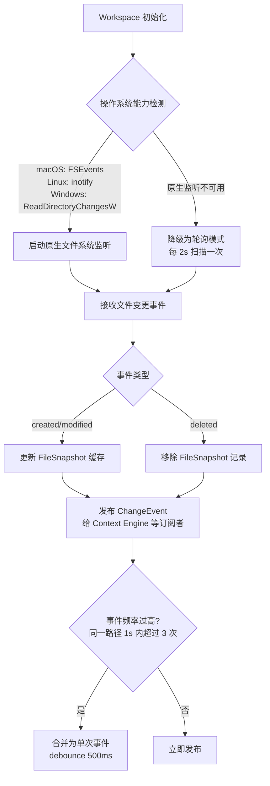
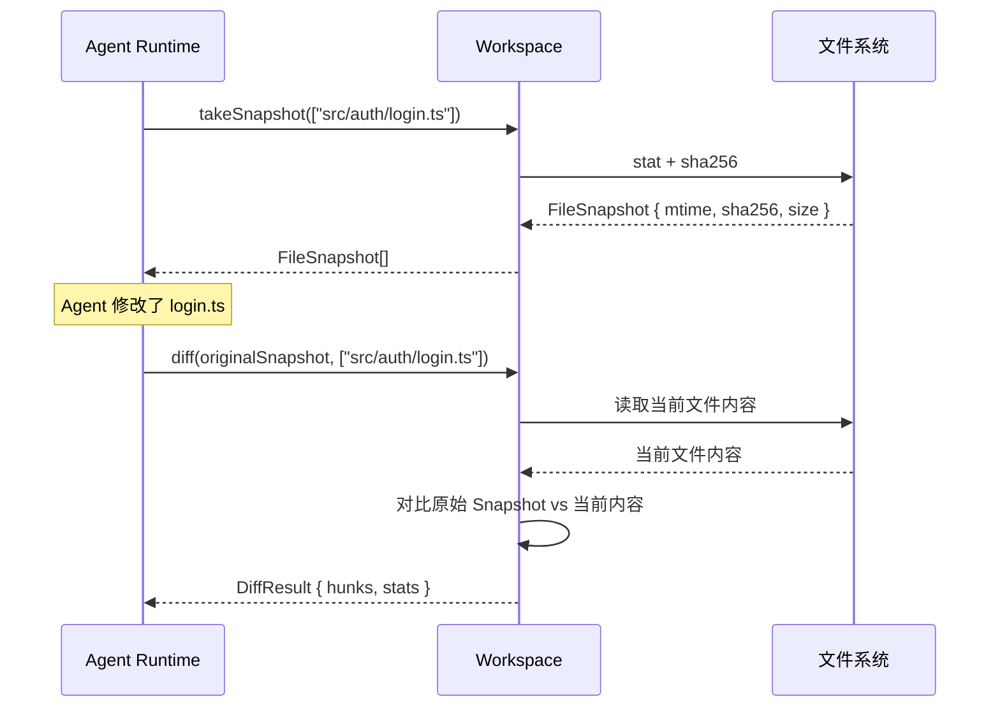
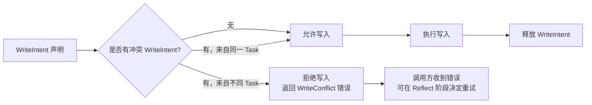
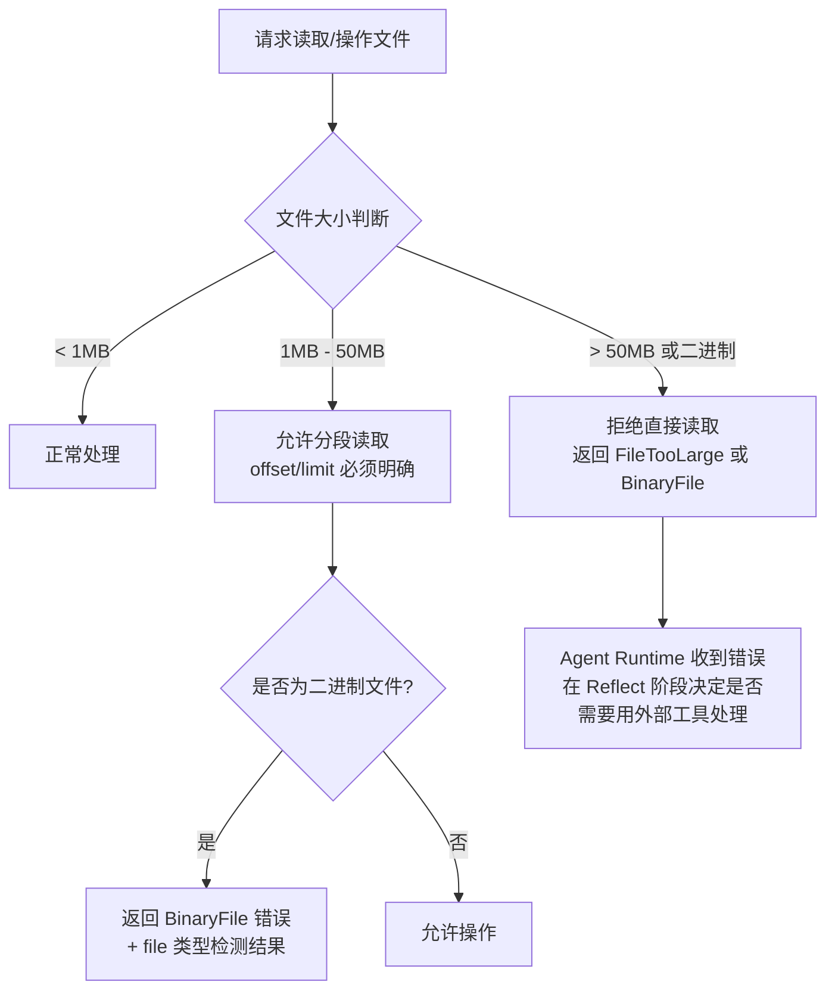
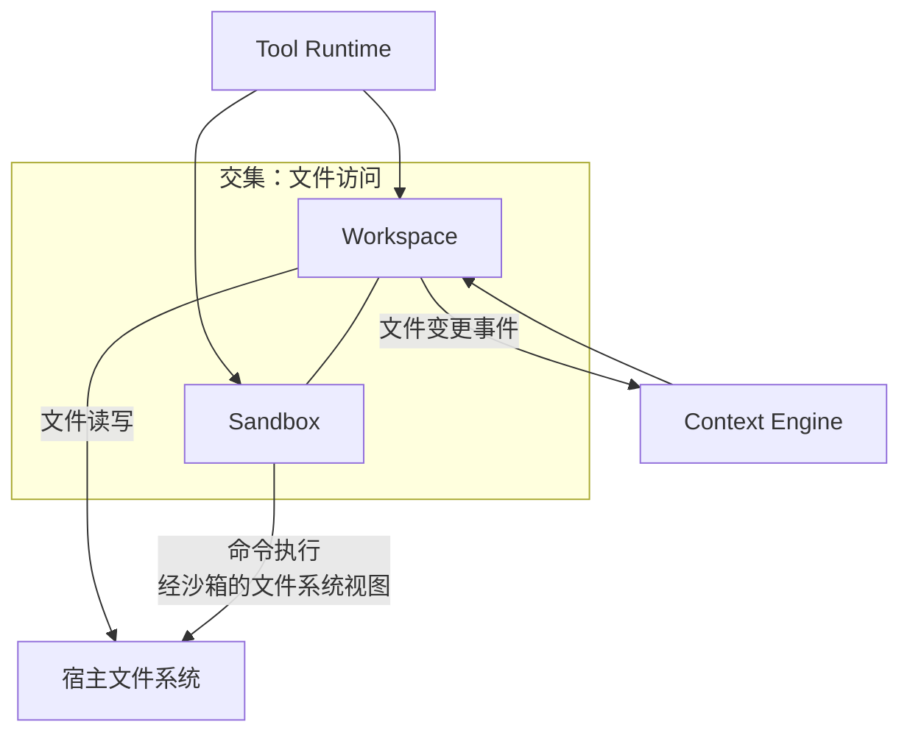

## 元信息

| 项 | 值 |
|---|---|
| RFC 编号 | RFC-0006 |
| 标题 | Workspace |
| 状态 | Draft |
| 关联 PRD | [P0-3](../01-Product/PRD.md#3-产品范围本阶段-p0p1p2)、[P0-6](../01-Product/PRD.md#3-产品范围本阶段-p0p1p2) |
| 关联架构 | [Overall Architecture §7](../02-Architecture/Overall%20Architecture.md#7-跨模块设计约束) |
| 依赖 RFC | RFC-0014 Sandbox |

## 1. 背景与目标

Workspace 是文件操作的唯一入口——呼应 [Overall Architecture §7](../02-Architecture/Overall%20Architecture.md#7-跨模块设计约束) 约束 4。Tool Runtime 不直接调用宿主文件系统 API，所有读写经 Workspace 抽象。这不仅保证了文件操作的统一接口，也为未来"本地 Workspace ↔ 云端 Sandbox Workspace"的可替换性（[RFC-0011 Cloud Agent](RFC-0011%20Cloud%20Agent.md) P2 预留）奠定了基础。

### 目标

1. 统一文件读写、目录浏览、文件变更追踪的接口
2. 为 [RFC-0002 Context Engine](RFC-0002%20Context%20Engine.md) 提供文件变更事件（增量索引触发源）
3. 为 [RFC-0007 Review](RFC-0007%20Review.md) 提供 Diff 生成能力（中间状态变更对比）
4. 处理大文件、二进制文件、超大目录的性能边界
5. 检测外部并发修改（用户在另一编辑器中改了文件），避免 Agent 基于过期状态继续操作

### 非目标

- 取代文件系统——Workspace 是文件系统的薄抽象层，不是虚拟文件系统
- 替代 Git（[RFC-0008 Git](RFC-0008%20Git.md)）做版本管理——Workspace 的 FileSnapshot 机制用于状态对比和回退，不是 Git 的替代品

## 2. 核心概念

| 概念 | 定义 |
|---|---|
| **Workspace** | 一个文件系统抽象实例，绑定到一个项目根目录，提供统一的读写/监听/diff 接口 |
| **FileSnapshot** | 单个文件在某个时间点的状态记录：`(path, mtime, sha256, size)`，用于变更检测和 Diff 生成 |
| **ChangeEvent** | 文件变更事件：`created` / `modified` / `deleted`，携带文件路径和变更类型 |
| **WriteIntent** | 一次文件写入的意图声明——在真正写入之前声明"我要改这个文件"，用于并发写冲突检测 |
| **ExternalModification** | 用户通过外部编辑器（非 Agent）对 Workspace 内文件进行的修改——Agent 需要通过监听机制感知到 |

## 3. 接口规范

```typescript
interface Workspace {
  // 文件读写
  readFile(path: string, options?: { offset?: number; limit?: number }): Promise<FileContent>;
  writeFile(path: string, content: string): Promise<void>;

  // 目录浏览
  listDirectory(path: string, options?: { recursive?: boolean; maxDepth?: number }): Promise<DirectoryEntry[]>;

  // 文件存在性与元数据
  exists(path: string): Promise<boolean>;
  stat(path: string): Promise<FileStat>;

  // 文件变更追踪
  watch(paths: string[], callback: (event: ChangeEvent) => void): WatcherHandle;

  // Snapshot 与 Diff
  takeSnapshot(paths: string[]): Promise<FileSnapshot[]>;
  diff(snapshot: FileSnapshot[], currentPaths?: string[]): Promise<DiffResult>;

  // 并发控制
  declareWriteIntent(path: string, taskId: string): Promise<void>;
  releaseWriteIntent(path: string, taskId: string): Promise<void>;
  checkExternalModification(snapshot: FileSnapshot): Promise<boolean>;
}

interface FileSnapshot {
  path: string;
  mtime: number;
  sha256: string;
  size: number;
}

interface ChangeEvent {
  type: "created" | "modified" | "deleted";
  path: string;
  timestamp: number;
}
```

**关键设计决策**：`readFile` 支持 `offset/limit` 分段读取——大型文件不全量加载到内存，由调用方按需分页获取。这与 [RFC-0003 Tool Runtime](RFC-0003%20Tool%20Runtime.md) §6 的 Observation 截断策略一致。

## 4. 文件变更检测机制



**事件 debounce**：文件保存操作可能触发多次连续事件（编辑器 auto-save、formatter 自动格式化）。同一路径 1s 内超过 3 次事件会被合并为单次 `modified` 事件——避免 Context Engine 被"保存一次文件触发三次索引重建"的打脸。

**原生监听 vs 轮询**：
- 优先使用操作系统原生文件系统事件监听（零轮询开销、实时性高）
- 不支持时降级为 2s 轮询（兼容性保证，但有一定延迟和 CPU 开销）
- 不论哪种模式，上层调用方（Context Engine 等）通过 `watch()` 接口订阅，不感知底层实现差异

## 5. Diff 生成

Workspace 层提供两套 Diff 接口，服务不同场景：

| Diff 类型 | 接口 | 使用场景 | 调用方 |
|---|---|---|---|
| **Snapshot Diff** | `diff(snapshot, currentPaths)` — 对比 FileSnapshot 与当前文件状态 | Agent 执行中的中间变更对比（每修改一个文件都能看到即时 Diff） | Agent Runtime（Reflect 阶段自我检查）、Review（中间预览） |
| **Workspace File Diff** | 基于两个 FileSnapshot 集合做对比 | Review 展示（当 Git 不可用时作为降级方案） | [RFC-0007 Review](RFC-0007%20Review.md) |



**关于 Review 最终 Diff 来源的约定**：
- 最终的 Review 展示使用 **Git diff**（[RFC-0008 Git §5](RFC-0008%20Git.md#5-diff-生成git-层-vs-workspace-层)）作为权威来源——Git 状态是用户和团队用于代码审查的标准语义
- Workspace 层 Diff 作为 Git 不可用时的降级方案——性能和格式质量上接近 Git diff，但语义上不包含"staged vs unstaged"等 Git 特定概念
- Agent 内部使用 Workspace Snapshot Diff——因为 Agent 的执行不是以"Git commit"为单位，而是以"每修改一个文件"为单位

## 6. 并发写保护

同一 Workspace 内可能有多股力量尝试同时写入——Agent 的工具调用、Agent 的 Sub-agent（P1）、用户在外部编辑器中的手动修改。需要避免互相覆盖：



**冲突判定规则**：
- 同一 Task 内的多个工具调用可以并发写入同一文件——因为它们属于同一次用户请求，Agent Runtime 自己负责协调调用顺序
- 不同 Task 对同一文件的写入必须串行——后到的 Task 收到 WriteConflict 错误，Agent Runtime 在 Reflect 阶段决定等待或换策略
- 用户外部修改不受 WriteIntent 控制——用户有权在任何时候修改任何文件。Agent 的责任是通过 `checkExternalModification()` 检测外部变更并做出反应，而非阻止用户操作

## 7. 大文件/二进制文件处理



**二进制文件检测**：读取文件前 512 字节，检测是否包含 null 字节（\0）——这是识别二进制文件的最简单最可靠启发式方法。如果检测为二进制，返回错误并携带 MIME 类型推断结果。

**大文件分段读取**：当 Agent 需要看大型日志文件或数据文件时，`offset/limit` 分段读取避免了全量加载到内存再注入 LLM 上下文（LLM 上下文通常也不需要整个文件）。文件大小上限（默认 50MB，可配置）防止 Agent 浪费时间处理明显超出 LLM 理解范围的文件。

## 8. 与 Sandbox 的关系

Workspace 是文件访问抽象，Sandbox（[RFC-0014](RFC-0014%20Sandbox.md)）是执行环境隔离。两者在不同层次工作，但在文件访问路径上有重叠：



**边界划分**：
- Agent 通过 `read_file`/`write_file` 等工具操作文件 → 走 Workspace
- Agent 通过 `execute_command` 执行命令（如 `sed -i 's/foo/bar/g' file.txt`）→ 命令中涉及的文件操作受 Sandbox 的文件系统视图约束（只能访问白名单路径），但 Sandbox 不通过 Workspace——这是性能和安全隔离的权衡
- 两者互不替代：Workspace 不能取代 Sandbox 的隔离，Sandbox 不能取代 Workspace 的 Diff/监听/review 功能

## 9. 风险与缓解

| 风险 | 缓解措施 |
|---|---|
| 文件系统事件监听在大型 monorepo （10 万+ 文件）上事件过多导致性能问题 | debounce + 事件合并（§4）；Context Engine 只 watch 用户代码目录，忽略 `node_modules`/`dist`/`.git` |
| 轮询模式下 2s 间隔导致 Context Engine 索引延迟 > 5s（违背 [RFC-0002 §10](RFC-0002%20Context%20Engine.md#10-验收标准) 的验收标准） | 只在原生监听不可用时才降级为轮询——三主流 OS 均支持原生事件 API，轮询只是兜底 |
| `checkExternalModification` 与真正冲突之间存在时间窗口（check-then-act race） | 检测到外部修改仅是"提示 Agent 注意"而非"拒绝 Agent 操作"——Agent 自行在 Reflect 阶段决定是否继续。真正的文件级保护由 WriteIntent 提供 |
| 大项目 Workspace 初始化时遍历文件树构建 FileSnapshot 缓存耗时过长 | 懒加载——FileSnapshot 只在文件首次被操作或被 watch 时生成，不预构建全量索引 |

## 10. 验收标准

1. Agent 修改文件后，`diff(previousSnapshot, currentPaths)` 返回的 DiffResult 包含准确的 Hunks，与 `git diff` 输出等价
2. 用户在外部编辑器中保存文件后，Workspace 在 1s 内发出 ChangeEvent（原生监听模式）
3. 尝试读取 100MB 文件时返回 FileTooLarge 错误，返回的 Observation 中包含文件大小和分页读取建议
4. 两个不同 Task 同时尝试写入同一文件，第二个 WriteIntent 声明返回冲突错误
5. 检测到二进制文件（前 512 字节含 \0）时返回 BinaryFile 错误

## 11. 开放问题

- `watch()` 的路径过滤（include/exclude glob）是在 Workspace 层实现还是在调用方（Context Engine）实现——当前倾向于 Workspace 层提供粗粒度过滤（如排除 `node_modules`），精确过滤由调用方自己再做
- 文件操作是否需要支持事务性（即"一组写入要么全成功要么全回退"，Agent 修改了 3 个文件、第 3 个写入失败了，前 2 个是否应该回滚）？当前 v1.0 不做事务性（复杂度和性能开销大），依赖 Git 回退兜底
- Workspace Snapshot 的存储位置——内存缓存 vs 持久化到 Task Engine（见 [RFC-0004 Task Engine](RFC-0004%20Task%20Engine.md)）？当前 Snapshot 存内存（纯性能用途），持久化由 Task Engine 的 Snapshot 负责（§4 快照）
