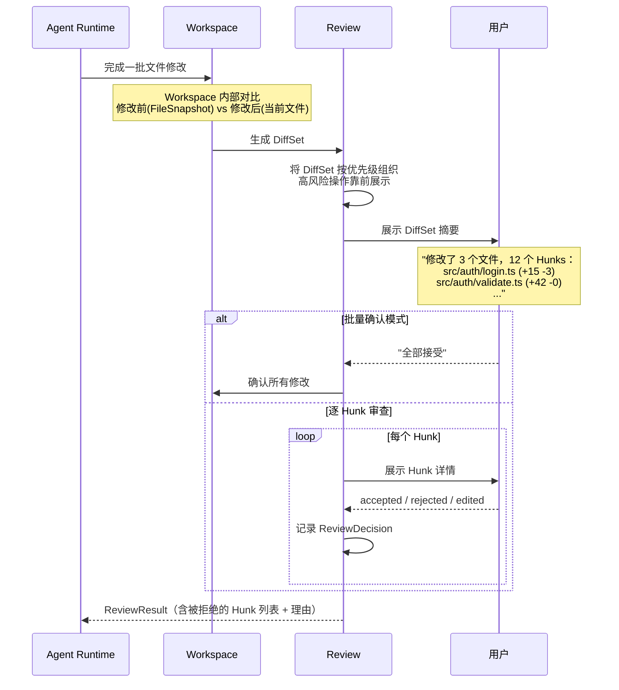
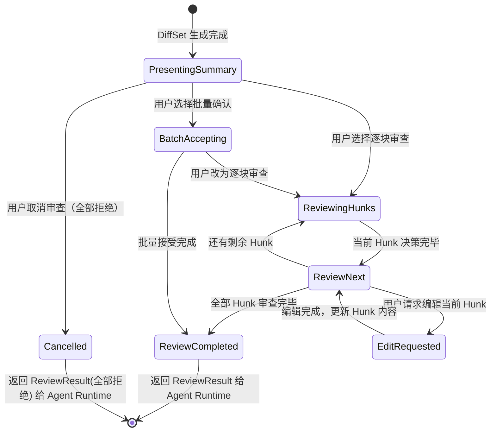
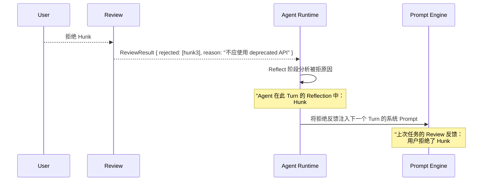

## 元信息

| 项 | 值 |
|---|---|
| RFC 编号 | RFC-0007 |
| 标题 | Review |
| 状态 | Draft |
| 关联 PRD | [P0-4](../01-Product/PRD.md#3-产品范围本阶段-p0p1p2) |
| 关联架构 | [Overall Architecture §3](../02-Architecture/Overall%20Architecture.md#3-模块职责总览) |
| 依赖 RFC | RFC-0006 Workspace、RFC-0008 Git、RFC-0015 Permission |

## 1. 背景与目标

Review 负责 Diff 展示与逐块（hunk-level）接受/拒绝交互，是 [Design Principles](../00-Vision/Design%20Principles.md) 原则 5"Diff 优先于覆盖"和 [PRD P0-4](../01-Product/PRD.md) 的直接落地。这是用户与 Agent 修改结果交互最频繁的界面——每次 Agent 完成一批文件修改后，用户通过 Review 流程决定"哪些改动接受、哪些拒绝、哪些要调整"。

### 目标

1. 所有 Agent 文件修改以 Diff 形式展示，用户可逐 Hunk 接受/拒绝
2. 支持多文件批量确认（熟练用户不应被逐个文件逐个 Hunk 的低效审核拖慢）
3. 用户拒绝的反馈能回传给 Agent Runtime，让 Agent 避免重复提出已被拒绝的方案
4. 大规模变更（如批量迁移）有信息分层机制，不让用户被几百个 Hunk 淹没
5. 双形态体验一致：CLI 和 IDE 插件的 Review 交互共享同一套底层状态机，仅在视觉渲染上适配各自的交互习惯

### 非目标

- 类 GitHub Pull Request 的多人协作 Review 流程（不在 v1.0 范围）
- Review 阶段的交互视觉设计（CLI 渲染、IDE 面板布局等——见 [04-UX](../04-UX/_INDEX.md)）

## 2. 核心概念

| 概念 | 定义 |
|---|---|
| **DiffSet** | 一次 Review 会话中的全部文件变更集合——一个 Task 可能产生多个 DiffSet（Agent 分批次提交修改给用户审查） |
| **Hunk** | Diff 的最小可操作单元——通常是一个连续的函数/方法/代码块变更，不是单行（粒度太细）也不是整个文件（粒度太粗） |
| **ReviewDecision** | 用户对单个 Hunk 的决策：`accepted` / `rejected` / `edited`，以及可选的拒绝理由（供 Agent 调整后续策略用） |
| **BatchReviewMode** | 批量审查模式——用户可选择"全部接受"或"按风险分级确认"，降低高频审核疲劳 |

## 3. Diff 生成与展示流程



## 4. Review 粒度与交互状态机

### 4.1 默认粒度：Hunk 级

选择 Hunk 级（而非行级或文件级）的理由：
- **行级过细**：一个函数修改可能产生多行变更，逐行审查会打断逻辑连续性——用户需要看到完整的"这个函数改了什么"，而不是"第 15 行改了"
- **文件级过粗**：用户可能同意文件中的大部分修改但不同意其中几处——文件级只能全接受或全拒绝，违背了"用户对代码保持最终控制权"的原则
- **Hunk 级是最优权衡**：一个 Hunk 通常对应一个语义连贯的代码块变更（一个函数体的修改、一个 if-else 分支的替换），用户在认知上刚好能判断"这个改变是否正确"

### 4.2 Review 交互状态机



## 5. 拒绝反馈回路

被拒绝的 Hunk 不仅是 UI 层面的"不应用这个变更"，更重要的是要反馈给 Agent Runtime 的 Reflect 阶段：



**关键设计**：拒绝不是"这个 Hunk 被跳过了"——拒绝是"Agent 的知识库被更新了"。拒绝理由会被注入到下一个 Turn 的 Prompt 中作为约束条件，避免 Agent 换个方式提出本质上相同的方案。

## 6. 用户编辑 Hunk 的回环机制

[Design Principles](../00-Vision/Design%20Principles.md) 原则 5 的深度体现：用户不仅可以说"不"，还可以说"改成这样"。

```mermaid
graph LR
    A[Agent 生成的 Diff] --> B{Hunk 决策}
    B -->|接受| C[原样应用]
    B -->|拒绝+理由| D[反馈给 Agent]
    B -->|编辑| E[用户修改 Hunk 内容]
    E --> F[以用户编辑后的内容覆盖应用]
    F --> G[将编辑后的内容作为<br/>"用户意图"反馈给 Agent]
    D --> H[Agent 下一个 Turn<br/>基于反馈调整策略]
    G --> H
```

**编辑后的内容处理**：用户编辑过的 Hunk，在下一个 Turn 中被视为"用户已接受的内容"——Agent 不会重新修改它，除非用户在新的 Task 中明确提出进一步修改。

## 7. 大规模变更的信息分层

当 DiffSet 包含超过 10 个 Hunk 或超过 3 个文件时，逐块审查会造成严重疲劳。信息分层策略：

| 层级 | 展示内容 | 用户操作 |
|---|---|---|
| **L1: 摘要视图**（默认） | 文件列表 + 每个文件的变更统计（+X -Y 行） + 风险标注 | 展开单个文件 / 全部接受 / 切换逐块审查 |
| **L2: 文件级详情** | 选中文件的完整 Diff（所有 Hunk 合并展示） | 按 Hunk 逐块审查 / 对单个文件全部接受/拒绝 |
| **L3: Hunk 级详情** | 单个 Hunk 的完整上下文（前后 10 行） | 接受 / 拒绝 / 编辑 |

CLI 和 IDE 使用同一套分层逻辑，仅视觉渲染方式适配各自终端能力。

## 8. 与 Permission 的协同

| AutonomyLevel | Review 行为 |
|---|---|
| L1（安全模式） | 每个 DiffSet 强制进入逐块审查——不可跳过 |
| L2（标准模式） | 默认进入逐块审查，但用户可选择批量接受 |
| L3（自主模式） | 默认展示摘要视图，用户可选择放大到逐块审查（**但 write 操作此时已经自动执行了——用户在 Review 阶段看到的是"已经写入了的结果"，Review 变成事后审核而非事前确认**） |
| L4（完全自主） | Review 只展示最终变更摘要，不要求交互——但用户仍可主动进入逐块审查 |

> **从 L3 开始的语义变化**：L3/L4 下 Agent 已经自主执行了写入操作——Review 不再是 Permission 的前置确认，而是事后可审计的变更日志。这与 [RFC-0015 Permission](RFC-0015%20Permission.md) 的整体设计一致。

## 9. 风险与缓解

| 风险 | 缓解措施 |
|---|---|
| 逐块审查在大批量修改时严重拖慢效率 | 信息分层（§7）+ 批量接受模式（熟练用户默认走摘要→批量接受路径） |
| 拒绝反馈被 Agent 忽略——下一轮又提出类似方案 | 拒绝理由注入到下一个 Turn 的 Prompt 中（§5），作为 explicit constraint 而非隐式信号 |
| 用户编辑 Hunk 后 Agent 后续推理与编辑内容不一致 | 编辑内容写入 Workspace 后生成新的 FileSnapshot，Agent 后续 Turn 基于此快照而非原始生成内容推理 |
| CLI 和 IDE 插件的 Review 体验差异太大导致用户切换终端时困惑 | 状态机统一（§4.2），视觉渲染由 04-UX 保证适配 |

## 10. 验收标准

1. 单文件 3 Hunk 修改：用户逐块接受 2 个、拒绝 1 个，最终文件只应用了 2 个 Hunk 的变更
2. 用户编辑一个 Hunk 后保存，Workspace 写入的是编辑后的内容而非 Agent 原始内容，且 Agent 下一 Turn 不会覆盖编辑结果
3. 拒绝某个 Hunk 并给出理由后，Agent 在下一 Turn 中不再提出使用被拒绝的技术方案
4. DiffSet 超过 10 个 Hunk 时，默认展示摘要视图，用户可逐文件展开查看
5. L3 自主模式下，Agent 自主写入了文件后 Review 展示的事后摘要与 Workspace 实际文件状态一致

## 11. 开放问题

- 拒绝反馈的"约束有效期"是多长——当前 Turn 内有效？当前 Task 内有效？还是永久记忆（依赖 [RFC-0005 Memory](RFC-0005%20Memory.md)）？建议 v1.0 只做到当前 Task 内有效
- 用户编辑 Hunk 后如果产生语法错误——Review 层是否应该在应用前做基本的语法校验，还是信任用户（错误是用户自己的责任）？
- 批量确认模式下"全部接受"是否需要区分"全部接受但事后可审计"和"全部接受不记录"——当前设计倾向于始终记录，不提供"不记录"选项（呼应可追溯性原则）
