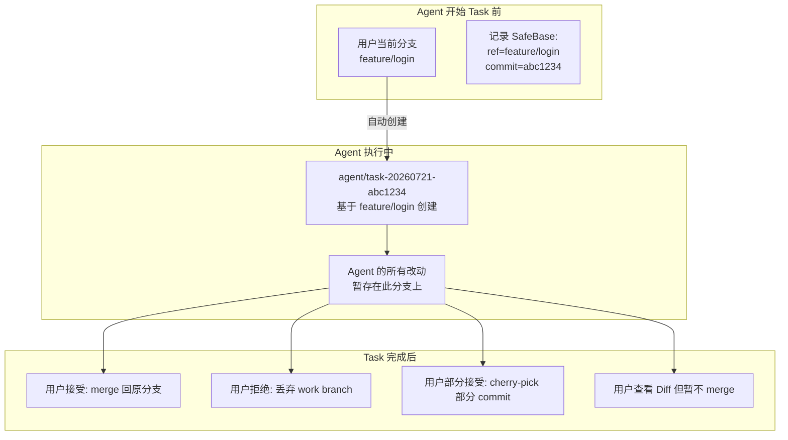
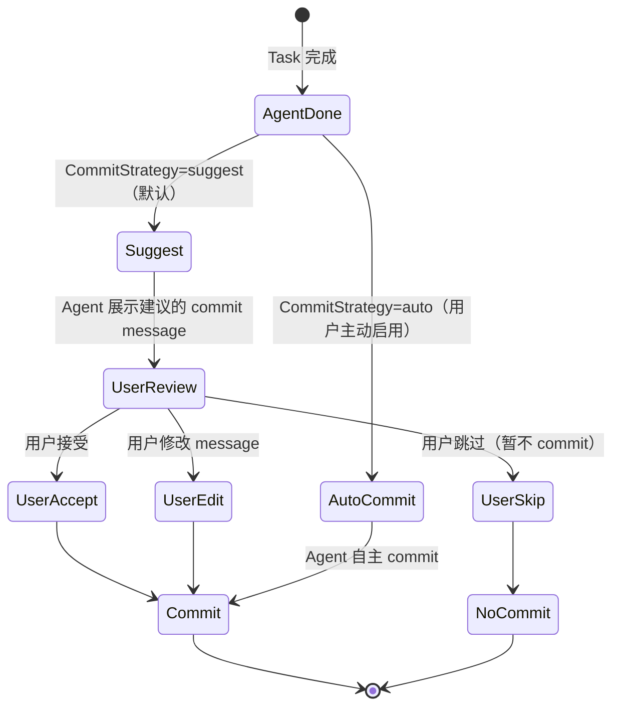
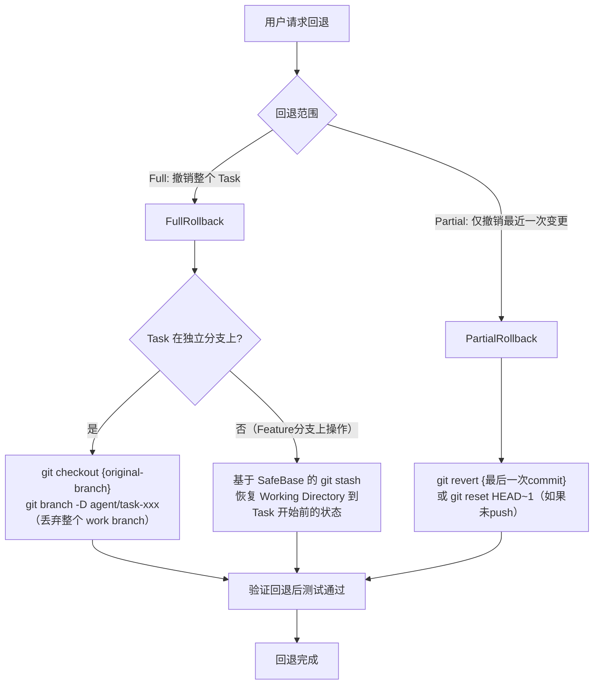
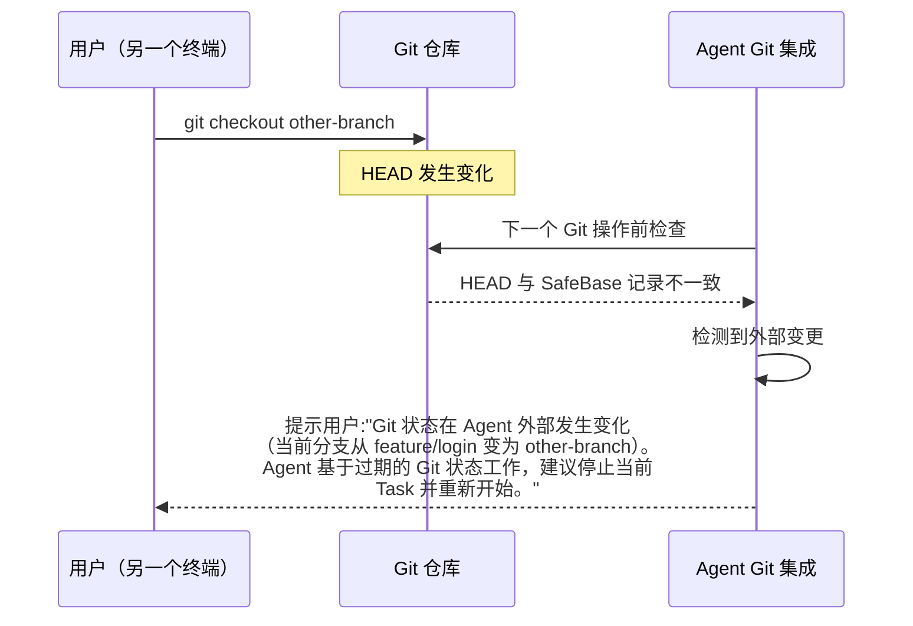

## 元信息

| 项 | 值 |
|---|---|
| RFC 编号 | RFC-0008 |
| 标题 | Git |
| 状态 | Draft |
| 关联 PRD | [P0-7](../01-Product/PRD.md#3-产品范围本阶段-p0p1p2) |
| 关联架构 | [Overall Architecture §3](../02-Architecture/Overall%20Architecture.md#3-模块职责总览) |
| 依赖 RFC | RFC-0006 Workspace、RFC-0007 Review |

## 1. 背景与目标

Git 集成实现 [PRD P0-7](../01-Product/PRD.md)：分支管理、diff 生成、commit 操作。Git 是 Agent 修改代码后"落地为可追溯变更"的关键路径，也是用户"撤销 Agent 所有改动"的最终安全网——呼应 [Product Philosophy](../00-Vision/Product%20Philosophy.md)"失败要显性、要可恢复"。

### 目标

1. Agent 的修改始终在可控分支上，不污染用户的当前工作分支
2. Commit 操作保留用户的最终控制权——Agent 可以建议 commit，但默认不代为执行
3. 提供一键回退机制，用户可以撤销整个 Task 的全部改动
4. 检测外部 git 操作冲突，避免 Agent 和用户在同一仓库的不同终端中互相干扰

### 非目标

- 类 GitHub PR 的全生命周期自动化（不在 v1.0 范围——见 [RFC-0011 Cloud Agent](RFC-0011%20Cloud%20Agent.md) P2）
- 代码托管平台的 API 集成（GitHub/GitLab API——v1.0 仅操作本地 Git 仓库）

## 2. 核心概念

| 概念 | 定义 |
|---|---|
| **WorkBranch** | Agent 为当前 Task 自动创建的工作分支——命名遵循固定规则（如 `agent/task-{timestamp}-{hash}`），便于事后识别和清理 |
| **CommitStrategy** | Commit 的触发模式——`suggest`（Agent 建议但不执行，默认）vs `auto`（Agent 在每个任务完成后自动 commit，需用户主动启用） |
| **SafeBase** | 开始 Task 前的 Git 状态快照（分支名 + HEAD commit hash）——用于回退和状态恢复 |
| **RollbackScope** | 回退的范围——`full`（撤销整个 Task 的全部改动回到 SafeBase）vs `partial`（仅撤销最近一次变更） |

## 3. 分支隔离策略

**分支命名规则**：`agent/task-{YYYYMMDD}-{commitHashPrefix}` 
- 日期和 commit hash 保证唯一性和可追溯性
- `agent/` 前缀方便用户识别和批量清理过期的 Agent 分支

**智能分支策略**：检测用户是否已经在 git 工作流中：

| 用户状态 | Agent 策略 |
|---|---|
| 在 `main`/`master` 分支，无未提交改动 | 自动创建 WorkBranch，完成任务 |
| 已在 `feature/xxx` 分支，有未提交改动（Working Directory dirty） | **不做自动分支切换**——在当前分支基于 Working Directory 状态继续，但会先记录 SafeBase（git stash snapshot + 当前 HEAD）用于回退 |
| 在 `agent/task-xxx` 分支（上次 Task 遗留） | 提示用户选择：继续上次的分支 / 基于最新状态创建新分支 |

**关键设计决策**：不强制所有场景都创建分支——用户在 feature 分支上正在手工写代码时 Agent 进来帮忙，如果 Agent 强制创建分支然后切换，用户的手工改动会丢失或产生冲突。智能判断 > 强制策略。

## 4. Commit 策略

**默认 CommitStrategy = `suggest`**。理由：
- 呼应 [Product Philosophy](../00-Vision/Product%20Philosophy.md)"人在回路"——commit 是对代码库的永久性操作，即使所有 diff 都已接受，commit 行为本身仍应经过用户确认
- 很多团队有严格的 commit message 规范（如 Conventional Commits），Agent 生成的 message 质量可能不符合团队标准
- 用户可选择启用 `auto` 模式（在[RFC-0015 Permission](RFC-0015%20Permission.md) L3/L4 场景下使用），但仍然可以随时切回 suggest

**Commit message 生成**：Agent 在 Task 完成时调用 Prompt Engine 生成 commit message，遵循 Conventional Commits 格式（`type(scope): description`）：
- `type` 基于 Task 意图自动推断（feat/fix/refactor/docs/test/chore）
- `scope` 基于被修改文件的目录结构推断
- `description` 用自然语言概括本次改动——用户可在 Review 阶段编辑此 message

## 5. Diff 生成：Git 层 vs Workspace 层

这是 Git 集成与 [RFC-0006 Workspace](RFC-0006%20Workspace.md)、[RFC-0007 Review](RFC-0007%20Review.md) 的核心接口交汇点——**谁来生成 Diff**：

| Diff 来源 | 适用场景 | 提供方 | 优势 |
|---|---|---|---|
| **Git diff** | Task 完成后的最终变更对比（HEAD vs Working Directory vs Staged） | RFC-0008 Git 集成 | 与团队 Code Review 工作流一致（标准 unified diff 格式） |
| **Workspace 层 diff** | Task 执行中的中间状态变更（Agent 每修改一个文件都能看到即时 Diff） | RFC-0006 Workspace | 不需要等 Agent 整个 Task 跑完，修改发生即反映 |

**分工约定**：
- [RFC-0007 Review](RFC-0007%20Review.md) 的 Diff 展示最终使用 **Git diff** 作为权威来源——因为 Git 状态（staged/unstaged/HEAD）是用户和团队用于代码审查的标准语义
- Workspace 层 diff 作为 Agent Runtime 执行中的内省工具——Agent 可以在 Reflect 阶段检查"我刚才改了哪几个文件的哪些部分"，但不暴露给用户的最终 Review 界面
- 如果 Git 不可用（用户非 Git 项目），降级使用 Workspace 层 diff 作为 Review 的展示来源

## 6. 一键回退机制

**回退的安全约束**：
- 回退前强制检查是否已将改动 push 到远程——如果已 push，回退需要 `--force`，强制执行 [RFC-0015 HardConfirmList](RFC-0015%20Permission.md#5-硬性确认清单hardconfirmlist)
- 回退后自动运行快速测试套件（如果项目配置了）验证回退没有引入不一致状态
- 每次回退操作记录到 Trajectory 日志，保证"撤销了什么、为什么撤销"可追溯

## 7. 外部 Git 操作冲突检测

用户在另一个终端中执行 git 操作时，Agent 正在此仓库内工作——如何避免互相干扰：

**检测机制**：
- 每次 Agent 执行 Git 操作前，对比当前 `HEAD`、当前 `branch` 与 SafeBase 记录是否一致
- 一致 → 正常执行
- 不一致 → 暂停 Git 操作，提示用户并等待确认
- Workspace 层的文件操作不受此影响——即使 Git 状态变了，Agent 仍然可以读文件（只读操作不需要 Git 上下文）

**关键设计**：只检测"冲突"，不阻止外部操作。用户在另一个终端 `git checkout` 是完全合法的工作流——Agent 的责任是"识别冲突并告知用户"，不是"锁住 Git 仓库不让用户操作"。

## 8. 风险与缓解

| 风险 | 缓解措施 |
|---|---|
| Agent 的 WorkBranch 长时间不清理导致仓库分支泛滥 | 命名规则（§3）保证可识别；提供 `agent clean-branches` CLI 命令批量清理过期分支；Session 结束时询问是否删除 WorkBranch |
| 用户在 Feature 分支上手动编码，Agent 的 Git 操作覆盖了用户的手工改动 | 智能分支策略（§3）——检测 Dirty Working Directory 时不做自动分支切换，先 git stash 保存用户改动 |
| Agent 在 `git push --force` 时覆盖远程分支 | 此操作已被 [RFC-0015 HardConfirmList](RFC-0015%20Permission.md#5-硬性确认清单hardconfirmlist) 列入强确认清单——任何自主性级别下都无法自动执行 |
| 一键回退后用户又想恢复 | SafeBase + WorkBranch 双重保障——如果 Task 在独立分支上，删除分支并非物理删除 commit（git reflog 可恢复 30 天）；如果用的是 stash 恢复，创建 stash 时记录 message 标注"Agent Task#XXX SafeBase" |

## 9. 验收标准

1. 用户当前在 `main` 分支无未提交改动，Agent 执行 Task 后改动在独立 `agent/task-*` 分支上，用户的 `main` 分支未被直接修改
2. 用户当前在 `feature/login` 分支且 Working Directory 有未提交改动（dirty），Agent 检测后不创建新分支，在当前状态基础上工作
3. Full Rollback 将仓库恢复到 SafeBase 记录的 commit 状态，且测试套件通过
4. 用户外部切换分支后 Agent 检测到 HEAD 变化，正确提示冲突
5. Commit message 自动生成符合 Conventional Commits 格式，用户可在 Review 阶段修改后提交

## 10. 开放问题

- 是否需要在 Task 开始时自动做 `git stash` 保存用户未提交改动——当前策略是不做 stash（保持 Dirty Working Directory 状态），但这意味着如果 Agent 搞砸了，用户未提交的改动也可能受影响。是否需要**强制 stash**作为可配置的安全选项？
- WorkBranch 上的多个中间 commit 在 merge 回原分支时是否需要 squash——当前默认建议 squash merge（保持原分支 commit 历史整洁），但需要用户确认，不做强制行为
- 用户的 `git rebase` 操作和 Agent 的 WorkBranch 之间的冲突检测——rebase 会改变 commit hash，可能导致 SafeBase 记录的 commit hash 失效。当前 v1.0 不处理此场景（假设用户不会在 Agent 执行期间做 rebase）
