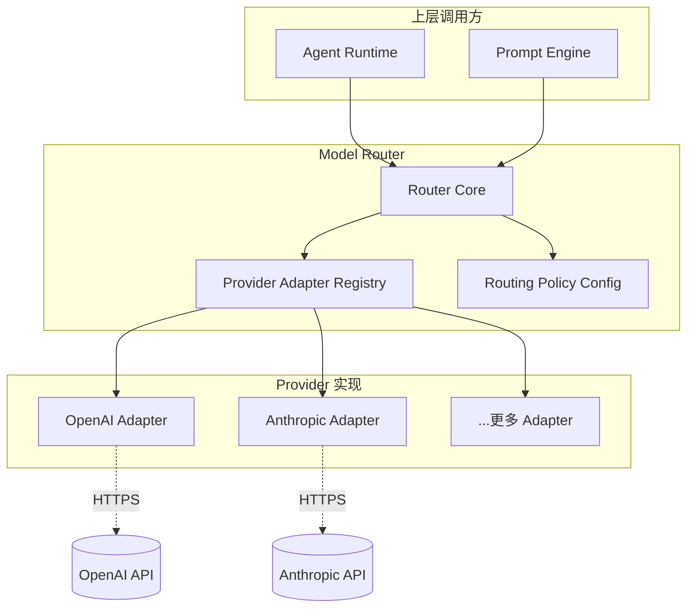
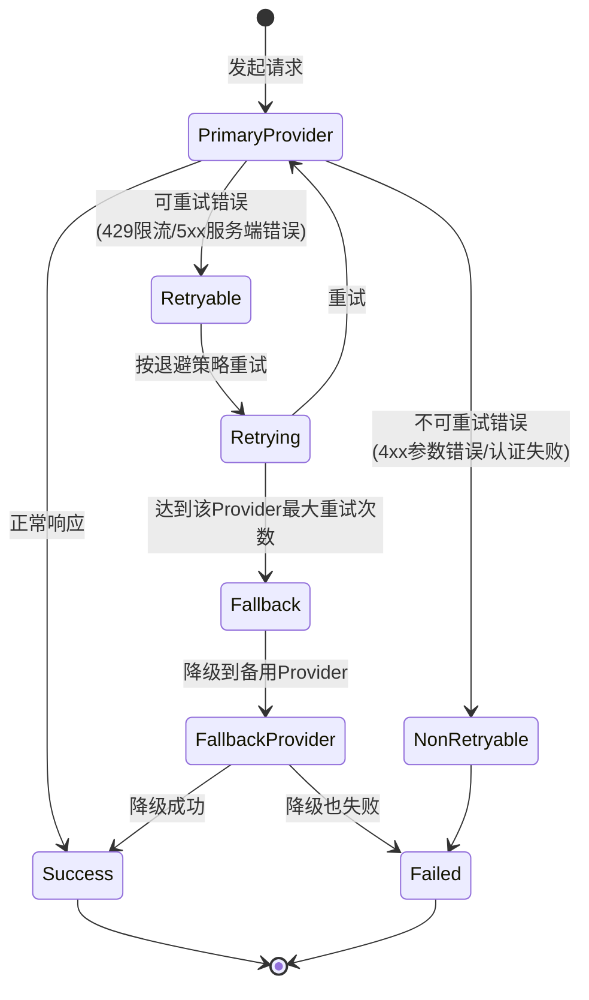

## 元信息

| 项 | 值 |
|---|---|
| RFC 编号 | RFC-0012 |
| 标题 | Model Router |
| 状态 | Draft |
| 关联 PRD | [P0-9](../01-Product/PRD.md#3-产品范围本阶段-p0p1p2) |
| 关联架构 | [Overall Architecture §7](../02-Architecture/Overall%20Architecture.md#7-跨模块设计约束) |
| 依赖 RFC | RFC-0013 Prompt Engine（大纲） |

## 1. 背景与目标

Model Router 是 LLM 调用的唯一出口（呼应 [Overall Architecture §7](../02-Architecture/Overall%20Architecture.md#7-跨模块设计约束) 约束 3），直接落地 [Design Principles](../00-Vision/Design%20Principles.md) 原则 8"Provider 无关，模型可替换"。它负责三件事：

1. **抽象**：让 Agent Runtime 和 Prompt Engine 不感知底层是 OpenAI 还是 Anthropic，API 格式差异由本层消化
2. **路由**：管理模型选择策略——用户指定走哪个模型，或未来自动路由（P1+）
3. **韧性**：处理请求失败、限流、超时，提供重试与降级保证任务不被单次网络波动打垮

### 目标

1. 至少支持 2 家主流 LLM Provider（如 OpenAI + Anthropic）可切换使用，这是 [PRD P0-9](../01-Product/PRD.md) 的硬性验收标准
2. 工具调用格式（function calling schema）差异在本层完全消化，上层代码感知不到 Provider 差异
3. 失败重试与降级策略保证单点故障不导致整个任务中断
4. 流式响应协议统一，客户端无需感知 Provider 差异

### 非目标

- 自动路由（根据任务复杂度选择不同模型）不在 v1.0 范围——v1.0 只做用户手动指定模型，自动路由留待 P1
- 本地自托管模型接入不在 v1.0 强制范围——接口设计预留，但不要求首发交付

## 2. 核心概念

| 概念 | 定义 |
|---|---|
| **Provider** | 一个 LLM 服务商（如 OpenAI、Anthropic），提供一组模型 |
| **Provider Adapter** | 特定 Provider 的适配器，负责 API 格式转换、工具调用 Schema 互转 |
| **Model Capability** | 模型的静态能力描述：上下文窗口大小、是否支持工具调用、是否支持多模态、token 定价 |
| **Routing Policy** | 模型选择策略——v1.0 仅支持用户手动指定，接口预留自动路由扩展点 |
| **UnifiedRequest / UnifiedResponse** | 本层定义的内部统一请求/响应格式，所有 Provider Adapter 都从/向此格式转换 |

## 3. Provider 抽象接口



**Provider Adapter 接口契约**：

```typescript
interface ProviderAdapter {
  readonly providerName: string;
  readonly supportedModels: ModelInfo[];

  // 核心能力
  chat(request: UnifiedRequest): Promise<UnifiedResponse>;
  chatStream(request: UnifiedRequest): AsyncIterable<UnifiedStreamChunk>;

  // 能力查询
  supportsToolCalling(modelId: string): boolean;
  getContextWindowSize(modelId: string): number;

  // 健康检查
  healthCheck(): Promise<boolean>;
}

interface ModelInfo {
  modelId: string;          // 如 "gpt-4o", "claude-sonnet-4-20250514"
  contextWindowTokens: number;
  maxOutputTokens: number;
  supportsVision: boolean;
  supportsToolCalling: boolean;
  pricing: {
    inputPer1KTokens: number;
    outputPer1KTokens: number;
  };
}
```

**关键设计决策**：Provider Adapter 之间无任何直接依赖。新增一个 Provider 只需实现 `ProviderAdapter` 接口并注册到 Router Core，不需要修改任何已有 Adapter 代码。这是保证"Provider 可替换"不退化为核心代码库膨胀的关键。

## 4. 工具调用格式统一转换

这是本 RFC 最核心的一个技术设计——不同 Provider 的 function calling 格式差异必须由本层兜底，上层代码看到的永远是我们内部的统一格式。

**差异示例**：

| 维度 | OpenAI | Anthropic | 本层统一格式 |
|---|---|---|---|
| 工具描述字段 | `function.name` / `function.parameters` | `name` / `input_schema` | `name` / `parameters`（JSON Schema） |
| 调用标识 | `tool_calls[].id` | `tool_use[].id` | `callId` |
| 调用响应角色 | `role: "tool"` | `role: "user"`（含 tool_result） | 内部 `ToolObservation` 结构 |
| 并行调用标注 | 隐式（多次出现即并行） | 有 `tool_use` 数组 | 统一为 BatchCall 列表 |

**转换策略**：

```mermaid
flowchart LR
    subgraph Internal["内部统一格式"]
        UReq[UnifiedRequest<br/>含 tools[], messages[]]
        URes[UnifiedResponse<br/>含 text, toolCalls[]]
        UObs[UnifiedObservation<br/>tool call results]
    end

    subgraph Adapters["各 Provider Adapter 负责转换"]
        OA[OpenAI Adapter<br/>UReq→OpenAI Schema<br/>OpenAI Response→URes]
        AN[Anthropic Adapter<br/>UReq→Anthropic Schema<br/>Anthropic Response→URes]
    end

    UReq --> OA
    UReq --> AN
    OA --> URes
    AN --> URes
```

**关键设计**：工具调用结果的回传（"上一轮调用了某工具、结果是什么"）格式在不同 Provider 间差异最大。本层统一为 `UnifiedObservation` 结构，各 Adapter 负责将其转换为 Provider 接受的格式（OpenAI 的 `role: "tool"` / Anthropic 的 `tool_result` content block）。

## 5. 路由策略

v1.0 仅支持**手动路由**：用户在配置中指定默认模型（如 `model: "claude-sonnet-4-20250514"`），所有请求都走这个模型。接口上预留自动路由扩展点：

```typescript
interface RoutingPolicy {
  // v1.0: 手动路由——永远返回用户指定的模型
  selectModel(context: RoutingContext): ModelSelection;

  // 成本跟踪（即使手动路由，也需要记录每次调用的实际消耗）
  recordUsage(usage: TokenUsage): void;
}

interface RoutingContext {
  taskDescription: string;
  estimatedComplexity?: "simple" | "medium" | "complex";  // P1+ 自动路由用
  currentSessionBudget?: number;                           // P1+ 预算控制用
  userPreferredModel?: string;                             // 用户手动指定的模型
}

type ModelSelection = {
  provider: string;
  modelId: string;
  reason: string;  // "用户指定" / "自动路由-复杂度匹配" / "降级-主模型不可用"
};
```

**P1+ 自动路由方向**（不在 v1.0 交付，但接口已预留）：
- 根据任务描述复杂度判断：简单代码问答用小模型（降低成本），复杂多文件实现用大模型（保证质量）
- 支持成本预算控制：如用户在 Session 中设置了 token 预算上限，自动路由可以优先选低成本模型

## 6. 重试与降级策略



**重试策略参数**（每种错误类型差异化）：

| 错误类型 | 重试策略 | 退避算法 | 最大重试 | 是否可降级 |
|---|---|---|---|---|
| 429 限流 | 立即重试 | 指数退避 (1s, 2s, 4s, 8s) | 4 次 | 是，降级到备用 Provider |
| 5xx 服务端错误 | 立即重试 | 指数退避 | 3 次 | 是 |
| 网络超时 | 立即重试 | 固定间隔 2s | 2 次 | 是 |
| 4xx 参数/认证错误 | **不重试** | N/A | 0 | **否**（参数错误换 Provider 也是同样错误） |
| 上下文超长 | **不重试** | N/A | 0 | 否 |

**降级配置**：用户需要在配置中显式指定"备用模型"才能启用降级功能。如果用户只配置了一个模型且未设备用，则降级不可用——此时仅执行重试，不静默切换 Provider（避免用户不知道 Agent 换了模型）。

## 7. 流式响应统一

不同 Provider 的流式响应格式差异巨大，本层提供统一的 `AsyncIterable<UnifiedStreamChunk>` 接口：

```typescript
type UnifiedStreamChunk =
  | { type: "text_delta"; content: string }
  | { type: "tool_call_start"; callId: string; toolName: string }
  | { type: "tool_call_delta"; callId: string; argumentsDelta: string }
  | { type: "tool_call_end"; callId: string }
  | { type: "usage"; inputTokens: number; outputTokens: number }
  | { type: "error"; message: string; errorCode: string }
  | { type: "done"; finishReason: "stop" | "length" | "tool_calls" };
```

各 Provider Adapter 负责将其原始流式事件映射到 `UnifiedStreamChunk`。如果某 Provider 不支持工具调用的流式传输（如在工具调用完成前只发文本、不发工具调用事件），Adapter 应在流式结束后缓存完整响应，解析出工具调用后再发出 `tool_call_start/end` 事件。这是 Adapter 层的责任，不影响上层代码。

## 8. 成本追踪埋点

呼应 [RFC-0016 Telemetry](RFC-0016%20Telemetry.md) 大纲的可观测性需求，Model Router 层负责输出每次请求的成本事件：

```typescript
interface TokenUsage {
  provider: string;
  modelId: string;
  inputTokens: number;
  outputTokens: number;
  cacheReadInputTokens?: number;   // Provider 的 cache 命中（如 Anthropic prompt caching）
  cacheCreationInputTokens?: number;
  estimatedCostUSD: number;         // 基于 pricing 信息估算
  durationMs: number;
  retryCount: number;
  wasFallback: boolean;             // 是否经过了降级切换
}
```

每次请求完成后，Model Router 发出 `TokenUsage` 事件到 Telemetry 管道。`estimatedCostUSD` 是基于 `ModelInfo.pricing` 静态计算的估算值，非精确计费（最终扣费以 Provider 账单为准），但足以用于成本监控和预算告警。

## 9. 风险与缓解

| 风险 | 缓解措施 |
|---|---|
| Provider 更新 API 导致 Adapter 失效 | 每个 Adapter 有对应的集成测试，测试代码调用真实 API（或 mock 返回 Provider 真实格式的响应），CI 中定期运行 |
| 抽象层成为性能瓶颈（每次请求多一层转换开销） | Adapter 做格式转换（JSON 字段映射），不引入额外网络调用，转换开销 < 5ms，不成为瓶颈 |
| 降级策略被频繁触发，用户无感知地在一个降级的低质量模型上持续工作 | 降级激活时，由 Telemetry 发出告警事件（不是静默），并在 UI 中给用户可见提示"当前模型已自动切换" |
| 模型信息（pricing、窗口大小）随时间变化过时 | `ModelInfo` 不做硬编码，支持从配置文件/环境变量加载，更新模型信息无需发版 |

## 10. 验收标准

1. 用户可通过配置文件在 OpenAI 和 Anthropic 之间切换，重启 Agent 后生效，无需修改任何 Agent Runtime 代码
2. 同一个任务（如 [Benchmark Task Set](../Appendix/Benchmark%20Task%20Set.md) 类别 A 的 L2 任务），切换到不同 Provider 后工具调用的参数格式一致（验证统一抽象有效）
3. 人为触发限流（设置极低请求频率向 Provider 发送）后，系统自动重试并在 UI 上显示重试状态，不静默失败
4. 配置备用模型后，主模型不可用时自动降级，且输出正确的 `wasFallback: true` 埋点
5. 流式 Token 输出不因 Provider 切换而出现格式差异（文本流、工具调用流的事件类型一致）

## 11. 开放问题

- 本地自托管模型（Ollama/vLLM）的接入是否需要复用 `ProviderAdapter` 接口？本地模型通常不遵循 OpenAI/Anthropic API 格式，适配工作量可能远超云厂商
- Provider 的 prompt caching 能力（如 Anthropic 的 prompt caching）是本产品可以大幅降低上下文密集型任务成本的机制，但过度追求利用 cache 可能限制了 Context Engine 的动态检索灵活性——这是需要后续实测验证的权衡
- 是否需要"用户可见的模型选择器 UI"，还是仅通过配置文件管理？如果是后者，切换模型的体验门槛是否太高（特别是对非技术型用户）？
