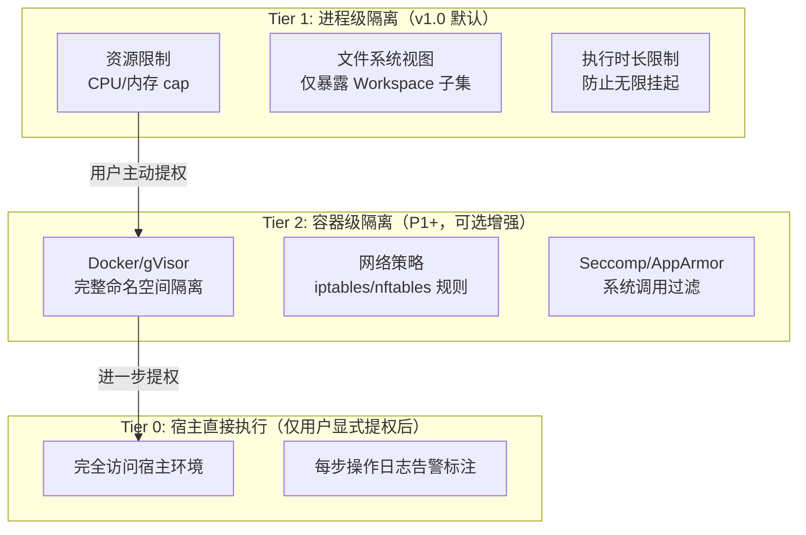
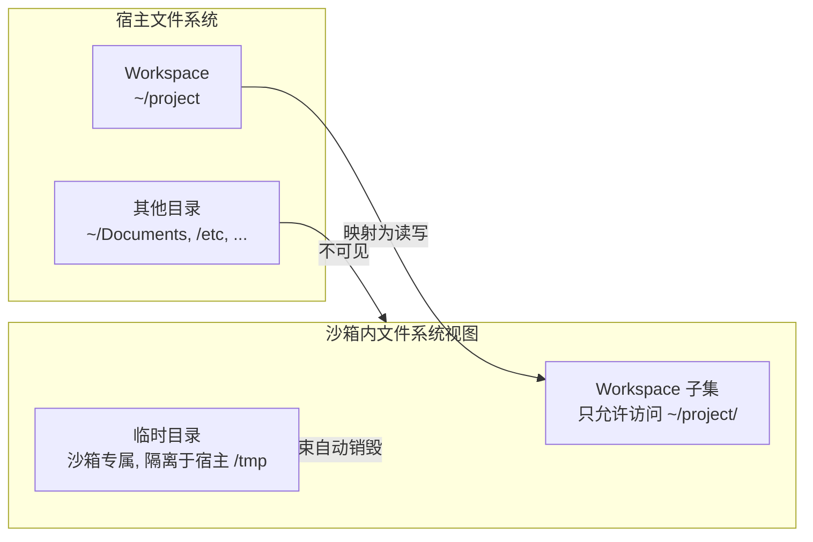
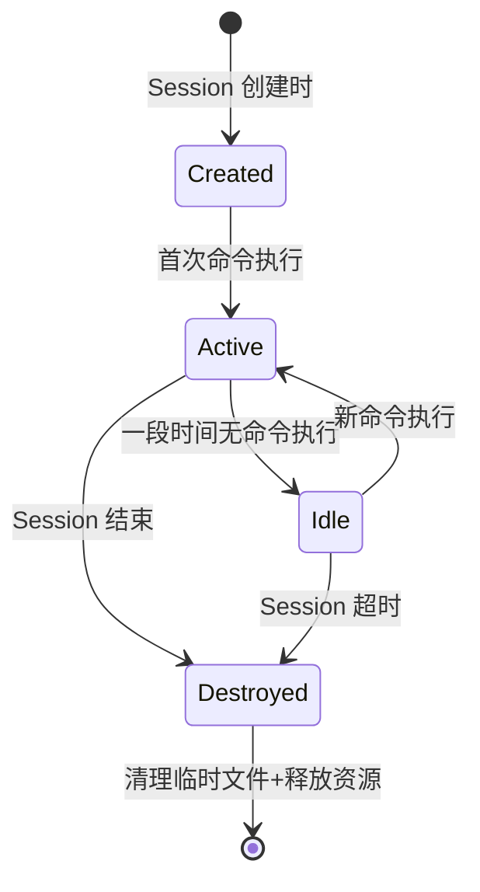
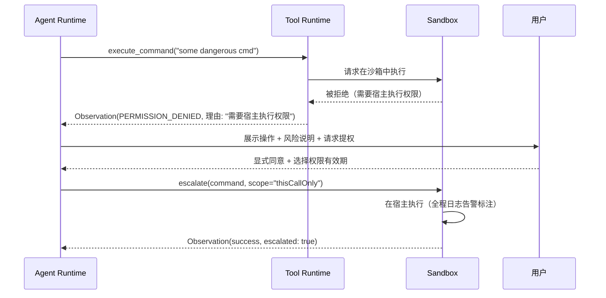

## 元信息

| 项 | 值 |
|---|---|
| RFC 编号 | RFC-0014 |
| 标题 | Sandbox |
| 状态 | Draft |
| 关联 PRD | [P0-6](../01-Product/PRD.md#3-产品范围本阶段-p0p1p2) |
| 关联架构 | [Overall Architecture §8](../02-Architecture/Overall%20Architecture.md#8-安全边界总览) |
| 依赖 RFC | RFC-0003 Tool Runtime、RFC-0004 Task Engine（大纲） |

## 1. 背景与目标

Sandbox 实现 [PRD P0-6](../01-Product/PRD.md)"本地沙箱执行"，直接落地 [Design Principles](../00-Vision/Design%20Principles.md) 原则 6"沙箱是缺省，不是选配"。这是本产品最大的安全风险面——Agent 天然需要执行任意命令（跑测试、装依赖、运行脚本）——的核心防线。如果 Sandbox 被绕过，Agent 实际上就获得了对用户机器的无限制访问权限。

### 目标

1. 所有命令执行默认在隔离环境中运行，不会污染宿主文件系统（除 Workspace 的预期修改外）
2. 隔离强度可配置，允许用户在信任度高的场景主动提升执行权限
3. 跨三大主流平台提供一致的沙箱行为，不因操作系统差异产生安全盲区
4. 沙箱生命周期与 Session 绑定，Session 结束自动清理沙箱资源，避免资源泄露

### 非目标

- 云端 Sandbox（Docker/gVisor 多租户隔离）不在 v1.0 范围——这是 [RFC-0011 Cloud Agent](RFC-0011%20Cloud%20Agent.md)（P2）的职责
- 恶意代码主动逃逸行为（dedicated attacker 场景）的防御不在 v1.0 范围——进程级沙箱提供的是"防止误操作"级别的隔离，不是"防止 APT 攻击"级别的安全

## 2. 核心概念

| 概念 | 定义 |
|---|---|
| **SandboxInstance** | 一个隔离执行环境实例，绑定到一个 Session，随 Session 结束销毁 |
| **ResourceLimit** | 沙箱内进程可使用的资源上限：CPU 核数、内存上限、执行时长上限 |
| **AccessPolicy** | 沙箱的文件系统/网络访问控制策略：哪些路径可读写、网络是否可用 |
| **FileSystemView** | 沙箱内的文件系统视图——通常指向 Workspace 的一个子集，沙箱进程无法访问视图外的文件 |
| **Escalation** | 用户主动将某个操作从沙箱模式提升为"直接宿主执行"的逃生舱口，需要显式确认，不可绕过 |

## 3. 隔离强度技术路线

**v1.0 选型理由**：选用 Tier 1 进程级隔离而非 Tier 2 容器级，理由：
1. **启动延迟**：容器启动（docker run）冷启动 ~500ms-2s，进程级隔离启动延迟为 0——这对 CLI 交互响应至关重要（用户不希望每次跑 `npm test` 都等容器启动）
2. **跨平台一致性**：macOS/Linux 的进程级资源限制（rlimit/cgroups）和文件系统控制（chroot/jail）成熟可靠；Docker Desktop 在 Windows 上的体验不够原生
3. **安装门槛**：容器方案强制用户安装 Docker，进程级隔离无额外依赖
4. **v1.0 威胁模型匹配**：我们防御的是 Agent 误操作（如 rm 了不该删的文件、跑了有 bug 的脚本），不是主动逃逸攻击。进程级隔离对此威胁模型足够

**P1+ 容器级增强**：如果后续用户反馈或安全审计发现进程级隔离不足以覆盖真实风险，Tier 2 容器方案已在架构上预留——Sandbox 接口抽象层（见 §6）使得两套实现可互换，无需改上层代码。

## 4. 文件系统边界

**路径白名单规则**（v1.0 默认配置）：

| 路径 | 沙箱内权限 | 说明 |
|---|---|---|
| `{workspace_root}/` | 读写 | Agent 需要改代码、跑测试、读文件 |
| `{workspace_root}/node_modules/` | 只读 | 防止 Agent 意外修改依赖，但允许读取 |
| `{workspace_root}/.git/` | 只读 | 防止 Agent 绕过 Git 集成直接操作 .git（Git 操作应走 [RFC-0008 Git](RFC-0008%20Git.md) 统一接口） |
| `{workspace_root}/.env` | **禁止访问** | 敏感文件默认禁止读写（呼应 [Security.md](../02-Architecture/Security.md) 敏感文件防护） |
| 沙箱专属 `/tmp/` | 读写 | 临时文件空间，仅本 Session 可见 |
| 其他所有宿主路径 | **不可见** | 防止 Agent 误操作或数据泄露 |

**关键设计**：Workspace 内的路径白名单不是完全禁用——用户可以配置允许访问/禁止访问的路径列表。`.env` 类的敏感文件禁止是默认规则，用户可显式解锁（解锁操作记录到 Telemetry 告警日志）。

**跨平台实现**：
- macOS：通过 `sandbox-exec` 配置文件限制文件系统访问
- Linux：通过 `unshare` + `chroot` 或 `bubblewrap` 实现文件系统隔离
- Windows：通过作业对象（Job Objects）限制进程访问，文件系统级别使用 NTFS 权限控制

## 5. 网络访问策略

v1.0 的默认网络策略遵循"默认允许开发所需、显式禁止高风险"：

| 操作 | 网络策略 | 理由 |
|---|---|---|
| `npm/pip/cargo install` | **允许** | 装依赖是开发工作的基本操作，禁止网络则 Agent 无法完成大量任务 |
| `git clone/pull/push` | **允许** | Git 操作天然需要网络 |
| `curl/wget 任意 URL` | **需要确认** | 下载执行外部资源是供应链攻击常见入口，默认要求用户确认 |
| 本地开发服务器绑定（如 `localhost:3000`） | **允许** | 跑 dev server 是日常操作 |

预置危险域名/IP 黑名单（如已知恶意域名），但 v1.0 不做深度流量内容检测——那是企业级网络安全产品的范畴，不在本产品范围。

## 6. 沙箱生命周期管理

**生命周期绑定规则**：
- 每个 Session 拥有独立的 SandboxInstance（一对一绑定）
- Session 恢复（[RFC-0004 Task Engine](RFC-0004%20Task%20Engine.md)）时重建同配置的 SandboxInstance
- Session 结束时强制销毁 SandboxInstance——清理临时目录、释放资源限制
- 用户在 Sandbox 存活期间手动执行的外部命令（在另一个终端中执行的）不会影响 Sandbox 内部状态——文件系统视图是独立的

## 7. 权限提升逃生舱口

呼应 [Design Principles](../00-Vision/Design%20Principles.md) 原则 6，沙箱是缺省，但也需要逃生舱口——否则当用户确实需要 Agent 执行沙箱无法支持的操作时，产品会变成阻碍。

**逃生舱口设计**：

**逃生舱口的安全约束**：

1. **永不静默提权**：任何从沙箱→宿主的权限提升都必须经过用户显式交互确认，每次提权独立确认（不能"这个 Session 以后都走宿主"）
2. **单次有效**：默认提权仅对本次工具调用有效，下一次危险操作仍需重新确认
3. **日志告警标注**：是否发生过提权、提权命令的内容、提权执行结果，全量记录到 Telemetry 告警日志（`escalated: true` 标记）
4. 用户可配置"信任模式"（对应 [RFC-0015 Permission](RFC-0015%20Permission.md) 的最高自主性级别），但即便如此，**导致文件被删除的 `rm -rf` 类操作仍需超越自主性配置的确认**（见 [RFC-0015 §4](RFC-0015%20Permission.md) 硬性确认清单）

## 8. 风险与缓解

| 风险 | 缓解措施 |
|---|---|
| 进程级隔离被绕过（如命令中用绝对路径访问宿主文件系统） | 文件系统视图由操作系统权限控制（chroot/bubblewrap/NTFS），不是用户态字符串过滤——即使命令写 `/etc/passwd`，操作系统层面也返回"文件不存在" |
| 资源泄露（沙箱进程 fork 子进程后父进程退出，子进程未清理） | 使用进程组（process group）管理，销毁沙箱时强制 kill 整个进程组，不依赖父-子关系链 |
| `.env` 禁止规则被用户轻易关闭导致无防护 | 关闭敏感文件保护需要在配置文件中显式修改 + 重启 Agent 生效，确保用户有充分意识（不是运行时一键关） |
| 不同操作系统的沙箱实现不一致导致某平台出现安全盲区 | 每个平台实现需通过同一套自动化安全性测试（尝试访问 Workspace 外路径、尝试网络外连等），测试结果纳入 CI |

## 9. 验收标准

1. Agent 执行 `cat /etc/passwd`（非 Workspace 内路径），返回"文件不存在"错误，不是实际读取内容
2. Agent 执行 `find / -name "*.env"`，结果中不包含 `{workspace}/.env`（即使该文件存在）
3. Session 结束后，沙箱临时目录（`/tmp/` 视图内）中创建的文件在宿主文件系统上不可见
4. 人为构造资源超限（死循环占满内存），验证沙箱能在 5s 内 kill 进程并返回 `TIMEOUT` 或 `RESOURCE_EXHAUSTED` errorCode
5. 跨平台验证：macOS、Linux、Windows 上运行同一组安全性测试，结果一致（允许平台特性差异，但不应出现安全盲区）

## 10. 开放问题

- 网络策略的"需要确认"提示频率如何设计——如果 Agent 在一个任务中频繁 `curl` 外部 API（如调第三方 API 验证功能），每次都要确认会严重影响效率，是否需要"同一域名仅确认一次"的 Session 内记忆机制？
- Workspace 外的系统工具（如 `docker`、`kubectl`，它们操作的不是本地文件系统而是远程资源）是否需要完全不同的沙箱逻辑？当前设计假设"命令操作的是 Workspace 内的文件"，不适用于管理外部系统的工具
- 沙箱资源限制的合理默认值需要通过真实使用数据调参——500MB 内存/60s 执行时长对小项目够用，但大型项目跑测试可能需要更高上限，首次使用时如果因为默认限制太低导致测试中断，用户体验会很差
