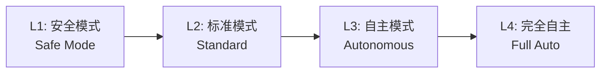
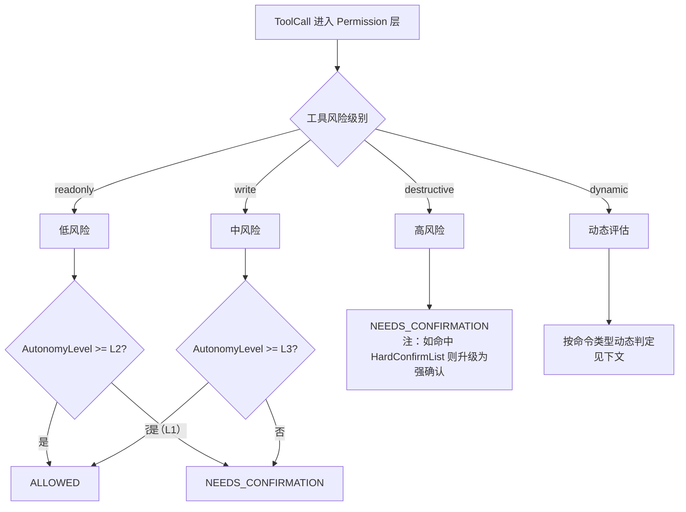
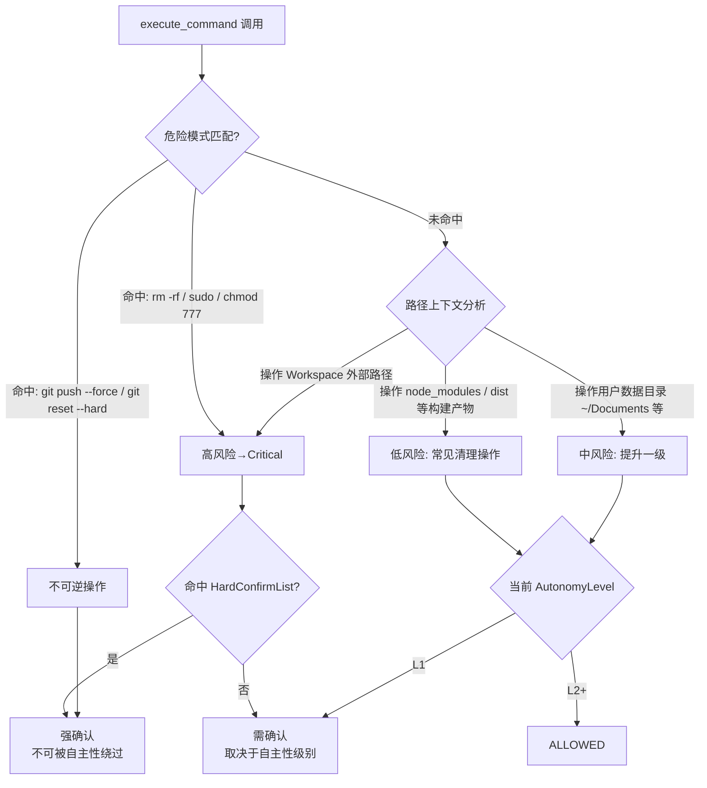
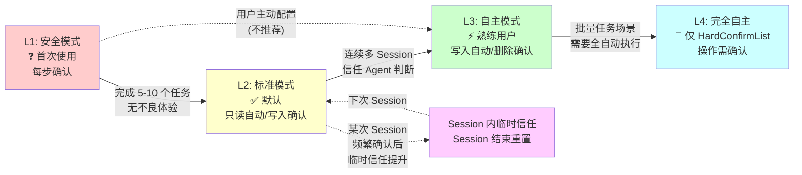
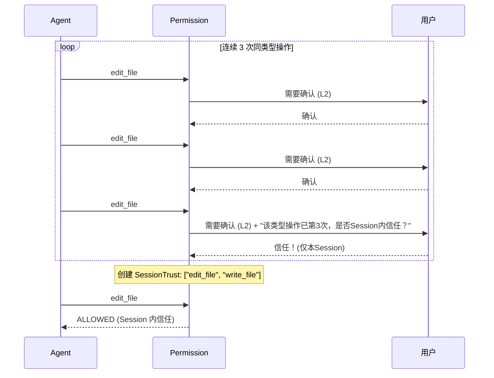
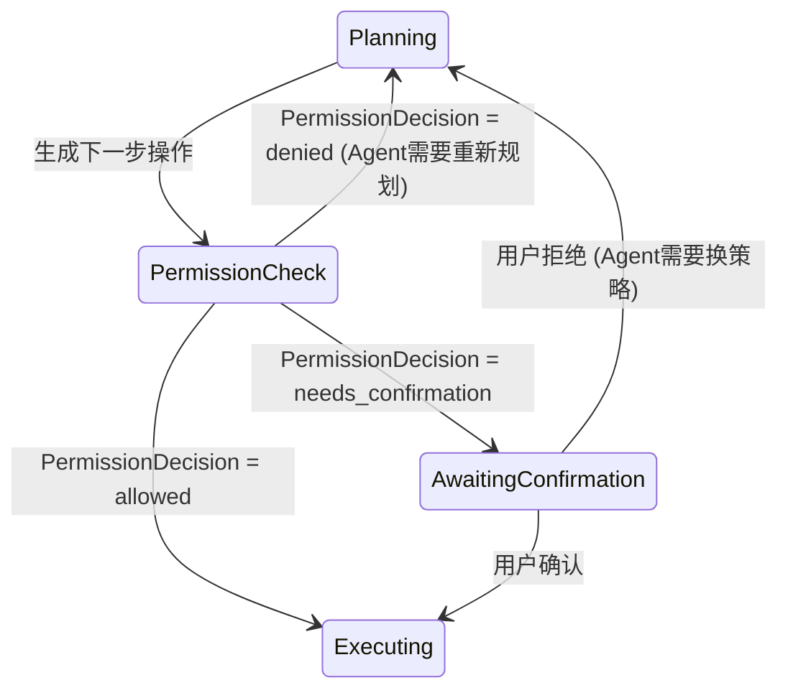

## 元信息

| 项 | 值 |
|---|---|
| RFC 编号 | RFC-0015 |
| 标题 | Permission |
| 状态 | Draft |
| 关联 PRD | [P0-8](../01-Product/PRD.md#3-产品范围本阶段-p0p1p2) |
| 关联架构 | [Overall Architecture §8](../02-Architecture/Overall%20Architecture.md#8-安全边界总览) |
| 依赖 RFC | RFC-0001 Agent Runtime、RFC-0003 Tool Runtime、RFC-0014 Sandbox |

## 1. 背景与目标

Permission 是渐进自主性和操作风险分级的核心实现，直接对应 [PRD P0-8](../01-Product/PRD.md) 和 [Design Principles](../00-Vision/Design%20Principles.md) 原则 1（渐进自主性）、原则 4（破坏性操作前置确认）。它在 [RFC-0001 Agent Runtime](RFC-0001%20Agent%20Runtime.md) 状态机的 `AwaitingConfirmation` 状态中扮演判定角色，决定了哪些操作可以直接执行、哪些需要用户确认、哪些永远不可自动通过。

### 目标

1. 提供可配置的自主性级别，让用户按信任程度调校 Agent 的行为自由度
2. 操作风险分级规则清晰、可解释——用户不仅看到"需要确认"，还能理解"为什么需要确认"
3. 硬性不可绕过确认清单：某些高风险操作无论自主性级别如何都强制确认
4. 判定逻辑完全独立于 LLM 输入，不受 Prompt Injection 影响
5. 支持 Session 内临时信任提升，降低高频确认带来的疲劳感

### 非目标

- 企业级 RBAC 多角色权限模型不在 v1.0 范围（见 [RFC-0019 Enterprise](RFC-0019%20Enterprise.md) P2）
- Permission 本身不负责执行隔离——沙箱隔离是 [RFC-0014 Sandbox](RFC-0014%20Sandbox.md) 的职责

## 2. 核心概念

| 概念 | 定义 |
|---|---|
| **AutonomyLevel** | 用户配置的全局/会话自主性级别 |
| **RiskTier** | 单个操作的风险级别，由工具类型和参数共同决定 |
| **PermissionDecision** | 判定结果：`allowed`（直接执行）、`needs_confirmation`（需用户确认）、`denied`（拒绝执行） |
| **HardConfirmList** | 硬性确认操作清单——无论 AutonomyLevel 如何都强制确认的操作集合 |
| **SessionTrust** | Session 内临时提升的信任——"这个 Session 内对同类操作不用再问了" |

## 3. 自主性级别定义



| 级别 | 名称 | 行为描述 | 适用场景 |
|---|---|---|---|
| **L1** | 安全模式（Safe） | 每步操作都需手动确认，包括文件读取外的所有操作 | 首次使用产品，建立信任阶段 |
| **L2** | 标准模式（Standard） | 只读操作自动执行，write 操作需确认，destructive 操作需强确认 | 日常默认模式（也是新用户的默认配置） |
| **L3** | 自主模式（Autonomous） | write 操作自动执行，destructive 操作需确认，不可逆操作强制确认 | 信任建立后，高频使用的熟练用户 |
| **L4** | 完全自主（Full Auto） | 除硬性确认清单外的所有操作自动执行 | 跑批量重复性任务、非生产环境实验 |

**默认配置**：新用户首次启动默认为 L2（标准模式）。这符合 [Product Philosophy](../00-Vision/Product%20Philosophy.md)"人在回路默认开启"，同时避免 L1 过于保守导致首次体验太繁琐。

**配置粒度**：

| 配置层级 | 优先级 | 说明 |
|---|---|---|
| 全局默认 | 最低 | 在用户配置文件中设置，如 `autonomy: "L2"` |
| Session 覆盖 | 中 | 启动时通过 CLI 参数覆盖，如 `--autonomy=L3` |
| 任务中动态切换 | 高 | 用户在任务执行过程中临时改变级别（同级操作批量确认后，用户可能选择"这个 Session 内信任"——见 §6） |

后一级覆盖前一级，动态切换的配置在当前 Session 结束后重置。

## 4. 操作风险分级规则



**风险分级矩阵**（对应 [RFC-0003 §8 内置工具清单](RFC-0003%20Tool%20Runtime.md#8-内置工具清单)）：

| 工具 | 风险级别 | L1 | L2 | L3 | L4 |
|---|---|---|---|---|---|
| `read_file` | readonly | 确认 | 允许 | 允许 | 允许 |
| `list_directory` | readonly | 确认 | 允许 | 允许 | 允许 |
| `search_code` | readonly | 确认 | 允许 | 允许 | 允许 |
| `search_symbol` | readonly | 确认 | 允许 | 允许 | 允许 |
| `write_file` | write | 确认 | 确认 | 允许 | 允许 |
| `edit_file` | write | 确认 | 确认 | 允许 | 允许 |
| `execute_command` (装依赖类) | dynamic: low | 确认 | 确认 | 允许 | 允许 |
| `execute_command` (跑测试类) | dynamic: low | 确认 | 确认 | 允许 | 允许 |
| `execute_command` (修改代码/copy/move 类) | dynamic: medium | 确认 | 确认 | 确认 | 允许 |
| `execute_command` (delete/force push 类) | dynamic: high | 强确认 | 强确认 | 强确认 | **强确认**（HardConfirmList） |
| `execute_command` (sudo 类) | dynamic: critical | 拒绝 | 强确认 | 强确认 | 强确认 |

**`execute_command` 动态风险判定**（本 RFC 的核心设计之一）：

`execute_command` 风险不固定，需要运行时分析命令内容再做判定。判定规则：

1. **模式匹配优先**：预定义危险命令模式列表（`rm -rf`、`git push --force`、`sudo`、`chmod 777` 等），命中模式直接分配到高风险/致命风险
2. **参数综合考量**：`git push` 是 write 但风险可控（可 revert）；`git push --force` 是不可逆的 destructive，需要强确认
3. **上下文感知**：如果命令中引用的是 `{workspace}/node_modules/` 下的路径（如 `rm -rf node_modules`），这是常见清理操作，风险放低；如果引用的是用户数据目录（如 `~/Documents`），风险提升

**关键设计决策**：风险判定逻辑在 Permission 层实现，**不对 LLM 可见**。LLM 不知道自己的哪些工具调用被判定为高风险，也就无法通过 Prompt Injection 诱导降低风险判定——呼应 [Design Principles](../00-Vision/Design%20Principles.md) 原则 4"破坏性操作前置确认"的独立性要求。

### 4.1 execute_command 动态风险判定决策树



### 4.2 自主性级别渐进路径

用户在真实使用中并非一蹴而就跳到高自主性，而是经历信任积累过程：



> **说明**：Level 间的箭头表示推荐的渐进路径，"临时信任"（§6）是横向旁路不作为正式升级。

## 5. 硬性确认清单（HardConfirmList）

以下操作**在任何自主性级别下都必须经用户显式确认**，不可被 L3/L4 自动通过：

| 操作 | 理由 |
|---|---|
| `rm -rf` 删除非 `node_modules`/`dist` 类构建产物的路径 | 不可逆数据删除，即使 L4 也不能自动执行 |
| `git push --force` / `git push --force-with-lease` | 不可逆的远程分支覆盖 |
| `git reset --hard` | 本地不可逆操作 |
| 任何 `sudo` 或等效提权命令 | 绕过沙箱隔离 |
| 写入 Workspace 外路径 | 沙箱层会拦截，但 Permission 层也应拒绝（双层防护） |
| `curl | bash` 类管道下载执行 | 供应链攻击经典入口 |
| 修改 `.gitignore`/`.env`/`.npmrc` 等配置文件的权限（chmod） | 可能被利用来降低后续安全防护 |

**清单维护**：HardConfirmList 不是一次写死就永远不变的——需要在真实使用中根据安全事件做增删。新增操作需要经过安全评审和 ADR 决策记录（[08-ADR](../08-ADR/_INDEX.md)），不能随意添加。

## 6. Session 内临时信任提升

高频确认带来的操作疲劳是真问题。如果用户在 L3 模式下连续 3 次确认同类型写操作（如连续确认 3 次 `edit_file`），系统应提供"这个 Session 内信任此类操作"的快捷选项：



**临时信任的约束**：
1. **仅本 Session 有效**：Session 结束自动清除，不改变全局配置
2. **范围精确**：仅对同风险级别的操作生效，不是对所有 write 操作生效——信任 `edit_file` 不代表信任 `execute_command`
3. **可撤销**：用户在 Session 内可以随时取消已授权的临时信任，哪怕已经点了"信任"
4. **不可累积到下次 Session**：不尝试自动学习"用户信任模式"（那是 [RFC-0005 Memory](RFC-0005%20Memory.md) P1 的职责）

## 7. 判定可解释性设计

呼应 [Product Philosophy](../00-Vision/Product%20Philosophy.md) 可解释性支柱，Permission 的每次判定都需在交互界面上展示判定理由：

**确认提示的结构**：

```
┌─────────────────────────────────────────┐
│ 操作需要确认                              │
│                                          │
│ 工具: write_file                         │
│ 风险: 中风险 (文件写入)                    │
│ 原因: 当前自主性级别为 L2（标准模式），      │
│       文件写入操作在此级别下需确认          │
│                                          │
│ 目标文件: src/auth/login.ts              │
│ 变更行数: +15  -3                        │
│                                          │
│ [确认] [拒绝] [查看完整 diff]              │
└─────────────────────────────────────────┘
```

每个确认提示必须包含三个要素：**做了什么（工具名+参数摘要）**、**为什么需要确认（风险级别+当前自主性设置）**、**有什么后果（影响范围）**。缺少任何一个要素，用户都无法做出知情判断——这不是"许不许"的问题，而是"让不让用户理解为什么需要这个判断"的问题。

## 8. 与 Agent Runtime 状态机的集成

Permission 判定插入在 [RFC-0001 §3](RFC-0001%20Agent%20Runtime.md#3-状态机设计) 状态机的 `Planning → AwaitingConfirmation` / `Planning → Executing` 分支：



`denied` 与 `needs_confirmation + 用户拒绝` 的区别：前者是 Permission 层的硬性拒绝（如 HardConfirmList 操作被判定为不应执行），后者是用户主动选择拒绝。Agent Runtime 在 Reflect 阶段需要区分两者——前者意味着"换个方法也大概率被拒"，后者意味着"用户只是不满意这个具体方案"。

Agent Runtime 看到 `PERMISSION_DENIED` errorCode 时，应在 Reflect 阶段尝试调整策略（如"换个不那么危险的方式实现同样目标"），而不是简单重试同样的操作——否则会陷入"尝试被拒→重试被拒→超限→Failed"的死循环。

## 9. 风险与缓解

| 风险 | 缓解措施 |
|---|---|
| Permission 风险判定规则被 LLM 通过 Prompt Injection 绕过（如诱导 Agent 构造看起来无害但实际危险的命令） | 判定逻辑完全在 Permission 层独立运行，不依赖 LLM 输入的任何元数据——LLM 输出的是"命令文本"，Permission 层独立分析"命令文本"的语义，不信任 LLM 对风险的自述 |
| 命令动态分析的不准确性——危险命令未被识别 | 命令分析器持续维护危险模式列表 + 结合沙箱的文件系统边界做双层防护——即使 Permission 漏过了，[RFC-0014 Sandbox](RFC-0014%20Sandbox.md) 的文件系统视图也会兜底阻止越界访问 |
| L4 模式下用户因为某次严重后果而追悔莫及 | L4 模式启动时需要展示警告 + HardConfirmList 操作仍然需要确认——不存在"完全无确认"的模式，最高自主性只是"大多数操作不烦你"，不是"所有操作都闭眼做" |
| 确认疲劳导致用户养成"闭眼点确认"的习惯 | Session 内临时信任机制（§6）缓解同类型操作的高频确认；确认提示中强制展示操作摘要/影响范围，增加闭眼点的心理成本 |

## 10. 验收标准

1. 在不同自主性级别（L1/L2/L3/L4）下用同一任务验证，确认提示的频率符合 §4 风险分级矩阵的设定
2. `rm -rf` 操作在 L4 模式下仍然弹出确认提示（HardConfirmList 生效）
3. Prompt Injection 测试：构造一个恶意代码库让 Agent 在执行任务时"被诱导"执行危险命令，验证 Permission 层的危险模式匹配先于 Agent 收到 LLM 响应执行——当前设计中 Permission 在 ToolCall 阶段判定，与 LLM 推理过程隔离，不受 Prompt Injection 直接影响
4. Session 内临时信任授予后，验证同类操作不再弹出确认，但不同类型操作仍然需要确认
5. 确认提示中始终包含"风险级别+原因"，可编程验证（检查 UI 渲染输出中是否包含必要字段）

## 11. 开放问题

- `execute_command` 动态分析依赖正则/模式匹配，其准确率取决于危险模式列表的完整度——是否需要定期从社区/安全团队获取更新的危险模式定义，还是维护一个"够用但不过度"的核心清单？
- 自主性级别的边界是否应支持**按项目类型**设不同的默认值——例如在测试项目/沙箱项目中默认 L4，在生产项目中默认 L2？这涉及与 [RFC-0006 Workspace](RFC-0006%20Workspace.md) 的项目识别能力集成
- "确认疲劳"的真实程度需要在可用性测试中验证——如果 L2 模式下的确认频率仍然导致用户抱怨，可能需要引入更智能的操作分组确认（"这一批 3 个文件修改一起确认"而非一个一个来），这与 [RFC-0007 Review](RFC-0007%20Review.md) 的批量 diff 确认设计有重叠，应当协同而非重复设计
