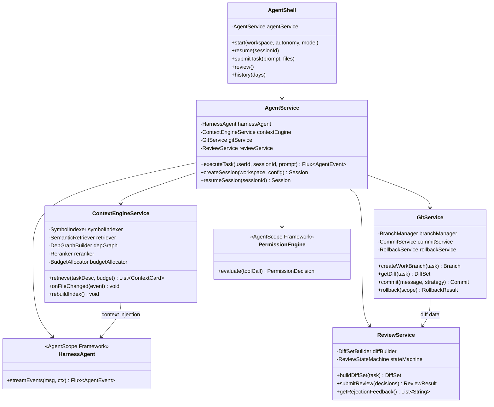
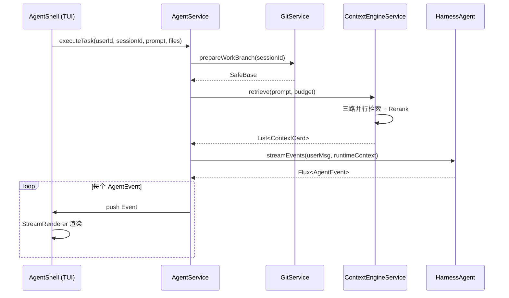

# Core Modules Class Design — 核心模块类设计

> **状态：✅ 完整** — 基于 [Technical Architecture](Technical%20Architecture.md) 的模块划分，给出 AgentService 和 ContextEngineService 的详细类图和方法签名。

## 1. 依赖注入全景图



## 2. AgentService 详细设计

```java
@Service
public class AgentService {

    private final HarnessAgent harnessAgent;
    private final ContextEngineService contextEngine;
    private final GitService gitService;
    private final ReviewService reviewService;
    private final CustomPermissionConfig permissionConfig;
    private final AgentCodingConfig config;

    public AgentService(
            AgentCodingConfig config,
            ContextEngineService contextEngine,
            GitService gitService,
            ReviewService reviewService,
            CustomPermissionConfig permissionConfig) {

        this.config = config;
        this.contextEngine = contextEngine;
        this.gitService = gitService;
        this.reviewService = reviewService;
        this.permissionConfig = permissionConfig;

        // 构建 HarnessAgent —— AgentScope 的核心接入点
        this.harnessAgent = HarnessAgent.builder()
            .name("coding-agent")
            .sysPrompt(config.getSystemPrompt())    // 来自 RFC-0013
            .model(ModelRegistry.resolve(config.getDefaultModel()))  // "qwen:qwen-plus"
            // Workspace 配置
            .workspace(WorkspaceBase.builder()
                .root(config.getWorkspacePath())
                .build())
            // Toolkit: 注册内置的7个 @Tool 注解工具
            .toolkit(Toolkit.builder()
                .tools(new ReadFileTool(),
                       new WriteFileTool(),
                       new EditFileTool(),
                       new ListDirectoryTool(),
                       new SearchCodeTool(),
                       new SearchSymbolTool(),
                       new ExecuteCommandTool())
                .build())
            // Permission: L1-L4 自定义规则
            .permission(permissionConfig.createEngine())
            // 构建
            .build();
    }

    /**
     * 执行用户任务——核心入口方法。
     * 返回 Flux<AgentEvent> 供 TUI 订阅渲染。
     */
    public Flux<AgentEvent> executeTask(
            String userId,
            String sessionId,
            String userPrompt,
            List<String> attachedFiles) {

        // Step 1: Git 分支准备
        SafeBase safeBase = gitService.prepareWorkBranch(sessionId);

        // Step 2: Context Engine 检索上下文
        List<ContextCard> contextCards = contextEngine.retrieve(
            userPrompt,
            ModelRegistry.getContextWindowSize(config.getDefaultModel())
        );

        // Step 3: 组装消息（含上下文）
        Msg userMsg = Msg.builder()
            .role(Role.USER)
            .content(List.of(
                // 上下文注入为 system 消息块
                TextBlock.of(formatContextCards(contextCards)),
                // 用户原始输入
                TextBlock.of(userPrompt)
            ))
            .build();

        // Step 4: 通过 HarnessAgent 执行
        return harnessAgent.streamEvents(
            userMsg,
            RuntimeContext.builder()
                .userId(userId)
                .sessionId(sessionId)
                .put("safeBase", safeBase)       // 通过 Reactor Context 传递
                .put("contextCards", contextCards)
                .build()
        );
    }

    /**
     * 格式 Context Cards 为可注入的文本。
     */
    private String formatContextCards(List<ContextCard> cards) {
        StringBuilder sb = new StringBuilder();
        sb.append("<code_context>\n");
        sb.append("以下是与当前任务相关的代码片段：\n\n");
        for (int i = 0; i < cards.size(); i++) {
            ContextCard card = cards.get(i);
            sb.append(String.format("--- 文件 %d: %s (来源: %s, 相关性: %.2f) ---\n",
                i + 1, card.filePath(), card.sourceType(), card.relevanceScore()));
            sb.append("```").append(detectLanguage(card.filePath())).append("\n");
            sb.append(card.content());
            sb.append("\n```\n\n");
        }
        sb.append("</code_context>");
        return sb.toString();
    }

    private String detectLanguage(String path) {
        if (path.endsWith(".java")) return "java";
        if (path.endsWith(".ts") || path.endsWith(".tsx")) return "typescript";
        if (path.endsWith(".py")) return "python";
        if (path.endsWith(".js") || path.endsWith(".jsx")) return "javascript";
        return "";
    }
}
```

## 3. ContextEngineService 详细设计

```java
@Service
public class ContextEngineService {

    // === 三个检索通道 ===
    private final SymbolIndexer symbolIndexer;
    private final SemanticRetriever semanticRetriever;
    private final DepGraphBuilder depGraphBuilder;    // M2 交付

    // === 后处理 ===
    private final Reranker reranker;
    private final BudgetAllocator budgetAllocator;

    // === 事件监听 ===
    private final EventBus eventBus;

    public ContextEngineService(
            WorkspaceConfig workspaceConfig,
            EventBus eventBus) {

        this.symbolIndexer = new SymbolIndexer(workspaceConfig);
        this.semanticRetriever = new SemanticRetriever(workspaceConfig);
        this.depGraphBuilder = new DepGraphBuilder();  // M2
        this.reranker = new Reranker();
        this.budgetAllocator = new BudgetAllocator();
        this.eventBus = eventBus;

        // 订阅文件变更事件——增量重建索引
        eventBus.subscribe("file:changed", this::onFileChanged);
    }

    /**
     * 三路检索主流程。
     */
    public List<ContextCard> retrieve(String taskDescription, int contextWindowBudget) {
        // 并行三路检索
        List<ContextCard> symbolResults = symbolIndexer.search(taskDescription);
        List<ContextCard> semanticResults = semanticRetriever.search(taskDescription);
        List<ContextCard> depResults = depGraphBuilder.query(taskDescription);  // M2

        // 去重合并
        List<ContextCard> merged = deduplicate(symbolResults, semanticResults, depResults);

        // Reranking
        List<ContextCard> ranked = reranker.rank(merged, taskDescription);

        // Budget 裁剪
        return budgetAllocator.allocate(ranked, contextWindowBudget);
    }

    /**
     * 文件变更事件处理——增量索引更新。
     */
    private void onFileChanged(FileChangedEvent event) {
        for (var change : event.changes()) {
            if (isIndexable(change.path())) {
                // 重新解析变更文件
                List<ContextCard> newCards = symbolIndexer.reindex(change.path());
                // 更新向量索引（删除旧向量 + 插入新向量）
                semanticRetriever.update(change.path(), newCards);
            }
        }
    }

    private boolean isIndexable(String path) {
        return (path.endsWith(".java") || path.endsWith(".kt") ||
                path.endsWith(".ts") || path.endsWith(".tsx") ||
                path.endsWith(".py") || path.endsWith(".js") || path.endsWith(".jsx"))
            && !path.contains("node_modules/")
            && !path.contains(".git/");
    }

    /**
     * 三路结果去重（以文件路径+行号范围为 key）。
     */
    private List<ContextCard> deduplicate(
            List<ContextCard>... sources) {
        Map<String, ContextCard> seen = new LinkedHashMap<>();
        for (List<ContextCard> source : sources) {
            for (ContextCard card : source) {
                String key = card.filePath() + "#L" + card.startLine() + "-L" + card.endLine();
                seen.putIfAbsent(key, card);
            }
        }
        return new ArrayList<>(seen.values());
    }
}
```

### 3.1 子组件接口

```java
// === SymbolIndexer ===
interface SymbolIndexer {
    /** 基于名称搜索符号（函数/类/变量） */
    List<ContextCard> search(String query);

    /** 对单个文件重建符号索引 */
    List<ContextCard> reindex(String filePath);
}

// Tree-sitter 实现
class TreeSitterSymbolIndexer implements SymbolIndexer {
    // M1 支持 Java, TypeScript, Python 三种语言 grammar
    // 索引字段：符号名、文件路径、起止行号、签名
}

// === SemanticRetriever ===
interface SemanticRetriever {
    /** 基于语义相似度检索 */
    List<ContextCard> search(String query);

    /** 更新单个文件的向量索引 */
    void update(String filePath, List<ContextCard> newCards);
}

// sqlite-vec + ONNX Runtime 实现
class SqliteVecSemanticRetriever implements SemanticRetriever {
    // Embedding 模型：all-MiniLM-L6-v2 (384维)
    // 推理：ONNX Runtime Java bindings
    // 存储：sqlite-vec 扩展
    // 相似度：cosine distance
}

// === Reranker ===
class Reranker {
    /**
     * 多维度打分：
     * - 语义相似度 (35%)
     * - 符号精确匹配加成 (25%)
     * - 结构邻近度 (20%)
     * - 最近修改时间加权 (15%)
     * - 用户历史交互加权 (5%) — Memory RFC-0005
     */
    List<ContextCard> rank(List<ContextCard> candidates, String taskDescription);
}

// === BudgetAllocator ===
class BudgetAllocator {
    /**
     * 四级优先级裁剪：
     * P1: 用户 @ 的文件（永不裁剪）
     * P2: Reranking Top-N 高分 Card
     * P3: 对话历史摘要
     * P4: 低分 Card（先于此项开始裁剪）
     */
    List<ContextCard> allocate(List<ContextCard> ranked, int budget);
}
```

## 4. GitService 类设计

```java
@Service
public class GitService {

    private final org.eclipse.jgit.api.Git git;
    private final WorkspaceService workspaceService;

    /**
     * 准备 WorkBranch——智能分支策略。
     */
    public SafeBase prepareWorkBranch(String sessionId) {
        Repository repo = git.getRepository();
        String currentBranch = repo.getBranch();
        Status status = git.status().call();

        // 检测 Dirty Working Directory
        boolean isDirty = !status.getModified().isEmpty()
                       || !status.getAdded().isEmpty()
                       || !status.getRemoved().isEmpty();

        if (isDirty) {
            // Feature 分支上有未提交改动——不做分支切换
            // 记录 SafeBase 用于回退
            return SafeBase.of(currentBranch, resolveHead(repo));
        }

        if (currentBranch.startsWith("agent/task-")) {
            // 上次遗留的 Agent 分支——询问用户是否继续
            throw new GitConflictException("Already on agent branch: " + currentBranch);
        }

        // 创建 WorkBranch
        String workBranch = "agent/task-" +
            LocalDate.now().format(DateTimeFormatter.BASIC_ISO_DATE) +
            "-" + resolveHead(repo).substring(0, 7);

        git.checkout()
            .setCreateBranch(true)
            .setName(workBranch)
            .call();

        return SafeBase.of(currentBranch, resolveHead(repo));
    }

    /**
     * Diff 生成——调用 Git，降级到 Workspace Diff。
     */
    public DiffSet getDiff(String taskId) {
        try {
            // 优先使用 Git diff
            ByteArrayOutputStream out = new ByteArrayOutputStream();
            git.diff()
                .setOutputStream(out)
                .call();
            return DiffSet.fromUnifiedDiff(out.toString());
        } catch (Exception e) {
            // Git 不可用时降级到 Workspace Snapshot Diff
            return workspaceService.snapshotDiff(taskId);
        }
    }

    /**
     * 一键回退。
     */
    public RollbackResult rollback(String sessionId, RollbackMode mode) {
        SafeBase safeBase = loadSafeBase(sessionId);

        if (mode == RollbackMode.FULL) {
            // 如果在独立 WorkBranch 上 → 直接删除分支
            if (isOnWorkBranch()) {
                git.checkout().setName(safeBase.branch()).call();
                git.branchDelete().setBranchNames(getCurrentBranch()).setForce(true).call();
            } else {
                // 在 Feature 分支上操作 → git stash pop
                git.checkout().setName(safeBase.branch()).call();
                // 这里 SafeBase 记录了 stash ref
            }
        }

        return new RollbackResult(true, safeBase);
    }

    private String resolveHead(Repository repo) {
        try {
            return repo.resolve("HEAD").getName();
        } catch (IOException e) {
            throw new GitOperationException("Failed to resolve HEAD", e);
        }
    }
}

// === 值对象 ===
record SafeBase(String branch, String headCommit) {
    static SafeBase of(String branch, String headCommit) {
        return new SafeBase(branch, headCommit);
    }
}

enum RollbackMode { FULL, PARTIAL }
```

## 5. 类之间的调用时序


