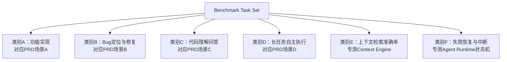
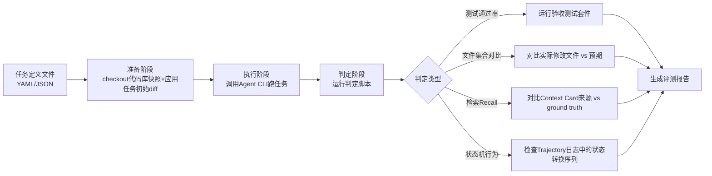

# Benchmark Task Set — 基准任务集定义

> **状态：✅ 完整** — 本文档定义了本产品验收所依赖的可执行基准任务集，是 [PRD.md §6](../01-Product/PRD.md#6-验收标准总纲)、[RFC-0001 §8](../03-RFC/RFC-0001%20Agent%20Runtime.md#8-验收标准)、[RFC-0002 §10](../03-RFC/RFC-0002%20Context%20Engine.md#10-验收标准) 中反复引用的"标准测试代码库""基准任务集"的具体定义来源。

## 1. 为什么需要这份文档

呼应 [Design Principles](../00-Vision/Design%20Principles.md) 原则 10"可验证优先于感觉好用"：本规范中大量验收标准写成了"任务一次性完成率 ≥ 70%""Recall ≥ 80%"这类可执行指标，但**如果没有一个具体、可复现的任务集，这些数字就是空中楼阁**——不同人跑不同任务、用不同代码库，得出的完成率毫无可比性，也无法用来做版本间回归对比或与 Claude Code/OpenCode 的定量对比（[PRD.md §6](../01-Product/PRD.md#6-验收标准总纲)"对比基线"）。

本文档的目标是把"验收标准"从叙述性描述转化为**可以直接被自动化脚本运行的任务清单**。

## 2. 设计原则

1. **每个任务必须有客观、自动可判定的通过/失败标准**——不依赖人工主观评价"看起来对不对"。优先用"跑测试是否通过""diff 是否命中预期文件集合"这类可编程判定，而非"LLM 评委打分"这种间接指标（间接指标可作为补充，不能作为唯一依据）。
2. **任务来源于真实开源项目片段，而非人工编造的玩具代码**——玩具代码无法反映真实代码库的上下文复杂度，会系统性高估 Agent 能力。
3. **任务集分层覆盖不同能力维度**，不是所有任务都验证"端到端完成率"，部分任务专门用于验证单一子系统（如 Context Engine 的检索准确率）。
4. **任务集需要版本化、可扩展**——初始版本不追求覆盖全部场景，但结构上要支持后续持续新增任务，不推倒重来。
5. **难度分级明确**，避免"一次性完成率 70%"这个数字因为任务难度分布不同而失去可比性。

## 3. 基准代码库选取标准

任务需要绑定在真实代码库快照上运行，而非抽象描述。候选代码库需满足：

| 标准 | 说明 |
|---|---|
| 开源、许可证允许用于评测 | 避免法律风险 |
| 有完整测试套件 | 支撑"跑测试验证改动"类任务的客观判定 |
| 代码规模覆盖中小型（1万-10万行级） | v1.0 暂不纳入百万行级 monorepo，避免 Context Engine 尚未成熟时基准过难导致数据无意义（超大规模场景见 [RFC-0002 §9 风险](../03-RFC/RFC-0002%20Context%20Engine.md#9-风险与缓解)，留待后续扩展任务集） |
| 覆盖至少 3 种主流语言生态 | 例如 TypeScript/Python/Java 各选 2-3 个代表性项目，避免评测结果对单一语言生态过拟合 |
| 代码库需要"冻结快照"（固定 commit） | 保证同一任务多次运行的可比性，代码库上游后续更新不影响历史评测数据 |

初始版本建议选取 6-9 个代码库（每种语言生态 2-3 个），具体项目清单待评测基础设施搭建时确定，本文档只定义选取标准，不锁定具体项目名单（避免规范文档与实际维护的代码库列表脱节）。

## 4. 任务分类体系

对应 [PRD.md §4 核心用户场景](../01-Product/PRD.md#4-核心用户场景详细旅程见-user-journeymd-大纲) 的四类场景，加上两类专门验证子系统的检索类任务：



### 类别 A：功能实现（对应 [RFC-0001 §8](../03-RFC/RFC-0001%20Agent%20Runtime.md#8-验收标准) 一次性完成率指标）

给定自然语言功能需求，在真实代码库中实现，通过预置的验收测试判定成功与否。

**判定方式**：任务附带一组"验收测试"（在任务设计时就已经写好、但对 Agent 不可见），Agent 完成实现后运行这组测试，全部通过即算任务成功。

**难度分级**：
- L1（简单）：单文件修改，功能边界清晰（如"给某个函数加一个可选参数并处理向后兼容"）
- L2（中等）：2-5 个文件协同修改（如"给某个数据模型加一个字段，同步更新验证逻辑和序列化逻辑"）
- L3（复杂）：跨模块修改，涉及新增文件、修改多处调用点（如"新增一个中间件并接入现有请求处理链路"）

### 类别 B：Bug 定位与修复（对应 [PRD.md 场景 B](../01-Product/PRD.md#场景-bbug-定位与修复)）

从真实历史 bug 中提取"引入 bug 前后的两个 commit"，将"引入 bug 后"的版本作为任务起点，给 Agent 报错信息/症状描述，要求定位并修复。

**判定方式**：
1. 修复后运行完整测试套件，之前失败的测试用例转为通过，且不能引入新的测试失败（防止"删测试"式作弊）
2. 记录 diff 的改动范围（行数、涉及文件数），用于验证 [Design Principles](../00-Vision/Design%20Principles.md) 原则 5"修复方案改动范围应与问题复杂度匹配"——与"最小修复"参考答案的 diff 大小做比例对比，过度膨胀（如超过参考答案 3 倍行数）视为不合格，即使测试通过

### 类别 C：代码理解与问答（对应 [PRD.md 场景 C](../01-Product/PRD.md#场景-c代码理解与问答)）

给定关于代码库的问题（"这个函数是做什么的""这两个模块什么关系"），要求 Agent 只读分析并回答。

**判定方式**：
1. **硬性检查**：回答中必须引用具体文件路径和代码片段（可编程校验——检测回答中是否包含代码库内真实存在的文件路径引用），未引用则直接判定不合格
2. **内容正确性检查**：预置人工撰写的参考答案要点清单，用 LLM-as-judge 方式检查回答是否覆盖关键要点（此项为辅助判定，权重低于硬性检查，且需要人工抽样复核 judge 结果的可靠性）
3. **副作用检查**：验证任务执行过程中没有产生任何文件写入操作（只读性验证）

### 类别 D：长任务自主执行（对应 [PRD.md 场景 D](../01-Product/PRD.md#场景-d长任务自主执行)）

批量性、重复性任务（如"把所有测试文件里过时的 mock 写法迁移到新写法"），在高自主性配置下要求 Agent 自主执行到底。

**判定方式**：
1. 执行完成后，全部目标文件是否都完成了迁移（可编程扫描代码库中是否还残留旧写法特征）
2. 迁移后测试套件是否仍然全部通过（防止批量修改引入回归）
3. 验证 Trajectory 完整可追溯（每一步操作有对应的推理记录，见 [RFC-0016 Telemetry](../03-RFC/RFC-0016%20Telemetry.md)），且支持一键回退全部改动后代码库能恢复到初始状态

### 类别 E：上下文检索准确率（专测 [RFC-0002 Context Engine](../03-RFC/RFC-0002%20Context%20Engine.md)）

不要求 Agent 完成任何修改，仅评测 Context Engine 对给定任务描述的检索结果。

**判定方式**：
1. 每个任务预先人工标注"正确相关文件集合"（ground truth）
2. 计算 Context Engine 实际检索结果与 ground truth 的 Recall（对应 [RFC-0002 §10](../03-RFC/RFC-0002%20Context%20Engine.md#10-验收标准) 验收标准 1：Recall ≥ 80%）
3. 专门构造一批"任务描述中提及具体函数名"的子任务，验证符号精确匹配结果是否进入检索结果 Top-3（对应 [RFC-0002 §10](../03-RFC/RFC-0002%20Context%20Engine.md#10-验收标准) 验收标准 3）
4. 构造"单文件变更后立即检索"的子任务，测量索引更新延迟（对应验收标准 2：< 5 秒）

### 类别 F：失败恢复与中断（专测 [RFC-0001 Agent Runtime](../03-RFC/RFC-0001%20Agent%20Runtime.md) 状态机）

人为注入故障场景，验证状态机行为符合设计。

**判定方式**（逐条对应 [RFC-0001 §8](../03-RFC/RFC-0001%20Agent%20Runtime.md#8-验收标准) 的验收标准 2-4）：
1. 任务执行到一半，模拟进程中断，验证 Session 可从 Task Engine 恢复并继续执行，Trajectory 不丢失
2. 人为注入工具调用失败（如模拟文件权限错误），验证状态机进入 `PartialFailure → Reflecting` 而非直接崩溃
3. 构造必然持续失败的任务（如要求写入一个权限被锁死的路径），验证在达到 `MAX_RETRIES` 后正确进入 `Failed` 状态而非无限重试

## 5. 评分与自动化运行机制



**任务定义格式**（每个任务是一个独立的结构化定义文件，示例字段，非最终 schema）：

```yaml
task_id: "func-impl-l2-003"
category: "A"  # 对应类别A-F
difficulty: "L2"
repo: "<代码库标识>"
repo_commit: "<冻结的commit hash>"
prompt: "<给Agent的自然语言任务描述>"
setup:
  apply_patch: "<可选，任务开始前需要应用的初始状态diff>"
verification:
  type: "test_suite"  # test_suite | file_diff_match | retrieval_recall | state_machine_trace
  test_command: "<验收测试运行命令>"
  expected_files_changed: ["<预期修改文件路径列表，用于Design Principles原则5的改动范围校验>"]
autonomy_level: "needs_confirmation"  # 该任务在哪个自主性级别下运行，见RFC-0015 Permission
```

**评测报告需要输出的核心指标**（与各 RFC 验收标准直接对齐）：

| 报告指标 | 对应验收标准来源 |
|---|---|
| 类别 A 各难度级别完成率 | [PRD §6](../01-Product/PRD.md#6-验收标准总纲)、[RFC-0001 §8](../03-RFC/RFC-0001%20Agent%20Runtime.md#8-验收标准) |
| 类别 B 修复正确率 + 平均 diff 膨胀系数 | [Design Principles 原则5](../00-Vision/Design%20Principles.md) |
| 类别 C 引用合规率 | [PRD 场景C](../01-Product/PRD.md#场景-c代码理解与问答) |
| 类别 D 完成率 + 回退成功率 | [PRD 场景D](../01-Product/PRD.md#场景-d长任务自主执行) |
| 类别 E 检索 Recall / Top-3 命中率 / 索引延迟 | [RFC-0002 §10](../03-RFC/RFC-0002%20Context%20Engine.md#10-验收标准) |
| 类别 F 状态转换正确率 | [RFC-0001 §8](../03-RFC/RFC-0001%20Agent%20Runtime.md#8-验收标准) |

## 6. 对比基线机制

呼应 [PRD.md §6](../01-Product/PRD.md#6-验收标准总纲)"与 Claude Code / OpenCode 在相同任务集上做定量对比"：

1. 同一套任务定义应能适配不同 Agent 工具的调用接口（每个待对比工具需要一个薄适配层：把任务的 `prompt` 转发给该工具的 CLI，采集其产生的文件改动用于统一判定）
2. 对比时必须使用相同的基座模型（如同为 Claude 3.5 Sonnet），避免"我们用了更强的模型所以分数更高"这种无意义对比——模型能力差异不是本产品要证明的目标，Agent 编排能力才是
3. 对比结果需要包含完成率、平均耗时、平均 token 消耗三个维度，不能只看完成率（例如"完成率相近但耗时/成本高 3 倍"仍然是需要改进的信号）

## 7. 已知局限与非目标

- 本任务集无法覆盖所有真实世界场景，尤其是需要长期项目背景知识、团队约定的任务（这类能力依赖 [RFC-0005 Memory](../03-RFC/RFC-0005%20Memory.md)/[RFC-0017 Knowledge](../03-RFC/RFC-0017%20Knowledge.md)，v1.0 暂不强制在基准中考核）
- LLM-as-judge 类判定（类别 C 部分场景）存在固有的不稳定性，报告中需要明确标注哪些指标是"硬性可编程判定"、哪些是"辅助性主观判定"，不能混为一谈
- 任务集本身需要防止"过拟合"——如果这套任务集长期不变且被用作模型/Prompt 调优的直接反馈信号，团队可能无意识地把 Agent 调优成"擅长应付这套特定任务"而非真正提升泛化能力，建议任务集分为"公开开发集"和"保留评测集"，后者仅用于最终验收、不用于日常调优反馈

## 8. 前置工作与后续维护

- 首批任务集（建议起始规模：类别 A-D 各 15-20 个任务，类别 E-F 各 10 个任务）需要人工设计并标注，工作量不可低估，建议作为独立的一次性专项工作排期，而非顺带完成
- 任务集需要纳入版本管理，随产品能力迭代持续扩充，扩充记录应体现在 [Appendix/Changelog.md](_INDEX.md) 中
- 自动化运行基础设施（任务准备/执行/判定的 pipeline）属于 [05-Engineering](../05-Engineering/_INDEX.md) 测试策略的一部分，本文档只定义任务集本身，不涵盖 pipeline 的工程实现细节
